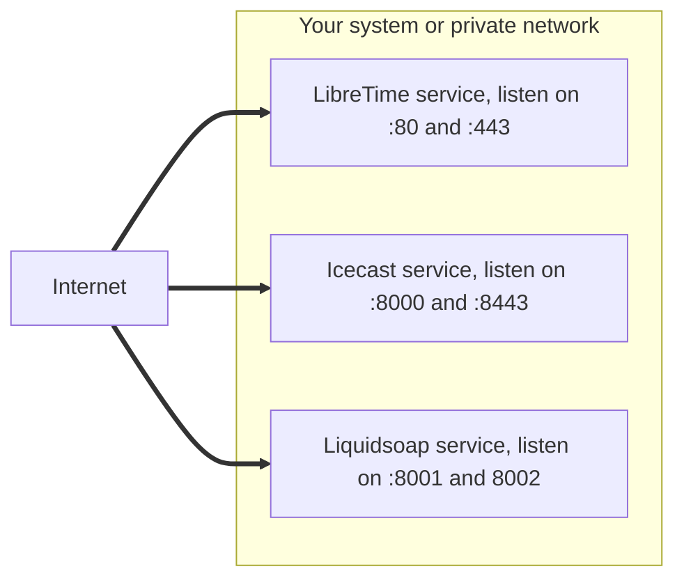
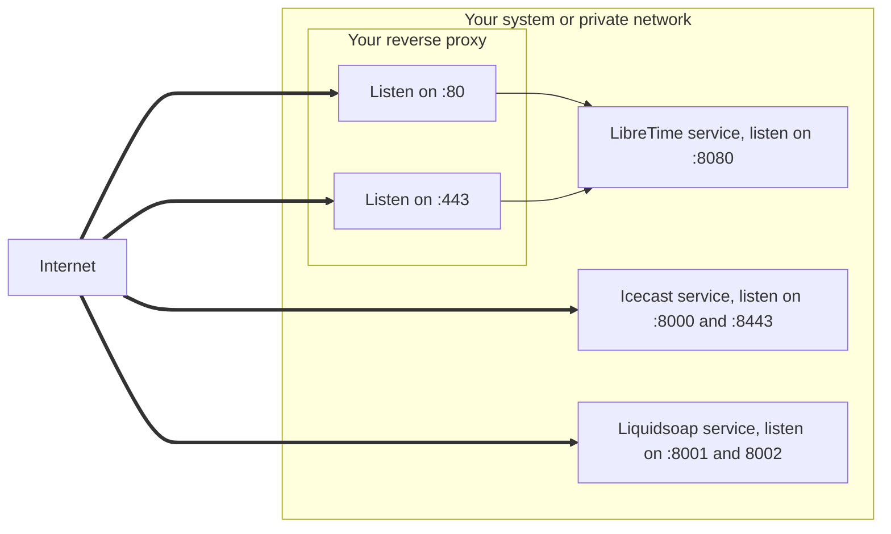

To secure the communication between the users and LibreTime, you have to serve LibreTime over `https`.

We document 2 options, with regards to were the `https` encryption should be terminated:

- [Securing without a reverse proxy](#securing-without-a-reverse-proxy)
- [Securing with a reverse proxy](#securing-with-a-reverse-proxy)

#### Securing without a reverse proxy

One option is to directly update the nginx server configuration (deployed by the LibreTime installer) to load your TLS certificates and listen on the ports 80 and 443.



This is usually done automatically by Certbot. You can accomplish this by following one these guides:

- [How To Secure Nginx with Let's Encrypt on Ubuntu 20.04](https://www.digitalocean.com/community/tutorials/how-to-secure-nginx-with-let-s-encrypt-on-ubuntu-20-04)
- [How To Secure Apache with Let's Encrypt on Ubuntu 20.04](https://www.digitalocean.com/community/tutorials/how-to-secure-apache-with-let-s-encrypt-on-ubuntu-20-04)

#### Securing with a reverse proxy

The second option, is to put a reverse proxy in front of LibreTime, and terminating the `https` communication at the reverse proxy.

The benefits are managing your certificates in a single place, and being easier to extend your infrastructure. You also don't have to edit the LibreTime specific files which greatly helps when upgrading LibreTime.



:::warning

By default, the installer configures nginx to listen on port 80, so you need to run the installer with the `--listen-port 8080` option to set the desired port.

:::

:::warning

The current input and output streams are Icecast based protocols and doesn't support being behind a reverse proxy. **Don't attempt** to [reverse proxy Icecast](#icecast) or the Liquidsoap harbor inputs.

You can [secure the Icecast output streams](#securing-the-icecast-output-streams) by adding an additional Icecast socket and reusing the TLS certificates used to secure LibreTime.

Modern protocols such as [HLS](https://en.wikipedia.org/wiki/HTTP_Live_Streaming) and [SRT](https://en.wikipedia.org/wiki/Secure_Reliable_Transport) will be implement in the future to fix those limitations.

:::

## Prerequisites

:::info

In this documentation, we will use `libretime.example.org` as domain name pointing to your server, and `localhost:8080` as location for the LibreTime web server.

:::

If LibreTime is running on the same host as the reverse proxy, you need to change the LibreTime web server default listening port because the reverse proxy needs to listen on the `80`and `443` ports.

Be sure that your firewall and network allows communications from the reverse proxy to the services. You can use `ping`, `telnet` and `curl` to check that communication is working.

## Install a reverse proxy

Pick one of the reverse proxies below.

:::info

LibreTime already uses Nginx as web server, so unless you have an advanced setup, we recommend that you use Nginx as reverse proxy.

:::

### Nginx

Paste the following configuration in `/etc/nginx/sites-available/libretime.example.org.conf` and be sure to replace:

- `libretime.example.org` with your own station url,
- `localhost:8080` with the location of your LibreTime web server;

```nginx title="/etc/nginx/sites-available/libretime.example.org.conf"
server {
    listen 80;
    server_name libretime.example.org;

    location / {
        proxy_set_header Host              $host;
        proxy_set_header X-Real-IP         $remote_addr;
        proxy_set_header X-Forwarded-For   $proxy_add_x_forwarded_for;
        proxy_set_header X-Forwarded-Proto $scheme;
        proxy_set_header X-Forwarded-Host  $host;
        proxy_set_header X-Forwarded-Port  $server_port;

        proxy_pass http://localhost:8080/;
    }
}
```

Ensure the default nginx server configuration is not enabled:

```bash
sudo rm -f /etc/nginx/sites-enabled/default
```

Enable the nginx configuration:

```bash
sudo ln -s /etc/nginx/sites-available/libretime.example.org.conf /etc/nginx/sites-enabled/
```

Test the nginx configuration:

```bash
sudo nginx -t
```

Restart nginx:

```bash
sudo systemctl restart nginx
```

You can now follow this guide to configure Nginx with a Let's Encrypt certificate.

- [How To Secure Nginx with Let's Encrypt on Ubuntu 20.04](https://www.digitalocean.com/community/tutorials/how-to-secure-nginx-with-let-s-encrypt-on-ubuntu-20-04)

You should end up with a nginx configuration similar to:

```nginx title="/etc/nginx/sites-available/libretime.example.org.conf"
server {
    listen 80;
    server_name libretime.example.org;

    if ($host = libretime.example.org) {
        return 301 https://$host$request_uri;
    } # managed by Certbot

    return 404; # managed by Certbot
}

server {
    listen 443 ssl; # managed by Certbot
    server_name libretime.example.org;

    ssl_certificate /etc/letsencrypt/live/libretime.example.org/fullchain.pem; # managed by Certbot
    ssl_certificate_key /etc/letsencrypt/live/libretime.example.org/privkey.pem; # managed by Certbot
    include /etc/letsencrypt/options-ssl-nginx.conf; # managed by Certbot
    ssl_dhparam /etc/letsencrypt/ssl-dhparams.pem; # managed by Certbot

    location / {
        proxy_set_header Host              $host;
        proxy_set_header X-Real-IP         $remote_addr;
        proxy_set_header X-Forwarded-For   $proxy_add_x_forwarded_for;
        proxy_set_header X-Forwarded-Proto $scheme;
        proxy_set_header X-Forwarded-Host  $host;
        proxy_set_header X-Forwarded-Port  $server_port;

        proxy_pass http://localhost:8080/;
    }
}
```

### Apache

Paste the following configuration in `/etc/apache2/sites-available/libretime.example.org.conf` and be sure to replace:

- `libretime.example.org` with your own station url,
- `localhost:8080` with the location of your LibreTime web server;

```apacheconf title="/etc/apache2/sites-available/libretime.example.org.conf"
<VirtualHost *:80>
    ServerName libretime.example.org

    <Location />
        ProxyPass           http://localhost:8080/
        ProxyPassReverse    http://localhost:8080/
    </Location>
</VirtualHost>
```

Ensure the default apache vhost configuration is not enabled:

```bash
sudo rm -f /etc/apache2/sites-enabled/000-default.conf
```

Enable the Apache2 proxy modules:

```bash
sudo a2enmod proxy proxy_http
```

Enable the Apache2 vhost configuration:

```bash
sudo a2ensite libretime.example.org
```

Test the Apache2 configuration:

```bash
sudo apache2ctl configtest
```

Restart Apache2:

```bash
sudo systemctl restart apache2
```

You can now follow this guide to configure Apache2 with a Let's Encrypt certificate.

- [How To Secure Apache with Let's Encrypt on Ubuntu 20.04](https://www.digitalocean.com/community/tutorials/how-to-secure-apache-with-let-s-encrypt-on-ubuntu-20-04)

You should end up with 2 Apache2 configurations similar to:

```apacheconf title="/etc/apache2/sites-available/libretime.example.org.conf"
<VirtualHost *:80>
    ServerName libretime.example.org

    RewriteEngine on
    RewriteCond %{SERVER_NAME} =libretime.example.org
    RewriteRule ^ https://%{SERVER_NAME}%{REQUEST_URI} [END,NE,R=permanent]

    <Location />
        ProxyPass           http://localhost:8080/
        ProxyPassReverse    http://localhost:8080/
    </Location>
</VirtualHost>
```

```apacheconf title="/etc/apache2/sites-available/libretime.example.org-le-ssl.conf"
<IfModule mod_ssl.c>
<VirtualHost *:443>
    ServerName libretime.example.org

    SSLCertificateFile /etc/letsencrypt/live/libretime.example.org/fullchain.pem
    SSLCertificateKeyFile /etc/letsencrypt/live/libretime.example.org/privkey.pem
    Include /etc/letsencrypt/options-ssl-apache.conf

    <Location />
        ProxyPass           http://localhost:8080/
        ProxyPassReverse    http://localhost:8080/
    </Location>
</VirtualHost>
</IfModule>
```

## Icecast

If you attempt to listen an insecure Icecast stream on a secure website, a
[mixed content error](https://support.mozilla.org/en-US/kb/mixed-content-blocking-firefox)
will be raised by your browser and should prevent your player from listening to the stream.

### Securing the Icecast output streams

:::caution

Before you start, make sure to have a working and secured LibreTime server, and that the TLS certificates generated by Cerbot are on the same host as Icecast.

:::

Create a Icecast specific SSL certificate bundle based on the TLS certificates generated by Certbot:

```bash
sudo install \
  --group=icecast \
  --mode=640 \
  <(cat /etc/letsencrypt/live/libretime.example.org/{fullchain,privkey}.pem) \
  /etc/icecast2/bundle.pem
```

Enable the secure socket and set the SSL certificate bundle path in the Icecast configuration file:

```git title="/etc/icecast2/icecast.xml"
     <!-- You may have multiple <listen-socket> elements -->
     <listen-socket>
         <port>8000</port>
         <!-- <bind-address>127.0.0.1</bind-address> -->
         <!-- <shoutcast-mount>/stream</shoutcast-mount> -->
     </listen-socket>
     <!--
     <listen-socket>
         <port>8080</port>
     </listen-socket>
     -->
-    <!--
     <listen-socket>
         <port>8443</port>
         <ssl>1</ssl>
     </listen-socket>
-    -->
```

```git title="/etc/icecast2/icecast.xml"
         <!-- Aliases: can also be used for simple redirections as well,
              this example will redirect all requests for http://server:port/ to
              the status page
         -->
         <alias source="/" destination="/status.xsl"/>
         <!-- The certificate file needs to contain both public and private part.
              Both should be PEM encoded.
         <ssl-certificate>/usr/share/icecast2/icecast.pem</ssl-certificate>
         -->
+        <ssl-certificate>/etc/icecast2/bundle.pem</ssl-certificate>
     </paths>
```

:::warning

Don't forget to open the new Icecast secure port `8443` in your firewall.

:::

Restart Icecast to apply the changes:

```bash
sudo systemctl restart icecast2
```

Next, you need to change the LibreTime `stream.outputs.icecast.*.public_url` configuration to use the newly enabled Icecast secure port, for example:

```git title="/etc/libretime/config.yml"
     # Icecast output streams.
     # > max items is 3
     icecast:
       - <<: *default_icecast_output
         enabled: true
-        public_url:
+        public_url: https://libretime.example.org:8443/main.ogg
         mount: main.ogg
         audio:
           format: ogg
           bitrate: 256

       - <<: *default_icecast_output
         enabled: true
-        public_url:
+        public_url: https://libretime.example.org:8443/main.mp3
         mount: main.mp3
         audio:
           format: mp3
           bitrate: 320
```

Restart LibreTime to apply the changes:

```bash
sudo systemctl restart libretime.target
```

Finally, you need to configure the Certbot renewal to bundle a Icecast specific SSL certificate and restart the Icecast service:

```git title="/etc/letsencrypt/renewal/libretime.example.org.conf"
 # Options used in the renewal process
 [renewalparams]
 account = d76ce6a241c7c74f79e5443216ee420e
 authenticator = nginx
 installer = nginx
 server = https://acme-v02.api.letsencrypt.org/directory
+
+deploy_hook = 'bash -c "install --group=icecast --mode=640 <(cat $RENEWED_LINEAGE/{fullchain,privkey}.pem) /etc/icecast2/bundle.pem && systemctl restart icecast2"'
```

Check that the renewal configuration is valid:

```bash
sudo certbot renew --dry-run
```
