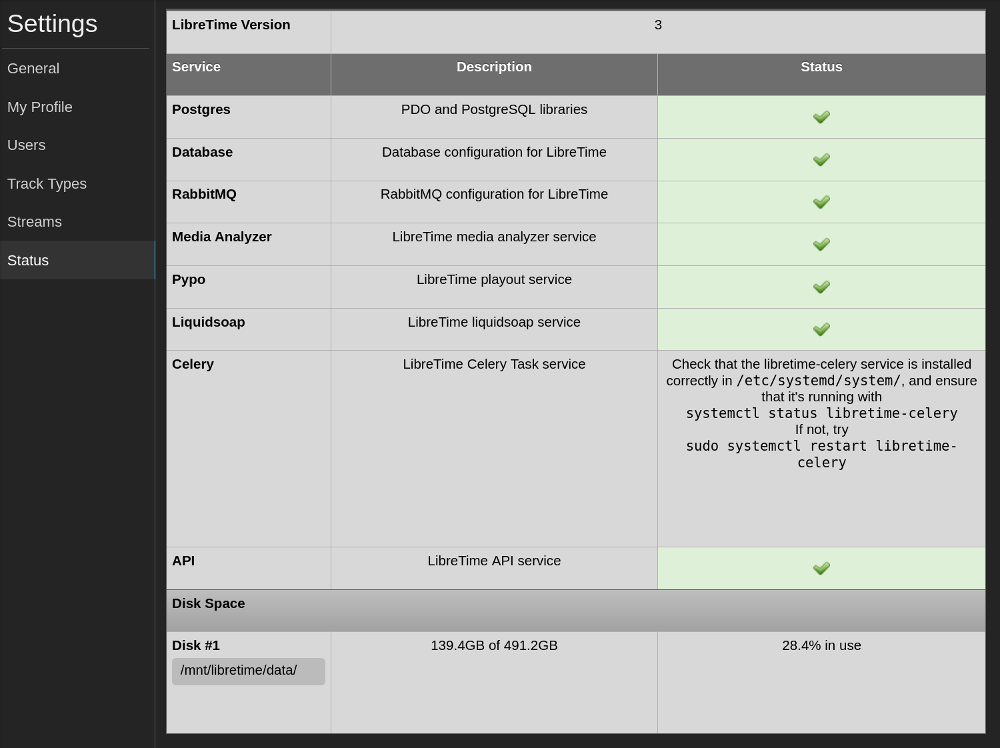

Is something not working for your LibreTime installation? Here's a quick guide to help you
troubleshoot most issues you'll run into.

## 1. Let's check the basics

Is your server on? (We hate to ask.) Is it connected to the internet? Is it connected to your
broadcast console or mixer if being used for soundcard output? If you're using a cloud host,
does your cloud provider's status page indicate any system outages?

Once you know your physical (or virtual) system is functional, was a show scheduled for the
current time with tracks or an autoplaylist scheduled?

## 2. Are all services working?

If you can log in to LibreTime, go to **Settings** > **Status** to see the service indicators.
A fully working server should have green checkmarks next to all services.



If one of the services isn't working, text will display with a terminal command to restart the service
or get status information for a particular service. For example (for Ubuntu 18.04), the following
commands would restart or check the status of LibreTime's Liquidsoap instance, respectively.

```bash
sudo systemctl restart libretime-liquidsoap
sudo systemctl status libretime-liquidsoap
```

If the service isn't wanting to restart, look at its status for clues as to why it stopped working.

> If you find yourself constantly needing to restart a service, there's a chance it was never set to autostart on system boot. Use `sudo systemctl enable servicename` to fix this problem.
