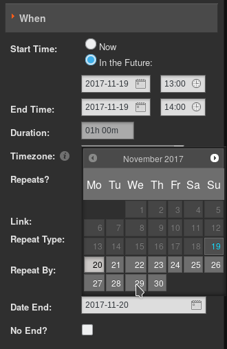

# Calendar

The Calendar page of the LibreTime administration interface has three views: **day**, **week** and **month**, which can be switched using the grey buttons in the top right corner. By default, the **month** view is shown, with today's date highlighted by a pale grey background.

In the top left corner of the page, you can go back or forward through the **Calendar** by clicking on the buttons which have a small grey triangle in a white circle. Click the **today** button to jump to today's date in the current view. (The **today** button will be greyed out if you are already viewing that date). In the **day** or **week** views, there is also a drop-down menu which allows you to set the resolution displayed for the calendar, ranging from one minute per row to sixty minutes per row.

Adding a show
-------------

Only *Admins* and *Program Managers* can use this feature. To add a new show to the Calendar, click the **+ New Show** button in the top left corner of the page, or click on any future row or box in the Calendar which is empty. Either of these actions opens the **Add this show** box, which has seven sections, arranged vertically: **What**, **Autoloading Playlist**, **When**, **Live Stream Input**, **Record & Rebroadcast**, **Who**, and **Style**. Click the small orange triangle to the left of the section name if you wish to minimize or maximize it.

What
----

In the **What** box, enter the **Name**, public website **URL**, **Genre** and **Description** for the show that you are creating.

Autoloading Playlist
------------------

In this section, you can select a playlist that will be used for this show. The playlist must already be defined in your library. **Auto Schedule Playlist** needs to be checked for **Select Playlist** and **Repeat AutoPlaylist Until Show is Full** to be visible.

When
----

Next, in the **When** section, if you clicked on a date in the **Calendar** this should already be entered in the **Date/Time Start** field. To set another date for the show, click on the date in the **Date/Time Start** field and select the date that you require from the small pop-up calendar which will appear. Click on the adjacent time field to set the start time for the show, with the pop-up **Hour** and **Minute** box. The Minute values in the pop-up time boxes are rounded to the nearest five minutes. You can also adjust the times manually by clicking into the fields and typing. Repeat the process to set the **Date/Time End** fields. The **Start Time** can be **Now** or **In the Future**. A show that starts now, will start at the time save is pressed, while a future show will start at the time set. The **Duration** of the show will be displayed automatically, based on the start and end times you have set.

By default, the **Timezone** of the show start and end times will be the timezone of the station, as set on the Preferences page on the System menu. You can specify an alternative time zone using the drop-down menu, if you wish. The time zone displayed in the Calendar when you log in depends on your personal settings. See 'Updating your own account' in the chapter *Users* for more details.

LibreTime will only allow you to enter valid times for shows. If you attempt to schedule show times which would be impossible, by ending the show before it begins, LibreTime will highlight the error with a pink background.

To schedule a regular show, check the **Repeats?** box, which will make a new section of the dialog appear. Optionally, click the **Link:** box to automatically schedule the same content in the repeated shows as in the original show.

Then select either **weekly**, **every 2 weeks**, **every 3 weeks**, **every 4 weeks** or **monthly** from the **Repeat Type** drop-down menu. If you have selected a weekly option, check the boxes for the days of the week that you want to schedule the regular show on. If you have selected **monthly**, you have the option to **Repeat By: day of the month** (for example the 9th of each month) or **day of the week** (for example the second Wednesday of each month).

Uncheck the **No End?** box and set the **Date End** for the regular show to finish, or leave the **No End?** box checked to schedule the show indefinitely.

Live Stream Input
-----------------

The **Live Stream Input** section can be used to enable live input streams during the show, and also to configure authentication for them. If you check the **Use LibreTime Authentication** box, the DJs (presenters) of the show will be able to connect a live stream to LibreTime's **Show Source Mount Point** using their login name and password. See the chapter *Stream Settings* for details.

If you check the **Use Custom Authentication** box instead, you can set a one-time username and password pair for live stream input to the show. For example, you may wish to create an authenticated live stream input for a particular remote news reporter, without providing any further access to your LibreTime server for that person.

A reminder of the connection **Host**, **Port** and **Mount** for the live input stream to use is shown at the end of the **Live Stream Input** section.

Record & Rebroadcast
--------------------

The **Record & Rebroadcast** section is currently not working, and so has been removed from the web interface. If this feature is important to you, please search for relevant issues in the [LibreTime github repository](https://github.com/LibreTime/libretime/search?q=record&type=Issues) and help us make it happen!

Who
---

In the **Who** section, type the first few letters of the name of the show's DJ (presenter) in the **Search Users** field to select a name from the LibreTime database, or check one of the **DJs** boxes in the vertical list below. This association of a DJ name with a particular show enables that presenter to add playout media to the show, and also to connect a live Show Source input stream (if that has been enabled), so it is important to get the DJ's name right.

Style
-----

Show colours in the Calendar are set automatically, based on the **Name** of the show, so that individual shows can be easily identified in the **Calendar**. If you wish, you can select a **Background Colour** and **Text Colour** manually by clicking the boxes in the **Style** section. Click the coloured circle icon in the lower right corner to close this pop-up window.

 

Optionally, you can upload a Show Logo by clicking the **Browse** button.

Finally, click the **Add this show** button at the top or bottom of the box. The new show will now be displayed in the **Calendar**, with a regular slot if you have chosen to schedule one. 

Editing a show
--------------

Show configuration and metadata can be changed at any time, except for **Date/Time Start** and **Record from Line In?** options, which are fixed after broadcast of that show commences. Click the show in the Calendar, and select **Edit Show** from the pop-up context menu. This opens the **Update Show** box, which is almost exactly the same as the **Add this Show** box. Click the **+ Update show** button at the top or bottom of the box when you are done.

Episodes of repeating shows also have an **Instance Description** field in which you can add details for that particular episode. Click the episode in the Calendar, click **Edit** on the pop-up menu, then click **Edit this instance**. After entering an Instance Description, click the **+ Update show** button.

Alternatively, individual shows can be clicked on and dragged to new days and times in the calendar. However, LibreTime will not allow you to drag a future show into the past, or drag and drop instances of a repeated show. In the **Day** and **Week** views, show length can be adjusted by clicking on the lower edge of the show box, and dragging the edge of the box upwards or downwards. The new show length is calculated automatically.

Adding content to a show
------------------------

To add content to a show, click the show in any view on the Calendar, and select **Schedule Tracks** from the pop-up menu. Shows that do not yet contain any scheduled content are marked with a red exclamation mark icon, to the right of the show start and end times in the top bar. Shows partially filled with content have a yellow exclamation mark icon. During playout of the show, a green play icon will also be shown in the top bar.

The **Schedule Tracks** action opens a window with the name of the show. Like when using the **Now Playing** page, you can search for content items and add them to the show schedule on the right side of the page. Refer to the *Now Playing* chapter for details.

When your show has all the required content, click the **OK** button in the bottom right corner to close the window. Back in the **Calendar**, click the show and select **View** from the pop-up menu to view a list of content now included in the show.

The **Contents of Show** window is a read-only interface featuring an orange bar which indicates how much media has been added to the show. Click the **OK** button in the bottom right corner, or the white **x** icon in the top right corner, to close the window.

Removing content from a show
----------------------------

To remove an individual item from a show, click on the show in the **Calendar**, and select **Schedule Tracks** from the pop-up menu. In the window which opens, click any item you wish to remove from the show, then click **Delete** on the pop-up menu, or check the box in the item's row then click the **Remove** icon at the top of the table. To remove all files and playlists from a show, click on the show in the **Calendar**, and select **Clear Show** from the pop-up menu. 

Deleting an upcoming show
---------------------------

To delete an upcoming instance of a repeating show, click on the show in the **Calendar**, and select **Delete**, then **Delete Instance** from the pop-up menu. If you wish to delete all future instances of a repeating show, select **Delete Instance and All Following** from the pop-up menu.

You cannot delete or remove content from shows that have already played out. These shows have only one option on the pop-up menu, which is **View**.

Cancelling playout
------------------

If you wish to cancel playout of a show while it is running, click on the show in the **Calendar** and select **Cancel Show** from the pop-up menu. LibreTime will ask you if you are sure about this action, as it cannot be undone.

