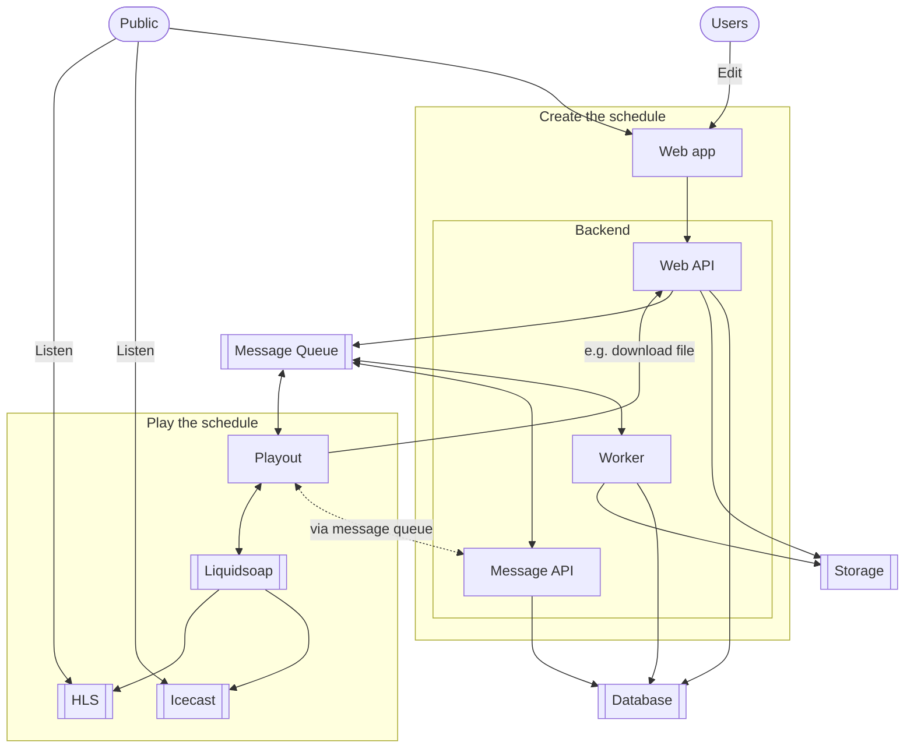

This document explains the design details and goals for the architecture of LibreTime. It describes the result of a [discussion that happened on Github](https://github.com/libretime/libretime/issues/1610).

## Previous architecture

The previous architecture of LibreTime (based on AirTime) was missing a proper separation of concerns. It was build around a legacy MVC app written in PHP, and services in Python to accomplish specific tasks.

## New architecture

Below is the new architecture goal of LibreTime, with a proper separation of concerns.

The LibreTime architecture is split into 2 main monolithic blocks `Create the schedule` and `Play the schedule`. Both blocks must be able to scale horizontally.

:::note

A microservice architecture was rejected as it won't fix or improve any aspect of LibreTime.

:::

:::danger

This document tries to focus on creating and playing a schedule, it doesn't consider features such as monitoring, logging or archiving.

:::

### Create the schedule

This block contains the following components:

- a web API,
- a worker to run background tasks,
- a message API to communicate with the `Play the schedule` block, and other services,
- a web app to interface with the users.

The web API, the worker and the message API rely on the [Django framework](https://www.djangoproject.com/) to handle database, message queue and storage access.

### Play the schedule

Since the `Play the schedule` has its own requirements in terms of logic and uptime, it's handled separately from the `Create the schedule` block. This block needs to be able to be duplicated in a high availability context.

This block contains the following components:

- a Playout app that communicates with the `Play the schedule` block to gather the schedule,
- a Liquisoap app that plays and mixes the scheduled items, and dispatch them to the delivery services,
- an Icecast server that delivers a legacy audio stream to the public,
- a HLS stream that delivers a modern audio stream to the public.

### One setup per radio station

LibreTime isn't meant to be used in a multi-tenant architecture, and an entire LibreTime installation should be dedicated to a single radio station. Previous SAAS or multi-tenant features from Airtime should be deprecated or removed.

### Separation of concerns

The `Create the schedule` block must only prepare a schedule, and the `Play the schedule` must only play that schedule. A strong separation of concerns is required between the 2 blocks to allow the `Play the schedule` block to meet its uptime requirements while not depending on the `Create the schedule` in case of a failure. Development will be simplified if both blocks share a single and properly defined protocol.
