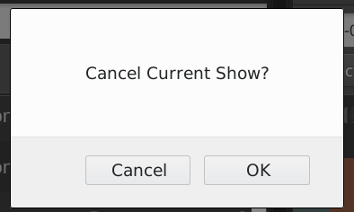

> Quick Links:
- [Dashboard](#dashboard)
- [Calendar](#calendar)

# Dashboard {#dashboard}

The Dashboard is divided into two sections a Library section divided between
[Tracks](../tracks), [Playlists](../playlists), [Smart Blocks](../smartblocks),
[Webstreams](../webstreams), and [Podcasts](../podcasts), with the **Scheduled
Shows** dialog on the right. This page provides an overview of the right-hand
interface. Check the links to see information about the other sections which
provide the content that can be scheduled.

The **Scheduled Shows** page provides a view of the content your station is will
playout, or has already played out, which defaults to showing the 3 hours
ahead. This page also enables you to make last-minute changes to running shows.

If you've only just installed LibreTime, there might not be any content shown
yet. Click the calendar and clock icons above the table to change the date and
time range, then click the **Find Shows** button (with the magnifying glass
icon) to the right.

To display the content of a particular show, click **Filter by Show** and select
the name of the show from the drop-down menu which will appear.

On the left side of the page, the **Start** and **End** times, **Duration**
and **Title** of each content item are shown. On the right, **Creator**,
**Album**, **Cue** or **Fade** times and **Mime** type (file format) can also be
shown. This information can help you to prepare voice tracks for insertion into
the show, including time checks if you wish. Putting current time information i
to voice tracks describing specific content can, of course, limit the
re-usability of those voice tracks, unless you always broadcast a particular
item at the same time of day.

Click the **Show/hide columns** button on the right to configure the metadata
displayed, by checking the boxes in the pop-up window.

The row for the currently playing item is displayed with a bright green
background. Any underbooked shows (shows with insufficient content to fill the
time allowed) are displayed with a row indicating the length of the underbooking
in minutes and seconds. These rows contain a red exclamation mark in the first
column, and have a pink background.

Removing content from a running show
------------------------------------

If a show is overbooked, which means the total playout duration is longer than
the time allowed for the show, a brown row indicates that the item will be faded
out when the show ends. A red row indicates that the item will not be played at
all. The length of the overbooking is shown in minutes and seconds in the last
row of the show. To remove the extra items from the end of an overbooked show,
click the **Scissors** button at the top left of the table.

Alternatively, check the boxes for items which have not yet completed playout,
and click the **Trashcan** button, to the right of the Scissors, to remove them
from the schedule. If you remove the currently playing item, playout will skip
to the next item in the show automatically, so you should make sure you have
enough items remaining in the show to avoid dead air.

If you have a long schedule displayed, and you wish to skip to the currently
playing item, click the button with the end arrow icon, to the right of the
**Trashcan**.

To cancel the current show completely, click the red button to the right again.
A pop-up window will ask you to confirm the cancellation, as this action cannot
be undone.

Items which are no longer available have an exclamation mark icon in the second
column. This may happen for media files which were part of previous shows, and
were removed from LibreTime's library (main storage or watched folders)
subsequently. Items which are included in forthcoming shows cannot be removed
from the Library via the LibreTime interface.

Adding content to a running show
--------------------------------

After you have found the items that you want using the search tools, you can
then drag and drop them from the library table on the left side of the page into
the shows on the right side, including the current playing show.

If the current show has nothing playing out at the time, the new item will begin
playing immediately. This manual triggering of playout can be used as a live
assist technique, in which the LibreTime server's soundcard output is mixed with
other sources such as microphones or telephone hybrids on its way to a
transmitter, or a separate stream encoder. For instance, a live show's host may
not wish to cut off a studio discussion in order to play music at a fixed time.

You can also select multiple items using the **Select** menu button, just
beneath the simple search field, which has the options to **Select this page**
of search results, **Deselect this page** and **Deselect all**. Alternatively,
use the checkboxes on the left side of the library table to select specific
items. Then drag one of the items into the show to add all of the selected
items, or click the **Add to selected show** button, which has a plus icon. If
you wish, you can also use the **Trashcan** button to permanently remove items
from LibreTime's library. Only *admin* users have permission to delete all
items.

To insert checkbox selected items at a specific time in the show schedule, click
one of the songs in the schedule table.  Then click the **Add to selected show**
button in the library table. This will insert the library songs after the
selected scheduled song.

To add a single item at the insertion point, double-click on it in the library.
There is no need to select or drag the item first.

Right-clicking on a song in the schedule table will show a pop-up. This pop-up
menu also enables you to audition the entire show in advance of playout, or
remove the item that was clicked on from the show.

Multiple insertion points can be enabled, so that the same item is inserted into
the schedule at different times. For example, you may wish to play a news report
every hour, or a station ident after every five music files.

# Calendar {#calendar}

The Calendar page of the LibreTime administration interface has three views: **day**, **week** and **month**, which can be switched using the grey buttons in the top right corner. By default, the **month** view is shown, with today's date highlighted by a pale grey background.

In the top left corner of the page, you can go back or forward through the **Calendar** by clicking on the buttons which have a small grey triangle in a white circle. Click the **today** button to jump to today's date in the current view. (The **today** button will be greyed out if you are already viewing that date). In the **day** or **week** views, there is also a drop-down menu which allows you to set the resolution displayed for the calendar, ranging from one minute per row to sixty minutes per row.

## Editing a show

Show configuration and metadata can be changed at any time, except for **Date/Time Start** and **Record from Line In?** options, which are fixed after broadcast of that show commences. Click the show in the Calendar, and select **Edit Show** from the pop-up context menu. This opens the **Update Show** box, which is almost exactly the same as the **Add this Show** box. Click the **+ Update show** button at the top or bottom of the box when you are done.

Episodes of repeating shows also have an **Instance Description** field in which you can add details for that particular episode. Click the episode in the Calendar, click **Edit** on the pop-up menu, then click **Edit this instance**. After entering an Instance Description, click the **+ Update show** button.

Alternatively, individual shows can be clicked on and dragged to new days and times in the calendar. However, LibreTime will not allow you to drag a future show into the past, or drag and drop instances of a repeated show. In the **Day** and **Week** views, show length can be adjusted by clicking on the lower edge of the show box, and dragging the edge of the box upwards or downwards. The new show length is calculated automatically.

## Adding content to a show

To add content to a show, click the show in any view on the Calendar, and select **Schedule Tracks** from the pop-up menu. Shows that do not yet contain any scheduled content are marked with a red exclamation mark icon, to the right of the show start and end times in the top bar. Shows partially filled with content have a yellow exclamation mark icon. During playout of the show, a green play icon will also be shown in the top bar.

The **Schedule Tracks** action opens a window with the name of the show. Like when using the **Now Playing** page, you can search for content items and add them to the show schedule on the right side of the page. Refer to the *Now Playing* chapter for details.

When your show has all the required content, click the **OK** button in the bottom right corner to close the window. Back in the **Calendar**, click the show and select **View** from the pop-up menu to view a list of content now included in the show.

The **Contents of Show** window is a read-only interface featuring an orange bar which indicates how much media has been added to the show. Click the **OK** button in the bottom right corner, or the white **x** icon in the top right corner, to close the window.

## Removing content from a show

To remove an individual item from a show, click on the show in the **Calendar**, and select **Schedule Tracks** from the pop-up menu. In the window which opens, click any item you wish to remove from the show, then click **Delete** on the pop-up menu, or check the box in the item's row then click the **Remove** icon at the top of the table. To remove all files and playlists from a show, click on the show in the **Calendar**, and select **Clear Show** from the pop-up menu. 

## Deleting an upcoming show

To delete an upcoming instance of a repeating show, click on the show in the **Calendar**, and select **Delete**, then **Delete Instance** from the pop-up menu. If you wish to delete all future instances of a repeating show, select **Delete Instance and All Following** from the pop-up menu.

You cannot delete or remove content from shows that have already played out. These shows have only one option on the pop-up menu, which is **View**.

## Cancelling playout

If you wish to cancel playout of a show while it is running, click on the show in the **Calendar** and select **Cancel Show** from the pop-up menu. This action cannot be undone.
