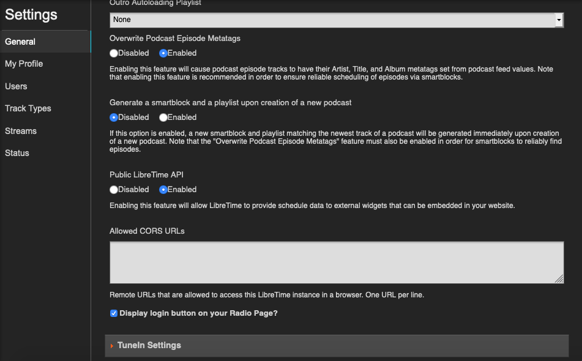
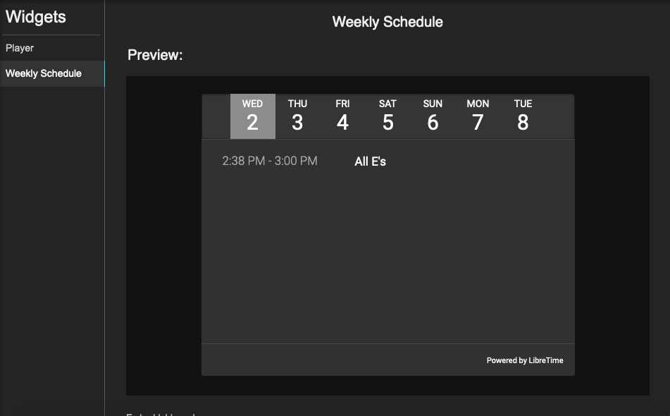

Bring your LibreTime broadcast to your website with embeddable widgets. LibreTime comes with two widgets: a streaming player and a schedule. Both widgets use iframes to display and can be placed wherever embeddable code can on a website.

## Getting started

Before using the widgets, make sure LibreTime's Public API is enabled in **Settings** > **General**.

:::tip[Note]

LibreTime widgets can't function through VPNs or SSH tunneling. The instance must be accessible from the internet for the widgets to work.

:::

## Streaming player widget

The streaming player widget inserts your LibreTime stream into your website. One example is from [WRCS Community Radio](https://wcrsfm.org/) in Columbus, Ohio, USA.

<iframe frameborder="0" width="400" height="235" src="http://broadcast.wcrsfm.org/embed/player?stream=auto&title=Now Playing"></iframe>

From **Widgets** > **Player**, enter a title for your streaming widget and select what stream you'd like to use. All selectible streams must first be configured in **Settings** > **Streams** (see [Settings](../user-manual/settings.md)). **Auto detect** should be fine for most.

## Show schedule widget

The show schedule widget displays the upcoming shows for the next seven days. There are no customizable settings for this widget.
