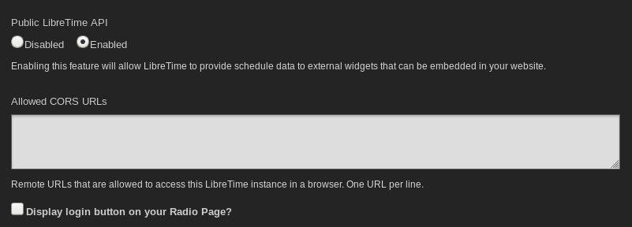

# Settings

On the **Settings** menu, click **General** to set your **Station Name**. This
text is shown in your web browser's title bar when your station staff are logged
into LibreTime, and optionally in stream metadata. You can also set a **Station
Description** and **Station Logo** here.

The **Default Interface Language** drop-down menu sets the default localization
for your LibreTime instance, and the **Station Timezone** drop-down menu can be
used to display local time at your station. LibreTime stores show times
internally in UTC format (similar to *Greenwich Mean Time*), but displays local
time for the convenience of your station staff. You can also set the day of the
week that you wish to start your station's weekly schedule on, which defaults
to Sunday.

The **Track Type Default** enables you to select a track type default for uploads.

Initially, the **Default Fade In** and **Default Fade Out** times for automated
fades are set to half a second, and the **Default Crossfade Duration** is set to
zero seconds. Custom fade and crossfade times can be set for adjacent items in a
playlist or static smart block. See the chapter *Library* for details.

The **Intro Autoloading Playlist** enables you to select a playlist that will be
scheduled at the beginning of every show that has enabled an autoloading
playlist. This can be used for instance to insert a station ID or other
announcements a the top of every show.

The **Outro Autoloading Playlist** enables you to select a playlist that will be
scheduled after the content of every show with an autoloading playlist.

The **Overwrite Podcast Episode Metatags** option which is enabled by default
causes LibreTime to override the Artist, Title & Album fields on any tracks
downloaded from a podcast with information from the RSS feed.

The **Generate a smartblock and a playlist upon creation of a new podcast**
option when enabled will create a smartblock matching the newest episode of a
podcast and a playlist containing that smartblock automatically upon adding a
podcast to LibreTime. This can also be done manually by the generate smartblock
and playlist button under a podcasts settings which is why it is disabled by
default.

You can enable live, read-only access to the LibreTime schedule calendar for
your station's public website with the **Public LibreTime API** option, if you
wish. (There is more about this feature in the
[*Exporting the schedule*](exporting-the-schedule) chapter, in the
*Advanced Configuration* section of this book).

The **Allowed CORS URLs** is intended to deal with situations where you want a
remote site with a different domain to access the API. This is relevant when
there is a reverse proxy server in front of LibreTime. If you are using a
reverse proxy, the URLs that will be used to access it should be added here.

The **Display login button on your Radio Page?** will determine whether visitors
to your site see a link to login. If this is disabled DJs and admins will need
to goto http://SITEURL/login to be able to login.

The **Tune-In Settings** section is intended for stations that have partnered
with TuneIn to automatically push their now playing metadata to TuneIn. This
hasn't been tested and also requires special credentials from TuneIn.

The **Dangerous Options** section provides an administrator the ability to erase
the entire LibreTime library.

When you are done remember click the **Save** button at the top or bottom of the
form.

Individual LibreTime users can choose another interface localization when they
log in, or set personal preferences for localization and time zone by clicking
their username on the right side of the menu bar.

