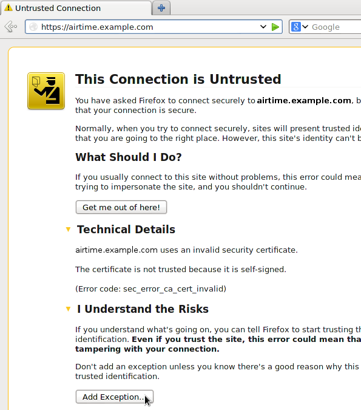

To increase the security of your server, you can enable encrypted access to the LibreTime administration interface, and direct your users towards this more secure login page. The main advantage of using this encryption is that your remote users' login names and passwords are not sent in plain text across the public Internet or untrusted local networks, such as shared Wi-Fi access points.

## Deploying a certificate with Certbot (Recommended)

One of the fastest, easiest, and cheapest ways to get an SSL certificate is through [Certbot](https://certbot.eff.org/), as created by the
Electronic Frontier Foundation. To use Certbot, your Libretime installation must be open to the internet on port 80.

Follow [Certbot's documentation](https://certbot.eff.org/instructions) for your OS and webserver to install an SSL certificate. You'll need to renew the certificate every 90 days to keep your installation secure.

If you aren't able to use Certbot, you may want to try a self-signed certificate.

## Deploying a self-signed certificate

The Debian/Ubuntu package _ssl-cert_ creates a _snakeoil_ certificate and key based on your server's hostname. This gratis certificate and key pair created under the _/etc/ssl/certs_/ and _/etc/ssl/private/_ directories will not be recognised by users' browsers without manual intervention. You can install the _ssl-cert_ package with `sudo apt-get install ssl-cert`.

If the hostname of your server does not match the domain name you intend to use with the LibreTime virtual host, the user's browser will present an additional security warning. You can set the domain name of the certificate by editing the file _/usr/share/ssl-cert/ssleay.cnf_ to replace the _@HostName@_ variable:

    commonName                      = @HostName@

with the domain name used by LibreTime:

    commonName                      = airtime.example.com

Then save the file and regenerate the certificate with

```bash
sudo make-ssl-cert generate-default-snakeoil --force-overwrite
```

You should enable additional Apache modules for page redirections, custom headers and secure access:

```bash
sudo a2enmod alias headers ssl
```

Next, edit the virtual host configuration for your LibreTime server to include a stanza for the https:// interface on port 443 and a redirect for logins from port 80:

```bash
sudo nano /etc/apache2/sites-available/airtime-vhost.conf
```

Using the following configuration as a guide, replace _libretime.example.com_ with the name of your server and *admin@example.com* with your email address. The older SSLv2 and SSLv3 protocols and SSL compression should be disabled, as they are generally believed to be insecure. You may wish to create a _ServerAlias_ for users to access the administration interface over https:// if required.

On port 80, Apache's _alias_ module is used to set a _Redirect permanent_ for the login page. Optionally, access could be denied to all sites except _localhost_ and any other LibreTime servers on your network, so that unencrypted communication between LibreTime components can continue.

```apacheconf title="/etc/apache2/sites-available/airtime-vhost.conf"
<VirtualHost *:443>
    SSLEngine on
    SSLProtocol All -SSLv2 -SSLv3
    SSLCompression off
    SSLCertificateFile /etc/ssl/certs/ssl-cert-snakeoil.pem
    SSLCertificateKeyFile /etc/ssl/private/ssl-cert-snakeoil.key
    Header always set Strict-Transport-Security "max-age=31536000"

    ServerName libretime.example.com
    #ServerAlias www.example.com

    ServerAdmin admin@example.com

    DocumentRoot /usr/share/airtime/php/legacy/public
    DirectoryIndex index.php

    <Directory /usr/share/airtime/php/legacy/public>
        Options -Indexes FollowSymLinks MultiViews
        AllowOverride all
        Order allow,deny
        Allow from all
    </Directory>
</VirtualHost>

<VirtualHost *:80>
    ServerName libretime.example.com

    ServerAdmin admin@example.com

    DocumentRoot /usr/share/airtime/php/legacy/public
    Redirect permanent /login https://airtime.example.com/login

    SetEnv APPLICATION_ENV "production"

    <Directory /usr/share/airtime/php/legacy/public>
        Options -Indexes FollowSymLinks MultiViews
        AllowOverride All
        Order allow,deny
        Allow from all
    </Directory>
</VirtualHost>
```

Save the file, then restart Apache with `sudo systemctl restart apache2`.

When attempting to log into your server via `http://` in future, you should be redirected to `https://` automatically.

### Importing a self-signed certificate into the browser

The first time you access an LibreTime server with a self-signed certificate over https:// your browser will block the login page and display a security warning. In **Mozilla Firefox**, you can click **Technical Details** to confirm that the warning is due to the certificate being self-signed before clicking the **Add Exception** button. In **Google Chrome**, the button to click on the security warning page is **Proceed Anyway**.



On the next page in Firefox, click the **Get Certificate** button to inspect the details of the self-signed certificate. If all is well, click the **Confirm Security Exception** button. You should now be able to proceed to the https:// login page.


If the users of your LibreTime server wish to avoid going through these steps, or they do not trust the remote LibreTime server to be what it claims to be, it is also possible to import a trusted local copy of a certificate file into the browser. For example, in Firefox version 30 preferences, you can go into the **Advanced** section, click the **Certificates** tab, then click the **View Certificates** button. On the **Servers** tab of the **Certificate Manager**, there is an **Import** button which enables you to load a certificate file from the local computer.

## Mixed encrypted and unencrypted content

Whether your certificate is self-signed or not, you will see browser security warnings whenever a https:// page is delivering unencrypted content, such as the stream from an Icecast server. In Firefox, an exclamation mark icon is displayed in the address bar of the **Listen** pop-up.
