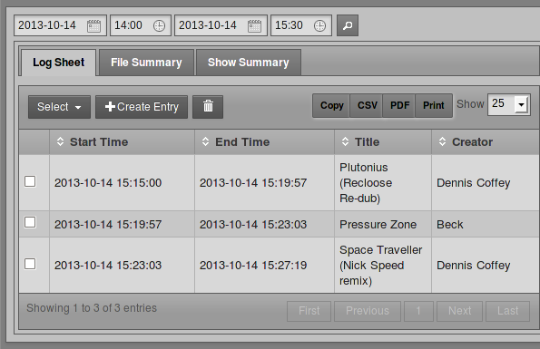
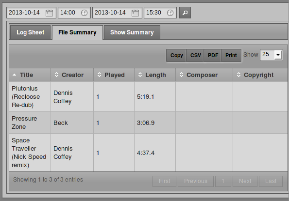
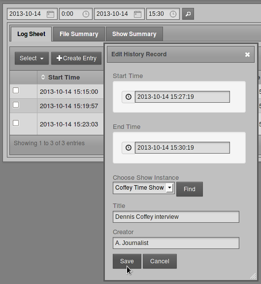
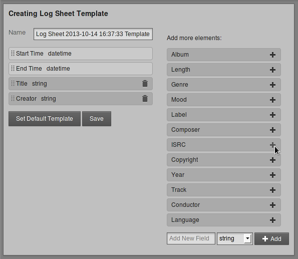

# History

On the History menu, the **Playout History** page enables you to view a list of files played within a specific date and time range. This page is designed to help your station prepare reports for music royalty collection societies and regulatory agencies.

Search results can be copied to the clipboard using the **Copy** button, exported as data in **CSV** format (comma separated values), exported as a document in **PDF** format, or displayed in a printer-friendly format using the **Print** button. (Your web browser must have an Adobe Flash plugin installed for these buttons to appear). Press the **Esc** key to return to the LibreTime interface once the print job is complete.

This page has three tabs: **Log Sheet**, **File Summary** and **Show Summary**. On any of these tabs, you can select a date and time range by clicking the calendar and clock icons in the upper left corner of the page. Then click the search button, which has a magnifying glass icon, to the right. A list of files played during that date and time range will appear further down the page.

In the **Log Sheet** tab, the playout history is sorted by **Start Time** and **End Time** by default.

The number of times each file was played and the length of the files are shown in the **File Summary** tab. To make optimal use of this feature for royalty reporting purposes, music files must be tagged with **Composer** and **Copyright** metadata. The artist performing a piece of music may not be the original composer of the work, or the copyright holder of the sound recording.

On the **Show Summary** tab, click the name of a show within the search range to expand its row and see its playout details.

## Manual logging

If your station features playout from analogue sources such as turntables or microphones, there is no automatic metadata for LibreTime to collect from these inputs. To ensure that the playout history is complete, you can add log entries manually by clicking the **+ Create Entry** button. This action opens a pop-up window with default fields of Start Time, End Time, Title and Creator. Click the **Find** button to automatically fill the **Choose Show Instance** menu with the names of shows that took place within the specified time range. Then click the **Save** button to enter the new item into the playout history.

Log entries can also be manually deleted, using the button with the trashcan icon, to the right of the **+ Create Entry** button. Pages of entries can be selected for deletion using the **Select** drop-down menu.

## History Templates

The **History Templates** page on the History menu enables you to prepare reports with the exact content required by regulatory agencies in the territories that you are broadcasting to. You can begin creating a custom template by clicking the button **New Log Sheet Template** or the button **New File Summary Template**.

Either of these actions opens a page in which you can name the new template, and add or remove elements from the list on the left. To add a new element from the list on the right, click the plus icon for the item you require. If the element you require is not listed, you can use the **Add New Field** box at the lower end of the right side column. Select *string*, *boolean*, *integer*, or *float*, depending on the type of data that you wish to log, and then click the **+ Add** button.

When the template is in the format you require, click the **Save** button, and **Set Default Template** if you wish. The new template will now be listed on the History Templates page. If you have set a new default template, any changes will be visible on the tabs of the Playout History page.

