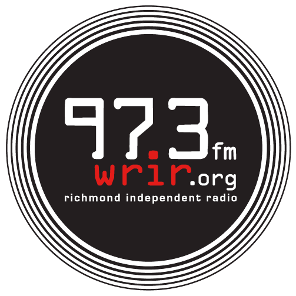

Welcome to LibreTime
====================

LibreTime makes it easy to run your own online or terrestrial radio station.
Don't believe us? Check out our [Quick Install](quickstart) page to see just how easy it is to install and use LibreTime!

Some of LibreTime's main features include:

* *Web-based remote station management* - authorized personnel can add
   programme material, create playlists or smart blocks, and stream in live,
   all via a web interface.
* *Automation* - LibreTime has a scheduler function that enables users to
   create shows with content for playback at the exact date and time specified.
   Playlists, smart blocks and remote stream URLs can be used multiple times.
* *Solid playout* - LibreTime uses the open source Liquidsoap streaming language
   for reliable and precise playback to multiple outputs.
* *Open source* - run LibreTime royalty-free, make changes to the code, and contribute to the project as you see fit, under the GNU AGPLv3 license.
* *Multilingual* - supports over 15 languages both in the interface and inside file metadata
* *Low system requirements*
  * For servers: 1Ghz processor, 2 GB RAM, and a wired ethernet connection with a static IP address
  * For end-users: a modern version of Firefox, Chrome, or Safari, and a screen resolution of at least 1280x768

LibreTime is a fork of AirTime due to stalled development of the FLOSS version. For background on this, see this [open letter to the Airtime community](https://gist.github.com/hairmare/8c03b69c9accc90cfe31fd7e77c3b07d).

We have a number of [how-to guides](tutorials) that contain step-by-step instructions for various common tasks for both end users and administrators.

There are currently no companies offering turn-key LibreTime hosting so if you are interested in running it you will need to have some familiarity with running a Linux server.
You can always reach out to help from the community at our [forum](http://discourse.libretime.org). You can also join our [Mattermost instance](https://chat.libretime.org/) and talk with other developers and users.

### Proud Users

   
