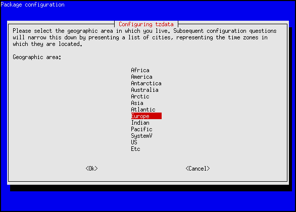

## Install

> Note: this guide is assuming you are using Ubuntu 18.04 LTS for installation, which comes with `ufw` and `netplan`,
and that you have already installed `git` and configured `ntp`. NTP configuration instructions can be found [here](setting-the-server-time).
While it is possible to install LibreTime on other OSes, such as CentOS 7, Debian 9 and 10, and Raspbian 9 and 10,
these are less tested. Firewall and static IP address configuration will need to be done according to your OSes instructions.

### Minimum System Requirements

| On-Premises Install | Cloud Install |
|---------------------|---------------|
| (FM + Internet Radio) | (Internet Radio Only) |
| 1 Ghz Processor| 1vCPU |
| 2 GB RAM | 2 GB RAM |
| Wired ethernet connection, static IP address | 2 TB of data transfer/month |

[DigitalOcean](https://www.digitalocean.com/pricing/#Compute) and [Linode](https://www.linode.com/pricing/#row--compute)
 have similar plans that meet Cloud Install requirements. Both plans cost $10/month.

### Preparing the server

Configure the server to have a static IP address by modifying the Netplan configuration.
If you're using a cloud VM, you likely already have a static IP address. Check with your provider to confirm this.

```
cd /etc/netplan && ls  # find the netplan filename
sudo nano ##-netcfg.yaml
```

If the Netplan configuration is empty, fill in the file with the example below. Otherwise,
input the IP address reserved for the server in `xxx.xxx.xxx.xxx/yy` format, the gateway (the IP address
of your router), and the DNS nameserver. If you don't have a nameserver on your network,
feel free to use Cloudflare's: `1.1.1.1` and `1.0.0.1`.

```
network:
  version: 2
  renderer: networkd
  ethernets:
    enp3s0:
      addresses: [192.168.88.8/24]
      gateway4: 192.168.88.1
      nameservers:
        addresses: 192.168.88.1
```

After the netplan file has been saved, run `sudo netplan apply` to apply changes.

Next, configure Ubuntu's firewall by running:

```
sudo ufw enable
sudo ufw allow 80/tcp
sudo ufw allow 8000/tcp
```

Unblock ports 8001 and 8002 if you plan to use LibreTime's Icecast server to broadcast livestreams without an external Icecast server acting as a repeater.

```
sudo ufw enable 8001/tcp
sudo ufw enable 8002/tcp
```

> If needed, instuctions for setting up a reverse proxy can be found [here](quickstart#reverse-proxy).

### Installing LibreTime

Installing LibreTime consists of running the following commands in the terminal:

```
git clone https://github.com/LibreTime/libretime.git
cd libretime
sudo ./install -fiap
```

After the install is completed, head to the IP address of the server LibreTime was just installed on
to complete the welcome wizard. While not strictly necessary, it is recommended that you change the passwords prompted in the welcome wizard if you intend on accessing the server from the Internet. The welcome wizard will
walk you through the rest of the installation process.

### Services

Once all of the services needed to run LibreTime are installed and configured,
it is important that the server starts them during the boot process, to cut down on downtime, especially in live enviornments.
Ubuntu 18.04 uses the `systemctl` command to manage services, so run the following commands to enable all
LibreTime-needed services to run at boot:

```
sudo systemctl enable libretime-liquidsoap
sudo systemctl enable libretime-playout
sudo systemctl enable libretime-celery
sudo systemctl enable libretime-analyzer
sudo systemctl enable apache2
sudo systemctl enable rabbitmq-server
```

If an error is returned, try adding `.service` to the end of each command. For example:

```
sudo systemctl enable apache2.service
```

### User Permissions

If you plan to have LibreTime output analog audio directly from its server to a mixing console or transmitter,
the `www-data` user needs to be added to the `audio` user group using the command below.

```
sudo adduser www-data audio
```

Congratulations! You've successfully installed LibreTime!

---

## Reverse Proxy {#reverse-proxy}

In some deployments, the LibreTime server is deployed behind a reverse proxy,
for example in containerization use-cases such as Docker and LXC. LibreTime
makes extensive use of its API for some site functionality, which causes
[Cross-Origin Resource Sharing (CORS)](https://developer.mozilla.org/en-US/docs/Web/HTTP/CORS)
to occur. By default, CORS requests are blocked by your browser and the origins
need to be added to the **Allowed CORS URLs** block in
[**General Settings**](settings). These origins should include any
domains that will be used externally to connect to your reverse proxy that you
want handled by LibreTime. These URLS can also be set during the first run configuration
that is displayed when you first install LibreTime

### Reverse Proxy Basics

A reverse proxy allows the LibreTime server to not be connected to the open internet. In
this configuration, it is rather behind another server that proxies traffic to it from
users. This provides some advantages in the containerization space, as this means that
the containers can be on their own internal network, protected from outside access.

A reverse proxy also allows SSL to be terminated in a single location for multiple sites.
This means that all your traffic to the proxy from clients is encrypted, but the reverse
proxy's traffic to the containers on the internal network is not. All the SSL certificates
live on the reverse proxy and can be renewed there instead of on the individual
containers.

### Setup

There are known bugs when using LibreTime behind a reverse proxy ([#957](https://github.com/LibreTime/libretime/issues/957)
tracks the issue and contains a temporary workaround). For SSL redirection to work, you
need two domains: one for LibreTime and one for Icecast. Here, these will be
`libretime.example.com` and `icecast.example.com`.

You will also require two VMs, servers or containers. Alternatively the reverse proxy can
be located on the server, proxying connections to containers also on the host. Setting up
a containerization environment is beyond the scope of this guide. It assumes that you have
Nginx set up on `proxy` and LibreTime will be installed on `libretime`. You will need root
access on both. `libretime` also needs to be able to be accessed from `proxy`
(`ping libretime` on `proxy`).

On `libretime`, install LibreTime as described in the [install guide](quickstart). In short
this means run the following commands:

```
git clone https://github.com/LibreTime/libretime.git
cd libretime
sudo ./install -fiap
```

Once it has installed, replace `<hostname>localhost</hostname>` in
`/etc/icecast2/icecast.xml` with the following:

```
<hostname>icecast.example.com</hostname>
```

This is the hostname that people listening to your stream will connect to and what
LibreTime will use to stream out to them. You will then need to restart Icecast:

```
sudo systemctl restart icecast2
```

On `proxy`, run the following:

```
cat << EOF | sudo tee /etc/nginx/sites-available/libretime.conf
server {
    listen 80;
    server_name libretime.example.com;
    location / {
        rewrite ^ https://$server_name$request_uri? permanent;
    }
}
server {
    listen 443 ssl;
    server_name libretime.example.com;
    ssl_certificate /etc/letsencrypt/live/libretime.example.com/fullchain.pem;
    ssl_certificate_key /etc/letsencrypt/live/libretime.example.com/privkey.pem;
    add_header Strict-Transport-Security "max-age=15552000;";
    add_header X-Frame-Options "SAMEORIGIN";
    client_max_body_size 512M;
    location / {
        proxy_set_header Host $host;
        proxy_set_header X-Real-IP $remote_addr;
        proxy_pass http://libretime/;
    }
}
EOF
```

This Nginx configuration ensures that all traffic uses SSL to the reverse proxy, and
traffic is proxied to `libretime`.

Next, the SSL certificate needs to be generated and the site activated.

```
sudo apt install certbot
sudo systemctl stop nginx
sudo certbot certonly -d libretime.example.com -a standalone
sudo systemctl start nginx
```

You can now go to [https://libretime.example.com](https://libretime.example.com) and go
through the installer. On `General Settings`, you need to change the Webserver Port to
`443` and add the following CORS URLs:

```
https://libretime.example.com
http://libretime.example.com
https://localhost
http://localhost
```

---

## Host Configuration

The streaming host configuration for LibreTime is shown in the file */etc/airtime/liquidsoap.cfg* which is automatically generated by the **Streams** page, found on the **System** menu of the LibreTime administration interface. For this reason, you would not normally edit the streaming configuration manually, as any changes are likely to be overwritten by the administration interface.

### Database and RabbitMQ hosts {#database}

Optionally, you may wish to edit the file */etc/airtime/airtime.conf* to set the PostgreSQL database host, and the username and password to connect to the database with:

    sudo nano /etc/airtime/airtime.conf

You can also set options for RabbitMQ messaging, the LibreTime server and SoundCloud uploads in this file, although you should not normally need to adjust the defaults unless you are running a large LibreTime system distributed across multiple servers. To run the LibreTime server in demo mode, which changes the greeting on the login page and prevents user accounts from being created or modified, set the value of *demo* to 1.

    [database]
    host = localhost
    dbname = airtime
    dbuser = airtime
    dbpass = airtime

    [rabbitmq]
    host = 127.0.0.1
    port = 5672
    user = airtime
    password = XXXXXXXXXXXXXXXXXXXX
    vhost = /airtime

    [general]
    api_key = XXXXXXXXXXXXXXXXXXXXX
    web_server_user = www-data
    airtime_dir = /usr/share/airtime
    base_url = libretime.example.com
    base_port = 80
    base_dir = /
    cache_ahead_hours = 1

    [monit]
    monit_user = guest
    monit_password = airtime

    [soundcloud]
    connection_retries = 3
    time_between_retries = 60

    [demo]
    demo = 0

Save and close the file with **Ctrl+O** and **Ctrl+X**.  In order to update the configuration
used by the various components of LibreTime, run the following commands

    sudo systemctl restart libretime-liquidsoap
    sudo systemctl restart libretime-playout
    sudo systemctl restart libretime-celery
    sudo systemctl restart libretime-analyzer

### Changing the default PostgreSQL passwords {#postgre}

Two of the most important passwords that should be changed *immediately* after installation
are the passwords used by the PostgreSQL database.
It is strongly recommended that you do this before exposing your server to the internet beyond your internal network.

1. Login to PostgreSQL with `sudo -u postgres psql`. The PostgreSQL shell - `postgres=#` - means that you have logged in successfully.
2. Change the admin password with `ALTER USER postgres PASSWORD 'myPassword';`, where `myPassword` is the new password.
Make sure to include the semicolon at the end! A response of `ALTER ROLE` means that the command ran successfully.
3. Change the password for the *airtime* user with `ALTER USER airtime WITH PASSWORD 'new_password';`
A response of `ALTER ROLE` means that the command ran successfully.
4. If all is successful, logout of PostgreSQL with `\q`, go back to */etc/airtime/airtime.conf* to edit the password
in the config file, and restart all services mentioned in the previous section.

### API client configuration {#api}

The LibreTime API enables many types of information about the broadcast schedule and configuration to be retrieved from the LibreTime server. Other than the live-info and week-info data fetched by website widgets (see the chapter *Exporting the schedule*), all API requests must be authenticated using the secret API key stored in the file */etc/airtime/api\_client.cfg* on the LibreTime server. This key is autogenerated during LibreTime installation and should be unique for each server.

If you intend to use the LibreTime API across a public network, for security reasons it is highly recommended that all API requests are sent over encrypted https: and that the web server is configured to accept requests to the api/ directory from specific host names or IP addresses only.

The format of API requests is:

    https://libretime.example.com/api/api-action/format/json/api_key/XXXXXX

where api-action is the type of request and XXXXXX is the secret API key. Available actions include:

-   on-air-light - return true if the station is on air
-   status - get the status of LibreTime components and resource usage
-   version - returns the version of LibreTime installed
-   get-files-without-silan-value - list files for which silence detection has not yet been performed
-   get-stream-setting - gets the settings of LibreTime output streams
-   get-stream-parameters - gets the parameters of LibreTime output streams

For example, using the action *get-stream-setting* returns the following output for the first configured stream:

    {"keyname":"s1_type","value":"ogg","type":"string"},

    {"keyname":"s1_host","value":"streaming.example.com","type":"string"},

    {"keyname":"s1_port","value":"8000","type":"integer"},

    {"keyname":"s1_mount","value":"airtime_128","type":"string"},

    {"keyname":"s1_url","value":"http:\/\/airtime.sourcefabric.org","type":"string"},

    {"keyname":"s1_description","value":"Airtime Radio! Stream
    #1","type":"string"},

    {"keyname":"s1_genre","value":"Screamo","type":"string"},

which is enough information to construct a player widget dynamically. (s1\_url is the station's homepage, not the stream URL). The same information is provided with an s2\_ prefix for the second stream, and s3\_ prefix for the third stream.

Some API requests require the directory ID number to be specified as *dir\_id* including:

-   list-all-files - list files in the specified directory
-   get-files-without-replay-gain - list files in the specified directory for which ReplayGain has not been calculated yet

For example, using a request such as:

     http://libretime.example.com/api/list-all-files/format/json/api_key/XXXXXX/dir_id/1/

returns the full path to each media file in the LibreTime storage directory:

```
    {"files":[
    "imported\/1\/Mark Ronson feat. Saigon\/Here Comes the Fuzz\/7-Diduntdidunt-unknown.flac",
    "imported\/1\/Jimi Tenor & Tony Allen\/Inspiration Information\/3-Selfish Gene-128kbps.mp3",
    "]}
```

If you have changed the *base\_url*, *base\_port* or *base\_dir* setting in */etc/airtime/airtime.conf* from the defaults, you will probably also have to update the *Hostname* settings in the file */etc/airtime/api\_client.cfg* accordingly.**

    bin_dir = /usr/lib/airtime/api_clients
    api_key = 'XXXXXXXXXXXXXXXXXXXX'
    api_base = api
    host = libretime.example.com
    base_port = 80
    base_dir = /

### Apache max file size configuration {#apache}

By default, the maximum upload file size is 500 MB, which may not be large enough for some stations, especially if they are uploading prerecorded shows. The setting for this is located in */etc/apache2/sites-available/airtime.config*. Search for and update the following in megabytes:

```
; Maximum allowed size for uploaded files.
upload_max_filesize = 40M

; Must be greater than or equal to upload_max_filesize
post_max_size = 40M
```

For quick reference, 1024 MB = 1 GB and 2048 MB = 2 GB, but most will be okay with rounding to the nearest thousand. After updating the config file, restart Apache by `sudo systemctl apache restart`.


### Playout settings {#playout}

Settings for pypo, the playout engine used by LibreTime, are found in the file */etc/airtime/airtime.conf*. After making changes to this file, you will have to issue the command:

    sudo systemctl restart libretime-playout

for the changes to take effect.

    ############################################
    # pypo - configuration                     #
    ############################################
    # Set the type of client you are using.
    # Currently supported types:
    # 1) "obp" = Open Broadcast Platform
    # 2) "airtime"
    #
    api_client = airtime

    ############################################
    # Cache Directories                        #
    # *include* trailing slash !!              #
    ############################################
    cache_dir = /var/tmp/airtime/pypo/cache/
    file_dir = /var/tmp/airtime/pypo/files/
    tmp_dir = /var/tmp/airtime/pypo/tmp/

    ############################################
    # Setup Directories                        #
    # Do *not* include trailing slash !!       #
    ############################################
    cache_base_dir = /var/tmp/airtime/pypo
    bin_dir = /usr/lib/airtime/pypo
    log_base_dir = /var/log/airtime
    pypo_log_dir = /var/log/airtime/pypo
    liquidsoap_log_dir = /var/log/airtime/pypo-liquidsoap

    ############################################
    # Liquidsoap settings                      #
    ############################################
    ls_host = 127.0.0.1
    ls_port = 1234

    ############################################
    # RabbitMQ settings                        #
    ############################################
    rabbitmq_host = localhost
    rabbitmq_user = airtime
    rabbitmq_password = XXXXXXXXXXXXXXXXXXXX
    rabbitmq_vhost = /airtime

    ############################################
    # pypo preferences                         #
    ############################################
    # Poll interval in seconds.
    #
    # This will rarely need to be changed because any schedule changes are
    # automatically sent to pypo immediately.
    #
    # This is how often the poll script downloads new schedules and files from the
    # server in the event that no changes are made to the schedule.
    #
    poll_interval = 3600# in seconds.

    # Push interval in seconds.
    #
    # This is how often the push script checks whether it has something new to
    # push to liquidsoap.
    #
    # It's hard to imagine a situation where this should be more than 1 second.
    #
    push_interval = 1# in seconds

    # 'pre' or 'otf'. 'pre' cues while playlist preparation
    # while 'otf' (on the fly) cues while loading into ls
    # (needs the post_processor patch)
    cue_style = pre

---

## Setting the server time

Accurate time keeping on your server is vital for LibreTime performance. You can confirm that the date and time of your server are set correctly with the **date** command:

    date

The server should respond with the date, time, time zone and year in a format similar to the following example:

    Tue Jul  2 15:08:57 BST 2013 

If the time on your server is wrong, it is recommended that you take LibreTime off-air until the problem is fixed.

### Configuring NTP

Although it is possible to set the date and time of the server manually, this is not recommended because the server clock can drift over time, compromising the accuracy of your broadcast schedule. If your LibreTime server is permanently connected to the Internet, you can synchronize your server to a time server with the **ntp** ** program. If **ntp** is not yet installed, you can enter the following command on Debian or Ubuntu:

    sudo apt-get install ntp

Optionally, open the **ntp** configuration file in the **nano** editor to add further time server names:

    sudo nano /etc/ntp.conf

On Ubuntu GNU/Linux, the default time server is *ntp.ubuntu.com*, but there are many other time servers available on the public Internet, including the group of servers listed at <http://www.pool.ntp.org/> for each country. Using a variety of NTP servers located closely to your LibreTime server should produce the most accurate results. For example, for a server in the United Kingdom you could use the following list:

    # You do need to talk to an NTP server or two (or three).
    server ntp.ubuntu.com
    server 0.uk.pool.ntp.org
    server 1.uk.pool.ntp.org
    server 2.uk.pool.ntp.org
    server 3.uk.pool.ntp.org

Enter the server names you require, press **Ctrl+O** to write out the */etc/ntp.conf* file, then **Ctrl+X** to exit **nano**. Restart the **ntp** service with:

    sudo invoke-rc.d ntp restart

The server should respond:

    * Stopping NTP server ntpd                                 [ OK ]
    * Starting NTP server ntpd                                 [ OK ]

Then use the **ntpq -p** command to confirm that **ntp** is working. This command should produce output similar to the following:

    ntpq -p
      remote      refid     st t  when poll reach  delay offset jitter
    ==================================================================
    europium. 193.79.237.14  2 u   28   64    3  39.571  12.600  3.590
    norb.v4.c 46.227.200.72  3 u   28   64    3  47.856  -6.908 10.028
    82.113.15 193.62.22.82   2 u   29   64    3  11.458  -0.513  2.629
    ntppub.le 158.43.192.66  2 u   91   64    2 122.781  44.864  0.001
    dns0.rmpl 195.66.241.3   2 u   27   64    3  22.171   1.464  4.242

### Adjusting the server time zone

The data centre which hosts your LibreTime server could be located anywhere in the world. Some servers are set to *Coordinated Universal Time* or UTC (similar to *Greenwich Mean Time* or GMT), regardless of their location. LibreTime uses UTC time in its database for scheduling purposes, independent of the server time zone.

If the server time zone is not appropriate for integration with your station's other systems, on a Debian or Ubuntu server you can reconfigure the **tzdata** (time zone data) package with the command:

    sudo dpkg-reconfigure tzdata

This command opens a menu in which you can select the continent that you require, by pressing the Enter key.



The next step is to select your nearest city, again by pressing the Enter key. The appropriate time zone is selected according to the information that you have entered.


The console output from the **dpkg-reconfigure tzdata** command will confirm the new setting:

    Current default time zone: 'Europe/London'
    Local time is now:      Tue Jul  2 15:18:01 BST 2013.
    Universal Time is now:  Tue Jul  2 14:18:01 UTC 2013.

---

## SSL Configuration

To increase the security of your server, you can enable encrypted access to the LibreTime administration interface, and direct your users towards this more secure login page. The main advantage of using this encryption is that your remote users' login names and passwords are not sent in plain text across the public Internet or untrusted local networks, such as shared Wi-Fi access points.

### Deploying a certificate with Certbot

One of the fastest, easiest, and cheapest ways to get an SSL certificate is through [Certbot](https://certbot.eff.org/), as created by the
[Electronic Frontier Foundation](https://www.eff.org/). There are some requirements for this process:
- you have an HTTP website (already installed and configured by default by the LibreTime installer) and
- this website is open to the public internet (likely via. port forwarding if your computer is behind a firewall) and
- the server is accessible to the public via. port 80

If you aren't able to verify all three requirements, you may want to try a self-signed certificate (see next section).

These instructions come from Certbot's website and assume that you are using an Apache web server
running on Ubuntu 18.04 LTS (the Apache web server is installed with LibreTime by default).
Instructions for other Debian-based OSes are similar, but check with Certbot for clarification.

Note: all instructions require you to have sudo priveledges

First, add Certbot's PPA using:

```
    sudo apt-get update
    sudo apt-get install software-properties-common
    sudo add-apt-repository universe
    sudo add-apt-repository ppa:certbot/certbot
    sudo apt-get update
```

Next, install Certbot and install the SSL certificate using the below commands:

```
sudo apt-get install certbot python3-certbot-apache
sudo certbot --apache  # get and install the certificate
sudo certbot certonly --apache  # to only get the certificate, not install it using Certbot
```

You can test certificate renewal by running `sudo certbot renew --dry-run`.
Head to your server's IP address to check to see that the installation worked.

### Deploying a self-signed certificate

The Debian/Ubuntu package *ssl-cert* creates a *snakeoil* certificate and key based on your server's hostname. This gratis certificate and key pair created under the */etc/ssl/certs*/ and */etc/ssl/private/* directories will not be recognised by users' browsers without manual intervention. You can install the *ssl-cert* package with the command:

    sudo apt-get install ssl-cert

If the hostname of your server does not match the domain name you intend to use with the LibreTime virtual host, the user's browser will present an additional security warning. You can set the domain name of the certificate by editing the file */usr/share/ssl-cert/ssleay.cnf* to replace the *@HostName@* variable:

    commonName                      = @HostName@

with the domain name used by LibreTime:

    commonName                      = airtime.example.com

Then save the file and regenerate the certificate with the command:

    sudo make-ssl-cert generate-default-snakeoil --force-overwrite

You should enable additional Apache modules for page redirections, custom headers and secure access:

    sudo a2enmod alias headers ssl

Next, edit the virtual host configuration for your LibreTime server to include a stanza for the https:// interface on port 443 and a redirect for logins from port 80:

    sudo nano /etc/apache2/sites-available/airtime-vhost.conf

Using the following configuration for Apache 2.2 as a guide, replace *airtime.example.com* with the name of your server and *admin@example.com* with your email address. The older SSLv2 and SSLv3 protocols and SSL compression should be disabled, as they are generally believed to be insecure. You may wish to create a *ServerAlias* for users to access the administration interface over https:// if required.

On port 80, Apache's *alias* module is used to set a *Redirect permanent* for the login page. Optionally, access could be denied to all sites except *localhost* and any other LibreTime servers on your network, so that unencrypted communication between LibreTime components can continue.

```
<VirtualHost *:443>
      SSLEngine on
      SSLProtocol All -SSLv2 -SSLv3
      SSLCompression off
      SSLCertificateFile /etc/ssl/certs/ssl-cert-snakeoil.pem
      SSLCertificateKeyFile /etc/ssl/private/ssl-cert-snakeoil.key
      Header always set Strict-Transport-Security "max-age=31536000"

      ServerName airtime.example.com
      #ServerAlias www.example.com

      ServerAdmin admin@example.com

      DocumentRoot /usr/share/airtime/php/airtime_mvc/public
      DirectoryIndex index.php

      <Directory /usr/share/airtime/php/airtime_mvc/public>
              Options -Indexes FollowSymLinks MultiViews
              AllowOverride all
              Order allow,deny
              Allow from all
      </Directory>
</VirtualHost>

<VirtualHost *:80>
      ServerName airtime.example.com

      ServerAdmin admin@example.com

      DocumentRoot /usr/share/airtime/php/airtime_mvc/public
      Redirect permanent /login https://airtime.example.com/login

      SetEnv APPLICATION_ENV "production"

      <Directory /usr/share/airtime/php/airtime_mvc/public>
              Options -Indexes FollowSymLinks MultiViews
              AllowOverride All
              Order allow,deny
              Allow from all
      </Directory>
</VirtualHost> 
```

Save the file with **Ctrl+O** and exit the **nano** editor with **Ctrl+X**. Then restart Apache with the command:

    sudo service apache restart

When attempting to log into your server via http:// in future, you should be redirected to https:// automatically.

### Importing a self-signed certificate into the browser

The first time you access an LibreTime server with a self-signed certificate over https:// your browser will block the login page and display a security warning. In **Mozilla Firefox**, you can click **Technical Details** to confirm that the warning is due to the certificate being self-signed before clicking the **Add Exception** button. In **Google Chrome**, the button to click on the security warning page is **Proceed Anyway**.


On the next page in Firefox, click the **Get Certificate** button to inspect the details of the self-signed certificate. If all is well, click the **Confirm Security Exception** button. You should now be able to proceed to the https:// login page.  


If the users of your LibreTime server wish to avoid going through these steps, or they do not trust the remote LibreTime server to be what it claims to be, it is also possible to import a trusted local copy of a certificate file into the browser. For example, in Firefox version 30 preferences, you can go into the **Advanced** section, click the **Certificates** tab, then click the **View Certificates** button. On the **Servers** tab of the **Certificate Manager**, there is an **Import** button which enables you to load a certificate file from the local computer.

### Mixed encrypted and unencrypted content

Whether your certificate is self-signed or not, you will see browser security warnings whenever a https:// page is delivering unencrypted content, such as the stream from an Icecast server. In Firefox, an exclamation mark icon is displayed in the address bar of the **Listen** pop-up.
