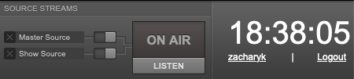

In the Master Panel, beneath the **ON AIR** indicator, you will find the **LISTEN** button.

This button opens a pop-up **Live stream** window, which enables you to monitor the streams that have been configured previously in the **Streams** page on the **System** menu. In the **Live stream** window, a drop-down menu enables you to switch between the streams which are currently available. Both the streaming server and name of the stream are shown. Your station logo is shown in the top left corner of the window, if you have uploaded one via the **Preferences** page on the **System** menu.

Beneath the drop-down menu for stream selection is an orange volume control bar. This volume control only adjusts the output level of the pop-up **Live Stream** window, not the output level of the LibreTime server itself. To adjust output level between muted and maximum, click on the corresponding place in the orange bar, with maximum level on the right side. Click on the left side speaker icon to mute the output. 

 

To display the URL of the stream you are monitoring, so that you can copy and paste it into an email or web page, click the **Share** button. Click the **X** icon to the right of the URL to return to the drop-down menu of available streams.

When you have finished monitoring the streams, you can close the pop-up window in the normal way, depending on the browser you are using. In Firefox, you can close the window by clicking the **X** button in the top right corner. This action will not shut down the output from the LibreTime server, only the stream monitoring on your desktop computer or laptop.
