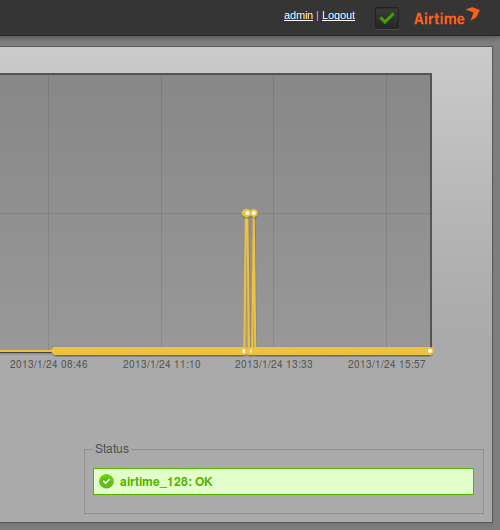

The Listener Stats page on the Analytics menu shows graphs of listener connections to the configured streaming servers for the selected date and time range.  On the right side, a green **Status** indicator shows **OK** if the connection to the streaming server is active.

If the status indicator is red, check that the **Admin User** and **Admin Password** settings are correct under **Additional Options** for the named mount point, such as *libretime\_128*, on the **Streams** page of the **Settings** menu.

By default, statistics for the last 24 hours of streaming are shown. To change this date and time range, click the calendar and clock icons in the lower left corner of the page, then click the magnifying glass icon.

To choose which particular streams should have statistics displayed, click the check boxes for the individual colour-coded mount points, just below the graph.

