***Beware, here be dragons!*** 

These Airtime instructions are outdated, see [install.md](../../install.md) for LibreTime instructions.

This installation method is intended for computers running Ubuntu or Debian GNU/Linux, and is the recommended method for production Airtime systems. If you have previously performed a manual installation of Airtime on the server, you should run the *airtime-uninstall* script to remove it before setting up the server for automated installation.

Set up repositories for Ubuntu
------------------------------

When installing on an Ubuntu server, a few of the packages that Airtime relies on are in the Ubuntu *universe* or *multiverse* repositories. If either of these repositories is disabled, you can enable them in the */etc/apt/sources.list* file, by opening the *nano* editor in your server's console. The *nano* editor should be installed by default, but if not, you can install it with the command:

    sudo apt-get install nano  

Then open the *sources.list* file with the command:

    sudo nano /etc/apt/sources.list

For an Ubuntu 10.04 Lucid server, find the lines which begin *deb* and end with *lucid universe* or *lucid-updates universe*, adding *multiverse* to the end of these lines, if it is not there already. Other versions of Ubuntu will have similar lines. The *multiverse* repository is required for the *libmp3lame0* library, which is an MP3 encoder. Later versions of Ubuntu, such as 12.04 Precise, have *libmp3lame0* in the *universe* repository.

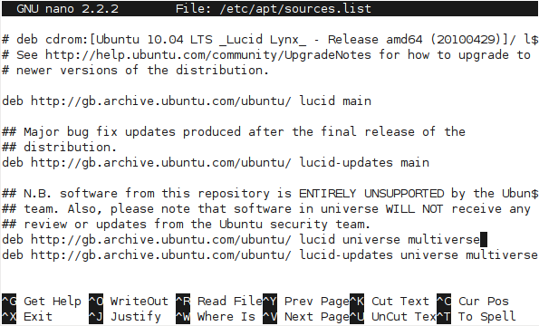

The exact repository mirror URLs in your *sources.list* file will differ from the above screenshot, depending on your location.

The Sourcefabric repository contains packages for Airtime, and any other packages which Airtime requires. To add the Sourcefabric repository to an Ubuntu Lucid server, scroll to the end of the *sources.list* file and add the following line:

    deb http://apt.sourcefabric.org/ lucid main

For Ubuntu 12.04 Precise, 12.10 Quantal, 13.04 Raring or 13.10 Saucy substitute *precise*, *quantal*, *raring* or *saucy* in place of *lucid* in the line above.

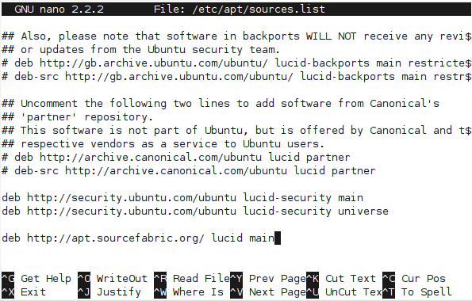

Press Ctrl+O (the Ctrl key and the letter O together) to save the file, then Ctrl+X to exit the nano editor.

Set up repositories for Debian
------------------------------

On a Debian squeeze or wheezy server, you can edit the */etc/apt/sources.list* file as root with the command:

    nano /etc/apt/sources.list

Packages for MP3 encoding are not included in the Debian squeeze repositories. If your server runs squeeze, you can obtain the necessary *libmp3lame0* package by adding the following repository to the end of the file:

    deb http://backports.debian.org/debian-backports squeeze-backports main

To add the Sourcefabric repository to a Debian squeeze server, add the following line to the end of the file:

    deb http://apt.sourcefabric.org/ squeeze main

or for Debian wheezy:

    deb http://apt.sourcefabric.org/ wheezy main

Press Ctrl+O (the Ctrl key and the letter O together) to save the file, then Ctrl+X to exit the *nano* editor.

Install the Sourcefabric signing key 
-------------------------------------

Reload the system's package list with:

    sudo apt-get update

You will see an error message about a missing public key.

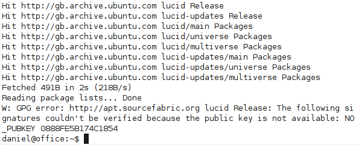

To fix this system error, you need to install the *sourcefabric-keyring* package, which contains the package signing key. This encryption key is a security measure which helps ensure that the Airtime packages you will be downloading in future have not been tampered with by a third party. You can install the key with the command:

    sudo apt-get install sourcefabric-keyring

When prompted, press the *y* key on your keyboard to install the *sourcefabric-keyring* package without verification. If you wish to verify the authenticity of the package signing key, please contact Sourcefabric for assistance.

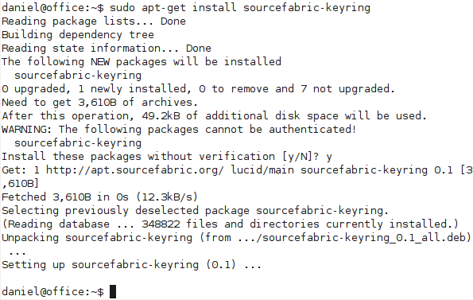

Update your computer's software sources again, to confirm that you are now using a trusted software repository:

    sudo apt-get update

You should no longer see the error message about the missing public key.

Install the database management system
--------------------------------------

Airtime uses a PostgreSQL database to keep track of media assets and associated metadata in its storage server. Depending on the scale of your Airtime installation and the hardware available, you may wish to install PostgreSQL on a separate server. If you only have one server, you can install the *postgresql* package on the same machine as Airtime with the command:

    sudo apt-get install postgresql

Install a streaming server
--------------------------

Optionally, you may wish to stream directly from Airtime to an **Icecast** media distribution server, without requiring a soundcard or mixer in the broadcast chain. This option is particularly suitable for fully automated stations, in which all shows are played out using Airtime. You can install the **icecast2** package on your server with the command:

    sudo apt-get install icecast2

In some scenarios, you may wish to stream from Airtime to a remote Icecast server, for example when Icecast is installed on a server in a data center with greater bandwidth available than an Airtime server located at your broadcast studio has. This separation may become necessary if your stream becomes popular, because each additional listener which connects to the Icecast stream uses additional bandwidth. In this case, you do not need to install the **icecast2** package on the same server as Airtime.

Before running Icecast on a remote server for the first time, you should change the default *&lt;source-password&gt;*, *&lt;relay-password&gt;* and *&lt;admin-password&gt;* values from *hackme* to something more secure. On more recent GNU/Linux distributions, such as Ubuntu 12.04 'Precise Pangolin' or later, you may be prompted for these settings during the installation of Icecast. If not, you can edit the Icecast configuration manually, with the command:

    sudo nano /etc/icecast2/icecast.xml

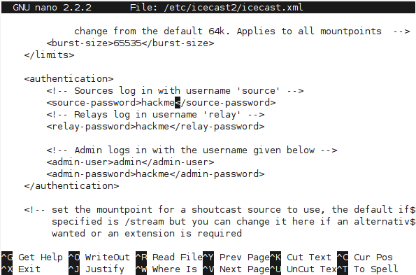

You should also set the value of *&lt;hostname&gt;* to the domain name of the Icecast server, for example:

    <hostname>icecast.example.com</hostname>

This step ensures that stream URLs are generated correctly by the Icecast server.

Save and close the *icecast.xml* file with Ctrl+O and Ctrl+X. Then check the Icecast server is set to start automatically when the server boots in the */etc/default/icecast2* file:

    sudo nano /etc/default/icecast2

The value of *ENABLE* should be set to *true* on the last line of that file:

    ENABLE=true

Save and close this file with Ctrl+O and Ctrl+X, then start Icecast:

    sudo service icecast2 start

The server should respond:

    Starting icecast2: Starting icecast2
    Detaching from the console
    icecast2.

Install Airtime
---------------

You can now install the Airtime package with:

    sudo apt-get install airtime

This command will install all of the Airtime components, plus any other packages that Airtime requires in order to run.

    Reading package lists... Done
    Building dependency tree
    Reading state information... Done
    Suggested packages:
      airtime-audio-samples
    The following NEW packages will be installed
      airtime
    0 upgraded, 1 newly installed, 0 to remove and 2 not upgraded.
    Need to get 8,446kB of archives.
    After this operation, 33.3MB of additional disk space will be used.
    Get: 1 http://apt.sourcefabric.org/ precise/main airtime 2.5.0-1 [8,446kB]
    Fetched 8,446kB in 8s (1,015kB/s)
    Preconfiguring packages ...
    Selecting previously deselected package airtime.
    (Reading database ... 657254 files and directories currently installed.)
    Unpacking airtime (from .../airtime_2.5.0-1_all.deb) ...

Once all the packages have been downloaded and installed, you will be asked a few questions about the configuration of the Airtime system. You can accept the default settings by pressing the **Enter** key, or use the **Tab** key to change your selection.

Firstly, you will asked if you wish to create an **Apache** virtual host web server configuration automatically.

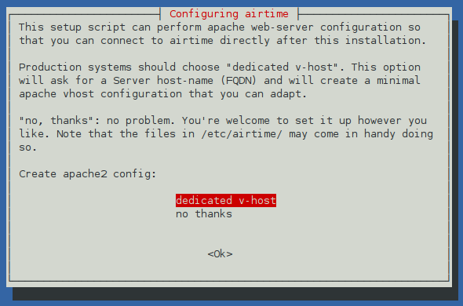

If so, you will need to enter the domain name that your station staff will use to access Airtime. This would normally be a fully qualified domain name (FQDN) which is already set up in DNS, or dynamic DNS, to point to the IP address of the Airtime server. For a test server that will only be accessed directly from the same machine, you can use the default setting of *localhost* here.

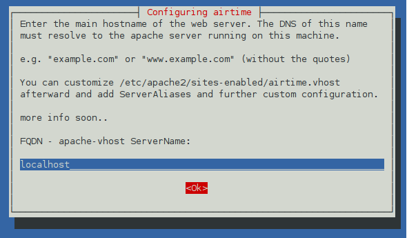

Next, set the contact email address of the server administrator, which is good practice in case of any server problems. For a test server, using an address at the *localhost* is acceptable.

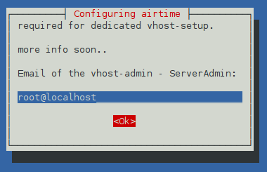

Debian and Ubuntu servers are set up with a default Apache configuration, which might block station staff from accessing Airtime. If you wish, this default configuration can be removed automatically for you.

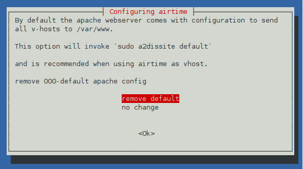

If you are installing Airtime and Icecast on the same machine, you can set the hostname and passwords for the Icecast server during the Airtime installation.

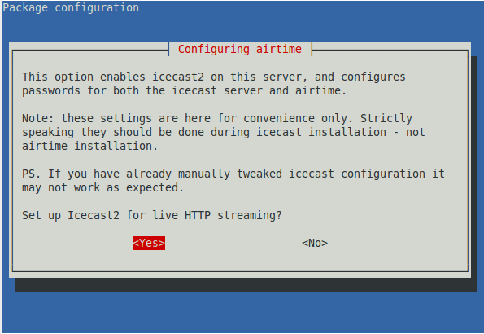

First, set the hostname of the Icecast server. For test installs in which you have Icecast installed on the same machine as Airtime, you can use *localhost* here.

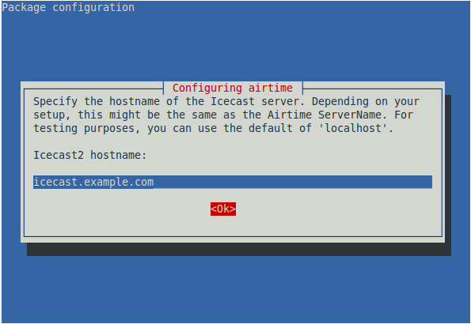

The security of your streaming server depends on the strength of the passwords that you choose. You should set strong passwords for *source*, *relay* and *admin* access.

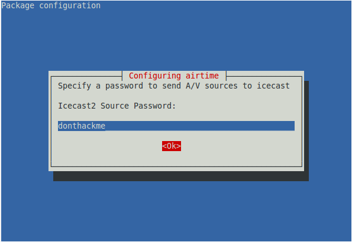

By default, Airtime stores media files under the path */srv/airtime/stor/* but you can specify an alternative path if you wish. If you change this setting, the new path must end with a slash. This main storage path is separate from the *watched folders* which are configured after installation, in the Airtime administration interface. See the chapter *Media Folders* for details of how to add watched folders.

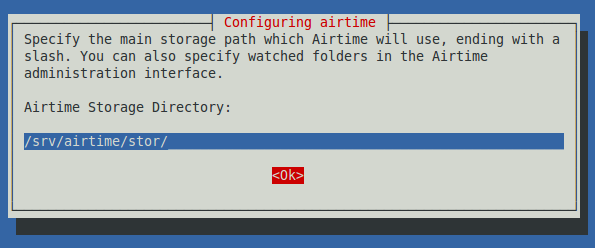

Finally, you have the option to set a more secure password for Airtime's *admin* user than the default of *admin*. You could change the password for the *admin* user later, in the Airtime administration interface, but this would mean that your installation would be insecure until you carried out that task.

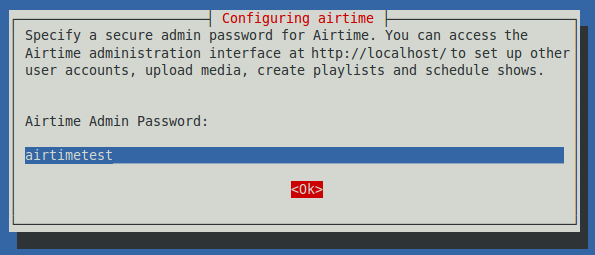

On some GNU/Linux distributions, you may be warned about upgrading the **rabbitmq-server** package, even if you have never installed this package before. If RabbitMQ is only being used by Airtime on your server, it is safe to press the **Enter** key to continue.

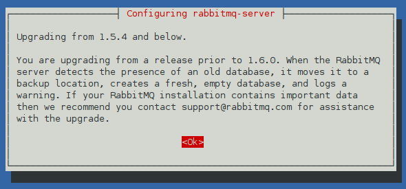

The Airtime installer will then run a script to check that your server environment is set up correctly.

    *** Verifying your system environment, running airtime-check-system ***
    AIRTIME_STATUS_URL             = http://airtime.example.com:80/api/status/format/json/api_key/%%api_key%%
    AIRTIME_SERVER_RESPONDING      = OK
    KERNEL_VERSION                 = 3.2.0-4-amd64
    MACHINE_ARCHITECTURE           = x86_64
    TOTAL_MEMORY_MBYTES            = 2963688
    TOTAL_SWAP_MBYTES              = 7812092
    AIRTIME_VERSION                = 2.5.1
    OS                             = Debian GNU/Linux 7.1 (wheezy) x86_64
    CPU                            = AMD Turion(tm) II Neo N40L Dual-Core Processor
    WEB_SERVER                     = Apache/2.2.22 (Debian)
    PLAYOUT_ENGINE_PROCESS_ID      = 4446
    PLAYOUT_ENGINE_RUNNING_SECONDS = 55
    PLAYOUT_ENGINE_MEM_PERC        = 0.5%
    PLAYOUT_ENGINE_CPU_PERC        = 0.4%
    LIQUIDSOAP_PROCESS_ID          = 4685
    LIQUIDSOAP_RUNNING_SECONDS     = 49
    LIQUIDSOAP_MEM_PERC            = 0.7%
    LIQUIDSOAP_CPU_PERC            = 7.4%
    MEDIA_MONITOR_PROCESS_ID       = 4410
    MEDIA_MONITOR_RUNNING_SECONDS  = 55
    MEDIA_MONITOR_MEM_PERC         = 0.5%
    MEDIA_MONITOR_CPU_PERC         = 0.0%
    -- Your installation of Airtime looks OK!

    ************ Install Complete ************

You should now be able to log in to the Airtime administration interface, as shown in the *Getting started* chapter. See the *Host configuration* chapter for advanced settings.

