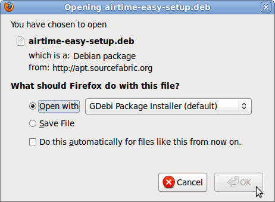
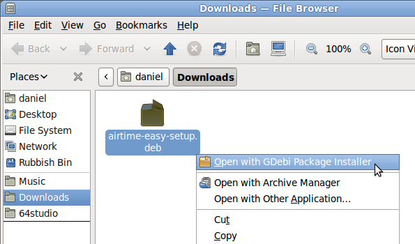
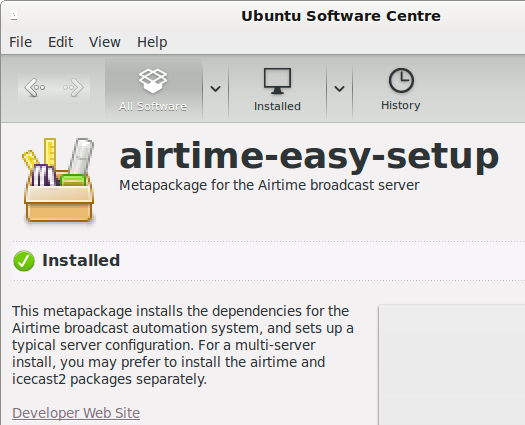
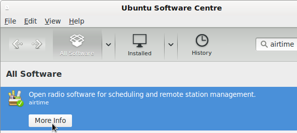

***Beware, here be dragons!*** 

These Airtime instructions are outdated, see [install.md](../../install.md) for LibreTime instructions.

The **airtime-easy-setup** package sets up a typical Airtime configuration without prompting you for any settings. You can then install the latest Airtime package from the Sourcefabric repository with a few clicks.

After that, the Airtime administration interface can be accessed at the default domain name of the computer (such as *http://airtime.example.com*). If you have not yet set a fully qualified domain name for the computer, you can use a URL such as *http://ubuntu/* on the localhost for testing purposes. Whichever domain name you use, the Icecast administration interface will be at port 8000 of the same URL (such as *http://airtime.example.com:8000*).

You can download the **airtime-easy-setup** package from <http://apt.sourcefabric.org/misc/airtime-easy-setup.deb> which is a link to the latest version of the package. You should stay connected to the Internet throughout the installation, as a number of dependency packages have to be installed from online repositories.

On Ubuntu 10.04 'lucid', Debian 6.0 'squeeze' or Debian 7.2 'wheezy', you can run the **airtime-easy-setup** ** package from your browser using the program **GDebi**.

 

If you have chosen to save the package to your computer instead, in the desktop file manager, right-click on the **airtime-easy-setup** ** package and select **Open with GDebi Package Installer**:

 

Or for an Ubuntu Lucid or Debian server without a desktop, you can use gdebi on the command line:

    sudo apt-get update
    sudo gdebi airtime-easy-setup.deb

If gdebi is not installed, you can run this command first:

    sudo apt-get install gdebi

Later versions of Ubuntu have replaced GDebi with the program **software-center**. On a desktop installation, right-click on the package and select **Open with Ubuntu Software Centre**. This desktop program can also be run from the command line, for example: 

    software-center airtime-easy-setup.deb

Any of the methods above should resolve package dependencies automatically.

Install Airtime
---------------

Once the installation of **airtime-easy-setup** has completed, you can install the latest Airtime package on a desktop system using your usual package manager, such as **Ubuntu Software Centre**, or **Synaptic** on Debian.

On a server, you can use the command:

    sudo airtime-easy-setup

Configure for production
------------------------

To convert a test installation into a production installation, you can run the command:

    sudo dpkg-reconfigure airtime

The **dkpg-reconfigure** command will run through the configuration steps shown in the *Automated installation* chapter, so that you can set the correct hostnames and passwords for your production Airtime server.
