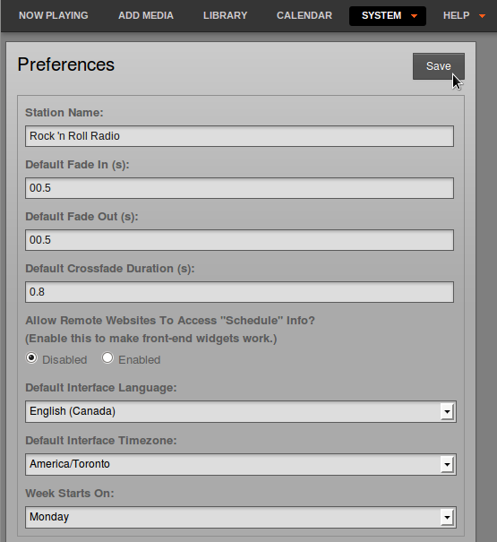

Airtime has a feature which enables your station's show and schedule information to be displayed on remote websites. This feature is included in Airtime because you would not usually invite the general public to access your Airtime server directly. If you had very large numbers of people requesting data from the Airtime server at once, the burst of network traffic might overload the server, potentially disrupting your broadcasts. If carried out maliciously, this network overload is known as a *denial of service attack*.

Instead, your public-facing web server can retrieve the schedule information from the Airtime API. This information can then be displayed on your broadcast station or affiliate websites by a content management system, such as Sourcefabric's **Newscoop** (<http://newscoop.sourcefabric.org/>). It can be presented using Javascript widgets and styled with CSS, in any format that you require. The **Broadcaster** theme for Newscoop (<https://github.com/newscoop/theme-Broadcaster>) integrates these widgets with ready-to-use styles.

There are two kinds of information that can be retrieved remotely from the Airtime API without authentication; the metadata for the current show plus the following show (live-info), or the schedule for the current week and the week ahead (week-info). The week-info metadata includes show names, times, and individual show URLs on your public website. That way, the audience for your station can click through from the schedule information to find out more about a particular show, or download a previous show recording that you might have made available.

If your Airtime server was accessible at https://airtime.example.com the live show information could be retrieved by your web server using this URL:

    https://airtime.example.com/api/live-info/?callback

The comma-separated text metadata returned to your web server might be something like this:

    ({"env":"production",
    "schedulerTime":"2013-07-03 14:07:31",

    "previous":{"name":"Earth, Wind &amp; Fire - Boogie Wonderland",
    "starts":"2013-07-01 22:53:00",
    "ends":"2013-07-01 22:55:00",
    "type":"track"},
    "current":{"name":"Deodato - Also Sprach Zarathustra",
    "starts":"2013-07-03 13:07:06",
    "ends":"2013-07-03 13:16:05",
    "media_item_played":true,
    "record":0,
    "type":"track"},

    "next":{"id":8,
    "instance_id":10,
    "name":"Rock Show",
    "url":"https:\/\/rock.example.com\/",
    "start_timestamp":"2013-07-03 14:00:00",
    "end_timestamp":"2013-07-03 15:00:00",
    "starts":"2013-07-03 14:00:00",
    "ends":"2013-07-03 15:00:00",
    "record":0,
    "type":"show"},

    "currentShow":[{"start_timestamp":"2013-07-03 14:07:00",
    "0":"2013-07-03 13:07:00",
    "end_timestamp":"2013-07-03 15:00:00",
    "1":"2013-07-03 14:00:00",
    "name":"Funk Show",
    "2":"Funk Show",
    "id":7,
    "3":7,
    "instance_id":9,"4":9,
    "record":0,
    "5":0,
    "url":"https:\/\/funk.example.com\/",
    "6":"",
    "starts":"2013-07-03 14:07:00",
    "7":"2013-07-03 13:07:00",
    "ends":"2013-07-03 15:00:00",
    "8":"2013-07-03 14:00:00"}],

    "nextShow":[{"id":8,
    "instance_id":10,
    "name":"Rock Show",
    "url":"https:\/\/rock.example.com\/",
    "start_timestamp":"2013-07-03 15:00:00",
    "end_timestamp":"2013-07-03 16:00:00",
    "starts":"2013-07-03 15:00:00",
    "ends":"2013-07-03 16:00:00",
    "record":0,
    "type":"show"}],

    "timezone":"BST",
    "timezoneOffset":"3600",
    "AIRTIME_API_VERSION":"1.1"})

The information for the current week's schedule could be retrieved using the URL:

    https://airtime.example.com/api/week-info/?callback

In this case, the metadata returned would be in a different format from the above example, something like the following. To keep the example short, this particular schedule export only contains four shows on a Monday. A full weekly schedule export would contain a great deal more text.

    ({"monday":[

    {"start_timestamp":"2013-07-01 12:05:00",
    "end_timestamp":"2013-07-01 13:00:00",
    "name":"Elvis Show",
    "id":2,
    "instance_id":2,
    "record":0,
    "url":"https:\/\/elvis.example.com\/",
    "starts":"2013-07-01 12:05:00",
    "ends":"2013-07-01 13:00:00"},

    {"start_timestamp":"2013-07-01 13:00:00",
    "end_timestamp":"2013-07-01 14:00:00",
    "name":"News",
    "id":3,
    "instance_id":4,
    "record":0,
    "url":"https:\/\/news.example.com\/",
    "starts":"2013-07-01 13:00:00",
    "ends":"2013-07-01 14:00:00"},

    {"start_timestamp":"2013-07-01 14:00:00",
    "end_timestamp":"2013-07-01 15:00:00",
    "name":"Funk Show",
    "id":4,
    "instance_id":6,
    "record":0,
    "url":"https:\/\/funk.example.com\/",
    "starts":"2013-07-01 14:00:00",
    "ends":"2013-07-01 15:00:00"},

    {"start_timestamp":"2013-07-01 15:00:00",
    "end_timestamp":"2013-07-01 17:30:00",
    "name":"Rock Show",
    "id":5,
    "instance_id":7,
    "record":0,
    "url":"https:\/\/rock.example.com\/",
    "starts":"2013-07-01 15:00:00",
    "ends":"2013-07-01 17:30:00"},

    ],

    "tuesday":[],
    "wednesday":[],
    "thursday":[],
    "friday":[],
    "saturday":[],
    "sunday":[],
    "AIRTIME_API_VERSION":"1.1"})

If you see the message *You are not allowed to access this resource* when attempting to display schedule information in your web browser, log in to the Airtime administration interface, click *System* in the main menu, then *Preferences*. Set **Allow Remote Websites To Access "Schedule" Info?** to **Enabled**, click the **Save** button, then refresh the browser window opened on the schedule export URL. If you do not wish to make schedule information available to the public, set this option to **Disabled** instead.

Caching schedule information
----------------------------

If the Airtime server is behind a firewall, or you want to protect the Airtime server from large numbers of schedule requests, you may wish to cache the schedule information on a public-facing or intermediate server. You can then create a firewall rule that only allows the schedule server to connect to the Airtime server, in addition to any remote users of the Airtime web interface.

Your system administrator can set up schedule caching on a standard Apache and PHP enabled web server with the *curl* program installed, using the following steps:

1. Create a shell script on the schedule server (schedule.example.com) that polls the remote Airtime server (airtime.example.com), and writes the metadata returned into a pair of local temporary files:

    sudo nano /usr/local/bin/airtime-schedule.sh

The content of this file should be like the following script, replacing airtime.example.com with the name of your Airtime server:

    #!/bin/sh

    curl -s "https://airtime.example.com/api/live-info/?callback=***" > /tmp/live-info

    curl -s "https://airtime.example.com/api/week-info/?callback=***" > /tmp/week-info

2. Make the script executable:

    sudo chmod +x /usr/local/bin/airtime-schedule.sh

3. Create an Apache VirtualHost configuration for the schedule server:

    sudo nano /etc/apache2/sites-available/schedule

containing a definition like the following, replacing *schedule.example.com* with the name of your schedule server:

    <VirtualHost *:80>
       ServerName schedule.example.com
       DocumentRoot /var/www/schedule/
    </VirtualHost>

4. In the schedule server's DocumentRoot folder, create the folders *api/live-info/* and *api/week-info/*

    sudo mkdir -p /var/www/schedule/api/live-info/
    sudo mkdir -p /var/www/schedule/api/week-info/

5. Create an index.php file in the *api/live-info/* folder:

    sudo nano /var/www/schedule/api/live-info/index.php

containing the following code:

    <?php
    $filename = '/tmp/live-info';  // define here the path and name of uploaded live-info file

    header('Content-Type: text/javascript');
    header("Expires: Thu, 01 Jan 1970 00:00:00 GMT");
    header("Cache-Control: no-store, no-cache, must-revalidate");

    $callback = empty($_GET['callback']) ? null : $_GET['callback'];
    $content = file_get_contents($filename);
    $content = str_replace('***', $callback, $content);
    echo $content;
    ?>

6. Create an index.php file in the *api/week-info/* folder:

    sudo nano /var/www/schedule/api/week-info/index.php

containing the following code:

    <?php
    $filename = '/tmp/week-info';  // define here the path and name of uploaded week-info file

    header('Content-Type: text/javascript');
    header("Expires: Thu, 01 Jan 1970 00:00:00 GMT");
    header("Cache-Control: no-store, no-cache, must-revalidate");

    $callback = empty($_GET['callback']) ? null : $_GET['callback'];
    $content = file_get_contents($filename);
    $content = str_replace('***', $callback, $content);
    echo $content;
    ?>

7. Enable the new configuration and reload the Apache web server:

    sudo a2ensite schedule
    sudo /etc/init.d/apache2 reload

8. Create a cron job to run the shell script each minute:

    sudo nano /etc/cron.d/airtime-schedule

containing the line:

    * * * * * www-data /usr/local/bin/airtime-schedule.sh

The schedule server will now be serving the same show information as the Airtime server, with a cache lifetime of one minute. You can adjust the cache lifetime by altering the frequency of the cron job that polls the Airtime server.

Pushing schedule information via FTP or SSH
-------------------------------------------

If there is no inbound access to the Airtime server at all, an FTP script can be used to push cached schedule data from Airtime to an external web server. The standard ftp command should be available on the Airtime server and the external web server should have a suitably restricted FTP account set up. After following steps 1 and 2 above to export schedule data to a pair of temporary files on the Airtime server, create a new script on the Airtime server to automatically make the upload:

    sudo nano /usr/local/bin/upload-schedule-data.sh

Replace host, user and password values with appropriate values for your external web server:

    #!/bin/sh
    HOST='website.example.com'
    USER='ftp_user'
    PASSWD='ftp_password'

    ftp -n -v $HOST << EOT
    user $USER $PASSWD
    ascii
    prompt
    put /tmp/airtime-week-info
    put /tmp/airtime-live-info
    bye
    EOT

Then make the new script executable and create a cron job to launch it every minute, as in step 8 above. Steps 3 to 7 above should be carried out on the external web server so that it can convert the two temporary files uploaded via FTP into public schedule data.

If you have secure shell access (SSH) to the remote web server, you could write a script to use the secure copy command (scp) instead of ftp.

Website widgets
---------------

Example HTML, Javascript and CSS code for your public website are provided in the *widgets* folder of the Airtime installation tarball, or on GitHub: <https://github.com/sourcefabric/Airtime/tree/master/widgets>

If you have performed an automated installation on Debian or Ubuntu, the widgets can be found in the */usr/share/doc/airtime/examples/* directory.

For the widgets to work on a typical web server, links to the Javascript and CSS code have to be included in the HTML page &lt;head&gt; element, like the following example:

    <head>
     <meta http-equiv="Content-Type" content="text/html; charset=utf-8" />
      <title>Airtime widgets</title>
       
       
       
      <link href="css/airtime-widgets.css" rel="stylesheet" type="text/css" />
    </head>

A full example is shown in the *widgets/sample\_page.html* file in the Airtime installation tarball, on GitHub, or in the */usr/share/doc/airtime/examples/* directory if you have installed the Debian/Ubuntu package of Airtime.

The following code is for a small *airtimeLiveInfo* widget that displays information about the current show (show time elapsed, and show time remaining), as well as some information about the next show (start time and end time). In this example, the label text for *onAirNow* is translated into French for local language support:

     

The &lt;script&gt; element above would typically be added to the page's &lt;head&gt; element. You would then add a &lt;div&gt; element to the &lt;body&gt; element of the page to hold the widget, such as:

    

On the public website, this widget can be made to look like the following screenshot:

 

The CSS properties *color:* and *text-transform:uppercase* have been used to style the *onAirNow* label. There is a full example CSS file *widgets/css/airtime-widgets.css* in the Airtime installation tarball, GitHub repository, or */usr/share/doc/airtime/examples/* directory on Debian/Ubuntu.

A variation on this widget displays the item being played out, rather than the show names:

    

The id of the &lt;div&gt; element in the page body would have to be updated to match:

    

The next widget *airtimeShowSchedule* is medium sized, and displays the upcoming show schedule for that day.

    

Again, the id of the &lt;div&gt; element has to match the script for the widget to appear:

    

The output from the widget script above can be styled to look like this screen shot:

Finally, the following code creates a large widget *airtimeWeekSchedule* that enables site visitors to browse through the show schedule for that week. In this example, all widget labels have been translated into French:

    

The &lt;div&gt; element for this widget would be:

    

Using the code above and the CSS and image files provided with Airtime, the weekly schedule can be styled to look like this:

Optionally, you can display the schedule for the week ahead, as well as the current week. This requires the Javascript file *jquery.showinfo.js* supplied with Airtime 2.5.0 or later, where the value of the variable *dow* (for days of the week) includes fourteen rather than seven days:

    var dow = ["monday", "tuesday", "wednesday", "thursday", "friday",
               "saturday", "sunday", "nextmonday", "nexttuesday", 
               "nextwednesday","nextthursday", "nextfriday",
               "nextsaturday", "nextsunday"];

In that case, the labels for the days of the week could be configured as follows:

    dowText: {monday:"Monday", tuesday:"Tuesday", wednesday:"Wednesday",
              thursday:"Thursday", friday:"Friday", saturday:"Saturday",
              sunday:"Sunday", nextmonday:"Next Monday",
              nexttuesday:"Next Tuesday", nextwednesday:"Next Wednesday",
              nextthursday:"Next Thursday",nextfriday:"Next Friday",
              nextsaturday:"Next Saturday", nextsunday:"Next Sunday"},

The value of **sourceDomain** in the code examples above should match the URL that you wish to serve schedule information to the public from. If you have used the *Caching schedule information* method detailed above, this would be the URL of your schedule server, not the Airtime server directly.
