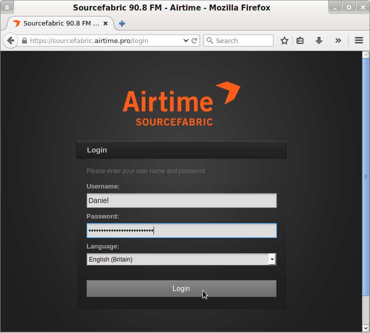
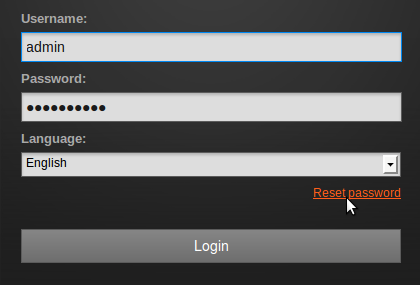
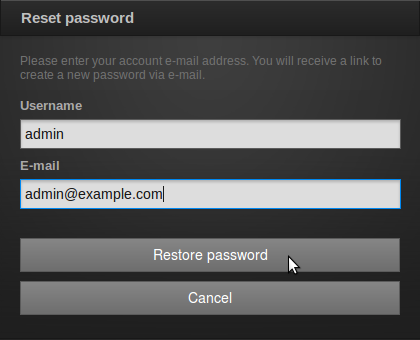
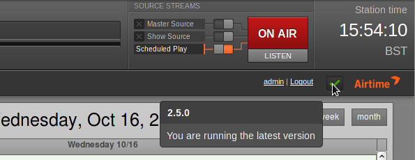

# Getting Started

If the server is only being used for LibreTime and has a web browser installed,
you can access the administration interface directly on that server by opening
the address:

    http://localhost/

If you have set up LibreTime so that it can be accessed from other computers,
you would use a domain name instead. For example:

    https://libretime.example.com/

You can log in for the first time with the user name *admin* and the password
*admin*. Your browser should automatically focus on the
**Username** field.

You will see a link **Reset password** below the password field, which enables
users to obtain a password reminder by email. You will need to have a
mailserver configured to work with PHP for this to work. There is an issue open
to add documentation for this
([#724](https://github.com/LibreTime/libretime/issues/724)).

 

The **E-mail** address you enter must match the address stored in the database
for your **Username**.

The Master Panel
----------------

The **Master Panel** is present at the top of every page of the LibreTime
interface. On the left hand side, the Master Panel displays the details of the
**Previous** file played out, the current file playing (with an orange progress
bar and time elapsed/time remaining), and the details of the **Next** file due
to play. It also displays the name and scheduled time of the current show, with
a blue progress bar.

Beneath this side of the Master Panel is the main navigation menu. We'll be
looking at the contents of these menus in the following chapters of this book.

On the right hand side of the Master Panel are the switches for the **Source
Streams**, which enable you to switch from scheduled play to remote live
sources, and back. (See the chapter *Stream settings* for details of this
feature). The **On Air** indicator turns from dark grey to red whenever audio
is being played out. Underneath this indicator is a **Listen** button, which
opens a pop-up player that can be used to audition the available playout
streams.

There is also a clock indicating the **Station time** and time zone. Beneath
the clock and just to the left, the name of the user currently logged in is
displayed, and there is the link for you to **Logout**. 

Clicking the username link opens a page in which you can update your LibreTime
password, contact details, language and time zone preferences. Click the
**Save** button once you have made the changes that you require.

On the right of the Logout link, clicking the green check mark opens a pop-up
window with information about the version of LibreTime installed. If your
LibreTime installation is not the latest version available, the green check
mark changes to a green upgrade arrow. Should your LibreTime installation get
too far out of date, this arrow will change to a red exclamation mark.

Checking an Icecast server
--------------------------

If you have installed an Icecast streaming media server, you can check that
Icecast is running by opening its default server port of 8000 in your web
browser. For example, on the server itself, you can use:

    http://localhost:8000

or from another machine, using the domain name of the Icecast server:

    http://streaming.example.com:8000

You should see the Icecast status page, with details of any connections that
your LibreTime server has made to this Icecast server. If you have only just
installed LibreTime, there may not be any media playing out yet.

