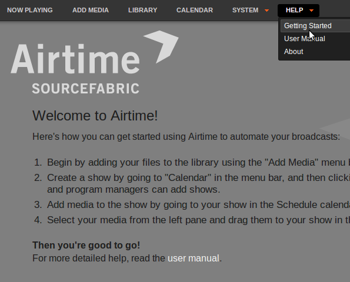

The first entry on LibreTime's **Help** menu offers a **Getting Started** guide
for new users. Further down, there is also a link to the online version of this
  **User Manual**.

You can visit the LibreTime online support forum at
<https://discourse.libretime.org/c/get-help> to ask for help from the community
regarding your LibreTime setup.

Bug reporting
-------------

LibreTime needs your input to improve. If you think you've found a bug, please
visit <https://github.com/LibreTime/libretime>. Create a bug report by selecting
**Issues**, then **New Issue**. That way, the LibreTime team can keep track of
your problem and notify you when it has been fixed. You can also suggest
improvements and new features for LibreTime on that site.

Other help
----------

The UNESCO publication [*Community Radio - A user's guide to the technology*](static/CommunityRadioUserGuide.pdf)
features a very comprehensive guide to setting up a community radio station.
This guide is aimed at people thinking about setting up a radio station in
India, but includes lots of practical advice that would be useful in any
country.
