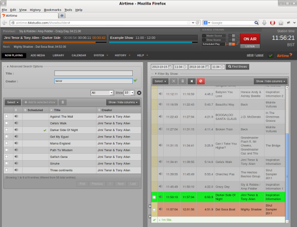
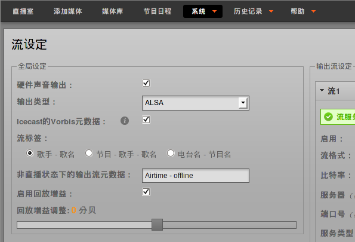

# What is LibreTime?

[LibreTime](http://libretime.org/ "LibreTime homepage") is the open broadcast
software for scheduling and remote station management. Web browser access to
the station's media library, multi-file upload and automatic metadata import
features are coupled with a collaborative on-line scheduling calendar and
playlist management. The scheduling calendar is managed through an easy-to-use
interface and triggers playout with sub-second precision.

LibreTime has been intended to provide a solution for a wide range of broadcast
projects, from community to public and commercial stations. The scalability of
LibreTime allows implementation in a number of scenarios, ranging from an
unmanned broadcast unit accessed remotely through the Internet, to a local
network of machines accessing a central LibreTime storage system. LibreTime
supports the playout of lossy compressed audio files in both MP3 and AAC
formats and the open, royalty-free equivalent
[Ogg Vorbis](http://www.vorbis.com/ "Ogg Vorbis homepage"). It also supports
playout of lossless FLAC and WAV format audio files.

LibreTime manages the [Liquidsoap](http://savonet.sourceforge.net/) stream
generator at the heart of the system. Liquidsoap generates streams from files
in the LibreTime library and any remote input streams that you specify.
Available stream output formats include Ogg Vorbis, Ogg Opus, MP3, and AAC. The
library is indexed in a [PostgreSQL](http://www.postgresql.org/) database to
enable searching. Live shows can be recorded automatically with
[Ecasound](http://eca.cx/ecasound/ "Ecasound homepage"), using the sound card
line input. News editors, DJs and station controllers can use LibreTime to
build playlists or smart blocks and manage media files (upload, edit metadata,
manage advertisements) at the station or via the Internet.

The LibreTime administration interface is designed to work with any web
browser, on any desktop or mobile platform with a minimum display size of
1280x768 pixels. LibreTime looks its best on a high definition display of
1920x1080 pixels. The recommended web browsers are **Mozilla Firefox 25** or
**Google Chrome 30** (or later versions). **Apple Safari 6** (or later) is also
supported.

International UTF-8 metadata in media files is supported throughout, and the
LibreTime interface can be localized into any language or dialect using the
standard GNU gettext utility. Localizations that are installed by default
include Austrian, Brazilian, British, Canadian, Chinese, Czech, French, German,
Greek, Hungarian, Italian, Korean, Polish, Russian, Spanish and USA. See the
chapter *Interface localization* for details of how to update a translation or add a new localization.

The scheduler in LibreTime has a calendar view, organized by months, weeks and
days. Here the program editors can schedule playlists and shows for their
broadcast station. In some scenarios, the transmitter is situated outside the
reach of the broadcaster and all program management has to be maintained
through the web interface. Possible reasons for this scenario might be of a
pragmatic nature (running many stations from one central office due to limited
human resources) or an emergency (running a transmitter in a crisis area
without putting staff at risk).

LibreTime workflow
----------------

This typical workflow is intended to clarify the difference between the various
components that make up a complete LibreTime system. 

1. There are media files on a storage server, which include metadata in their
tags (title, creator, genre and so on). This storage server might be accessed
directly via studio workstations on the local network.

2. The LibreTime media-monitor keeps track of files being added, renamed, moved
or removed from storage, and reads their metadata using the Mutagen library.

3. A PostgreSQL database contains the location of those media files and their
metadata. This means you can search for and playlist a set of media files
according to the specific metadata that you require, or use a 'smart block' to
select the files for you. The database also contains details of specified
remote input streams.

4. Pypo, the Python Playout engine, downloads media from the storage up to 24
hours ahead of playout and checks it for average level (with ReplayGain tools)
and leading or trailing silence (with Silan). At playout time, the media to be
broadcast is sent to Liquidsoap.

5. Liquidsoap takes individual media files and remote input streams, and
assembles them into a continuous output stream. This stream can be sent to a
sound card (e.g. for a broadcast mixer, on the way to an FM or DAB transmitter)
or to a streaming server for IP network distribution, over the LAN, local WiFi
or the Internet. You can stream to a sound card and up to three different
stream distribution servers with the same LibreTime server, if you wish.

6. Icecast (<http://www.icecast.org/>) is the default stream distribution
server, and there is also support for SHOUTcast
([http://www.shoutcast.com](http://www.shoutcast.com/ "Shoutcast homepage")),
but in theory you could stream from Liquidsoap to any online service. If a
suitable Liquidsoap output is not available for your streaming service of
choice, you can send audio from Liquidsoap to a separate encoding or
streaming machine via a sound card or relay stream.

7. Monit monitors the health of pypo, media-monitor and Liquidsoap, and
reports the status of these services to LibreTime.

8. RabbitMQ pushes messages from LibreTime to media-monitor and pypo about
changes to media files and the playout schedule.

9. LibreTime manages all of these components, and provides an easy,
multi-user web interface to the system. It enables your station staff,
depending on the permissions you have granted them, to:

a) upload media files to the storage server via the **Add Media** page

b) automatically import file metadata into the PostgreSQL database

c) search for and download media files, and edit the metadata of individual
files, if required, on the **Library** page

d) create and edit playlists of media files or create smart blocks of content
based on metadata, edit cue points and fades, and audition them. Playlists and
smart blocks are also saved in the database, and can be searched for

e) schedule colour-coded broadcast shows (which can contain playlists, smart
blocks, pre-recorded complete shows, timed remote input streams, or be live)
for specific dates and times on the **Calendar** page. Regular shows can be
scheduled by the day of the week or month, and can be linked to share content

f) automatically record live shows at specific times and dates (in 256 kbps Ogg
Vorbis format by default) from the sound card input with Ecasound, upload them
to the storage server and import them into the database

g) manage presenter, staff and guest access to LibreTime, and contact details,
via the **Manage Users** page

h) see what is about to be played by Liquidsoap on the **Now Playing** page,
with support for last-minute changes to the content

i) upload media files from LibreTime to a third-party hosting service, such as
SoundCloud

j) audition available output streams from the server using the **Listen**
button

k) check the status and resource usage of system components on the **Status**
page

l) export the broadcast schedule to external sites via the Schedule API

m) see logs on the **Playout History** page and view graphs on the
**Listener Stats** page

n) configure the LibreTime system on the **Preferences**, **Media Folders** and
**Streams** pages.

Example studio broadcast system
-------------------------------

In the diagram of an FM radio station below, LibreTime is hosted on a server
connected to the local network, with direct soundcard access. Liquidsoap
outputs streams to both the transmitter, via the main studio mixer, and
streaming media servers. The machine running LibreTime is behind a firewall
because it is also connected to the Internet for remote access by media
contributors. This enables LibreTime to offer password-protected access to the
media library and scheduling from both inside and outside the studio building.

Example web broadcast system
----------------------------

In the diagram below, LibreTime is hosted on a remote web server, and has no
soundcard. There does not need to be a centralised studio, although LibreTime
can enable remote studios to stream in to Liquidsoap at authorised times.
Optionally, the outgoing Icecast stream can be relayed to a transmitter.

