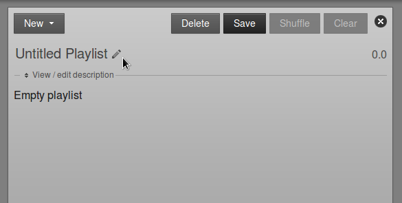
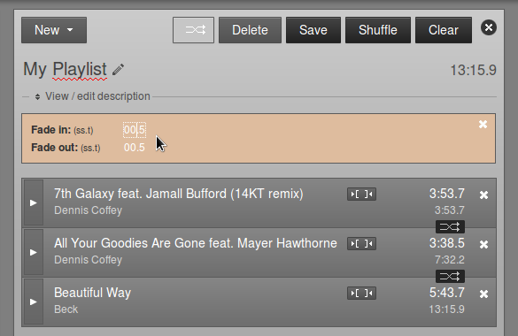
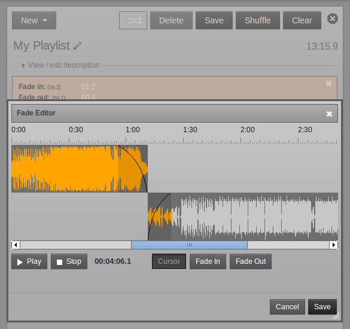
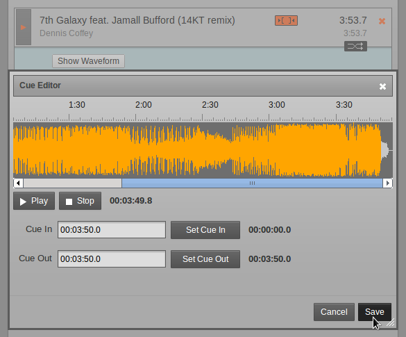
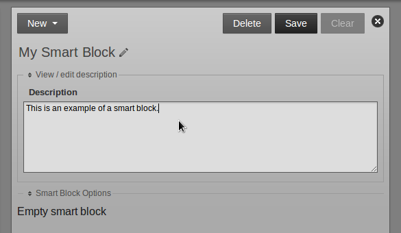
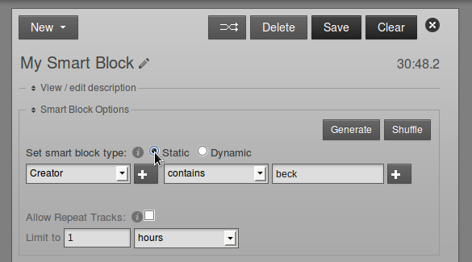
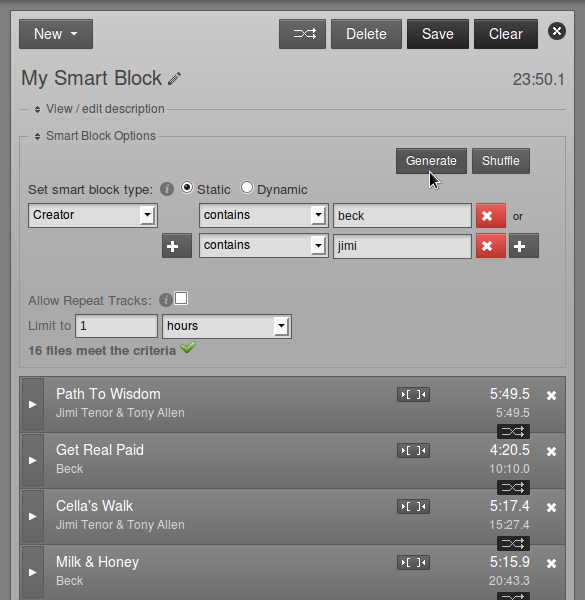
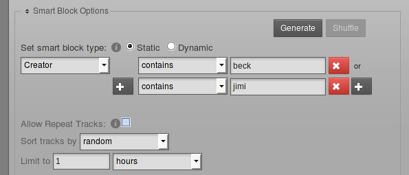

This page of the Libretime interface enables you to search the media library, sort and display the search results by the criteria that you choose, audition library items, and drag and drop those items into a playlist. You can also adjust fade and cue points, create smart blocks (automatically generated playlists), or add incoming web streams to the library. The **Library** page is not visible to *Guest* users.

Searching the library
---------------------

The search features on the left side of the **Library** page are the same as those available on the **Now Playing** page. Refer to the chapter *Now Playing* for details.

Creating a new playlist
-----------------------

Once you have found the media that you require using the search tools, you can create a new playlist on the right hand side of the **Library** page. If it is not already open, click the **Open Media Builder** button to begin.

Then click the **New** button and select **New Playlist** from the pop-up menu.

At first, the new playlist will be shown as *Untitled Playlist*. Click the pencil icon on the right to give the playlist a name.

Type the name you have chosen, then press the **Enter** key on your keyboard to save the new name. You can edit the name of the playlist later, by clicking on the pencil icon again.

Click the link **View / edit description** to expand a box where you can enter a **Description** for the playlist, then click the **Save** button. Setting good quality metadata here will help you find the playlist using the search box later, so you should be as descriptive as possible.

Adding content to a playlist
----------------------------

With a playlist open, click on an item in the search results and then click **Add to Playlist** on the pop-up menu. Or drag and drop items from the search results on the left into the playlist on the right. Jingles and voice tracks can be added before, after or between music items.

You can also select or deselect a whole page of search results using the **Select** button, just below the simple search field. Alternatively, use the checkboxes in the first column of the search results table to select individual items, then click the **Add to current playlist** button. Items that you own which you no longer require can be deleted from Libretime's library using the **Trashcan** button. 

After adding files to the playlist, the total playlist time is displayed in the top right corner. The duration of an individual file is shown in each row of the playlist in a white font, and beneath this figure the time since the beginning of the playlist is displayed in a smaller light grey font. This elapsed time figure can be used as a time check for voice tracks, although this option may limit the re-usability of the voice track.

To audition a playlist file in your web browser, click the white triangle**** button on the left side of its row. (If the format of the file is not supported by your browser, the triangle in this button will be greyed out). If audition of the file format is supported, a pop-up window will open, with the playlist starting at the file you clicked.

Click the small white **x** icon on the right hand side of each row to remove a file from the playlist. You can also drag and drop files to re-order them, or click the **Shuffle** button to re-order files automatically. Click the **Clear** button to remove all content from the playlist, or click the **Delete** button to remove the playlist from the Libretime library altogether.

To adjust start and end fades, click the playlist **Fade** button (two horizontal white arrows crossing in a grey rectangle), to the left of the **Delete** and **Save** buttons. This action opens a beige bar in which you can set the **Fade in** duration for the first item in this playlist, and the **Fade out** duration for the last item. This duration figure represents the length of the fade, in seconds and tenths of a second, not the time at which the fade takes place. The default fade duration is set in the **Preferences** page on the **System** menu.

Click any one of the smaller **Fade** buttons between file rows to open another beige bar, which enables you to set **Fade out** and **Fade in** durations between two adjacent files in the playlist. The fade buttons for adjacent files change to an orange background when you click them.

If your web browser supports the Web Audio API, you will see a **Show Waveform** button which enables you to view the waveforms of the adjacent items, adjust the fades and audition them. Click the **Fade Out** or **Fade In** button to change the fade curves by clicking in the waveforms, then click the **Play** button to audition the effect of any adjustment you have made. To audition just one part of the item, use the **Cursor** button to move the play cursor, which appears as a thin red line, on the waveform. The playback progress is shown by an orange colour on the waveform.

Each file in the playlist also has a button with two square brackets, which enables you to adjust **Cue In** and **Cue Out** times for that particular file. Like the fade button, the cue button changes to an orange background when you click it.

**Cue In** and **Cue Out** points are set in hours, minutes, seconds and tenths of a second, relative to the start of the item. If a file has leading or trailing silence, corresponding cue points will be set automatically. The duration of the file in the playlist is updated automatically when you adjust a cue point, but the **Original Length** of the file is also displayed for your reference.

If a **Fade In** and **Cue In** are set on the same item in the playlist, the fade in begins at the **Cue In** point. If a **Fade Out** and **Cue Out** are set on the same item, the fade out ends at the **Cue Out** point. If your web browser supports the Web Audio API, you can click the **Show Waveform** button to adjust and audition cue points.

When your playlist is complete, click the **New** button in the top left corner to create another playlist, click the close icon (a white cross in a black circle) in the top right corner, or browse to another page of the Libretime interface.

If you want to edit the playlist content or metadata later, you can find it by **Title**, **Creator**, **Last Modified** date, **Length**, **Owner** or **Year** using one of the search tools on the Library page. Click the playlist in the search results list, and then click **Edit** from the pop-up menu. You can also **Preview** the entire playlist in a pop-up audition window, **Duplicate** or **Delete** one of your playlists from this menu.

Creating a smart block
----------------------

Smart blocks are automatically filled with media files from the Libretime library, according to the criteria that you specify. This feature is intended to save staff time, compared to selecting items for a playlist manually.

To create a smart block, click the **New** button on the right side of the Library page, and select **New Smart Block** from the pop-up menu. Like a playlist, smart blocks can have a title and **Description**, which you can edit. This helps you find relevant smart blocks in searches.

Click the link **Smart Block Options** to display the criteria and modifiers for the smart block. The criteria can be any one of Libretime's metadata categories, such as **Title**, **Creator** or **Genre**. The modifier depends on whether the metadata in question contains letters or numbers. For example, **Title** has modifiers including *contains* and *starts with*, whereas the modifiers for **BPM** include *is greater than* and *is in the range*.

You can also set the **smart block type**. A **Static** smart block will save the criteria and generate the block content immediately. This enables you to edit the contents of the block in the **Library** page before adding it to a show. A **Dynamic** smart block will only save the criteria, and the specific content will be generated at the time the block is added to a show. After that, the content of the show can be changed or re-ordered in the **Now Playing** page. 

Click the **plus button** on the left to add OR criteria, such as **Creator** containing *beck* OR *jimi*. (The criteria are not case sensitive). For a static smart block, click the **Generate** button to see the results. Dynamic smart blocks do not display the **Generate** or **Shuffle** buttons.

If you don't like the ordering which is generated, click the **Shuffle** button, or drag and drop the smart block contents into the order that you prefer. You can also remove items or add new items manually from the Library. Changes to static smart block contents are saved automatically when you add items, remove or re-order them, or click the **Generate** button. Click the **Save** button in the upper right corner to save any changes to smart block criteria.

To add an AND criteria, such as **Creator** containing *jimi* AND BPM in the range *120* to *130*, click the **plus button** on the right. If you see the message **0 files meet the criteria** in this case, it might mean that the files in the Library have not been tagged with BPM metadata. See the chapter *Preparing media for ingest* for tips on tagging content.

By default, a smart block will not contain repeated items, which will limit the duration of the block if you do not have sufficient items meeting the specified criteria in your **Library**. To override the default behaviour, check the **Allow Repeat Tracks** box. The **Sort tracks by** menu offers the options of **random**, **newest** or **oldest** items first.

In addition Smart Blocks by default will never overflow the Time Limit. For instance if you set a time limit of 1 hour. It will add tracks to the schedule until it can't add any more tracks without exceeding the hour. This is to prevent tracks from being cut-off because they exceed the time limit of a show. 

If you want a smartblock to schedule tracks until it is longer than the Time Limit you can check "Allow last track to exceed time limit". This will make LibreTime add tracks that meet the criteria until it equals or is longer than the time limit. The was the default behaviour with the Libretime software.

If you have a large number of files which meet the criteria that you specify, you may wish to limit the duration of the smart block using the **Limit to** field, so that it fits within the show you have in mind. Select **hours**, **minutes** or **items** from the drop-down menu, and click the **Generate** button again, if it is a static smart block. Then click the **Save** button.

Smart blocks can be added to shows in the same way as a manually created playlist is added. Smart blocks can also be added to one or more playlists. In the case of a playlist containing a static smart block, click **Expand Static Block** to view the contents. For a dynamic smart block, you can review the criteria and duration limit by clicking **Expand Dynamic Block**.

Once created, smart blocks can be found in Library searches and refined at any time. They can be re-opened by clicking on the smart block and selecting **Edit** from the pop-up menu.

Adding a web stream
-------------------

A web stream URL and metadata can be added to the Libretime library, so that a remote stream can be searched for and scheduled to be *pulled* into a show. For example, at the top of the hour your station may pull a news report from journalists working in another studio. This is a different concept from **Master Source** and **Show Source** remote streams which are *pushed* into the Libretime playout schedule.

To add a web stream, click the **New** button on the right side of the Library page, and select **New Webstream** from the pop-up menu. Like a playlist, web streams in the Library can have a title and **Description**, which may help you find them in searches later.

The **Stream URL** setting must include the *port number* (such as 8000) and *mount point* (such as remote\_stream) of the remote stream, in addition to the streaming server name. A **Default Length** for the remote stream can also be set. If the stream is added at the end of a show which becomes overbooked as a result, it will be faded out when the show ends.
