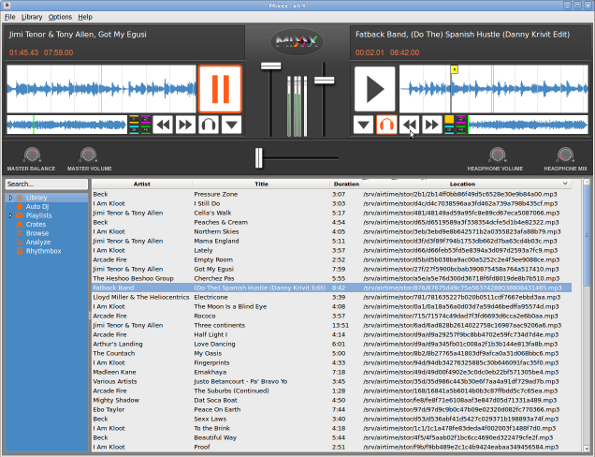

Live shows with Mixxx
=====================

Mixxx is a cross-platform Open Source application for DJs, available from <http://www.mixxx.org/>

Installed on a desktop or laptop computer, Mixxx complements your Airtime server to provide a complete system for both live and scheduled broadcasting. Although Mixxx has many features designed for dance music DJs that require beat matching and pitch independent time stretching, the program can be used for any kind of manually triggered broadcast playout, including live speech shows such as news or current affairs.

Mixxx supports a wide variety of popular hardware control surfaces, which can be connected to your computer using a USB cable. A control surface might replace or augment an analogue mixer in your studio, depending on your live mixing and playout requirements.

Sound cards
-----------

If your computer does not have a four-channel audio interface to provide a cue output or separate mixer outputs, you can configure Mixxx to use additional stereo sound cards or USB devices by clicking **Options**, **Preferences**, then **Sound Hardware** in the main Mixxx menu. Select a device other than the default ** for the **Headphones** output, or select separate devices for **Deck** outputs. Then click the **OK** button.

For performance and redundancy reasons it is advisable to cache files required for a particular show on the client machine where Mixxx is installed. For example, a nightly**** download of new media in the archive would guard against network problems at playout time potentially disrupting a broadcast at a remote studio.

Mixxx users can also record a show, and then upload it through the Airtime web interface for collaborative or user-generated broadcasts.

Streaming from Mixxx into Airtime
---------------------------------

Mixxx 1.9.0 or later includes a live streaming client which, like Airtime, is compatible with the **Icecast** and **SHOUTcast** media servers. This feature can also be used to stream from Mixxx directly into Airtime, using either the **Show Source** or **Master Source**.

To configure **Mixxx** for streaming into Airtime, click **Options**, **Preferences**, then **Live Broadcasting** on the main Mixxx menu. For server **Type**, select the default of **Icecast 2**. For **Host**, **Mount**, **Port**, **Login** and **Password**, use the **Input Stream Settings** configured in the Airtime **Streams** page, on Airtime's **System** menu. See the chapter *Stream settings* for remote input connection details.

Airtime skins for Mixxx
-----------------------

Airtime-themed skins for Mixxx, designed with broadcast users in mind, are available for download from <https://github.com/Airtime/MixxxSkins>

These skins provide a simplified interface for live broadcasting which do away with EQ, flange effect, looping and other features required by dance music DJs. Instead, the emphasis is on a clear and uncluttered interface which does not require large mouse movements to operate the most important controls. There are versions available both with and without pitch/tempo controls for beat matching.

After downloading one of the skins, extract the zip file and copy it to the *skins* directory on the computer where Mixxx is installed. For example, on Debian or Ubuntu:

    unzip Airtime1280x1024_skin_for_Mixxx.zip
    sudo cp -r Airtime1280x1024 /usr/share/mixxx/skins/

Then, start Mixxx and select the Airtime skin by clicking **Options**, **Preferences**, then **Interface** in the Mixxx main menu.

 

