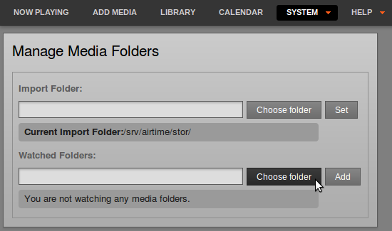
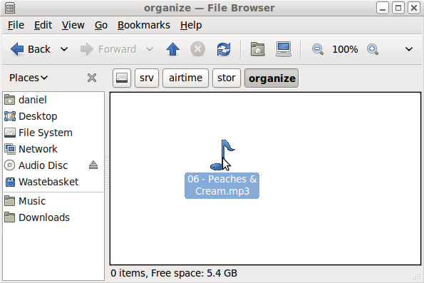
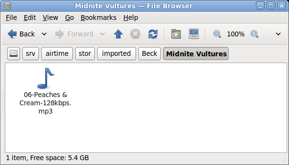
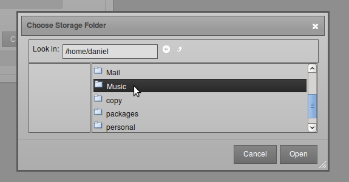
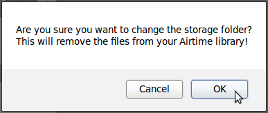
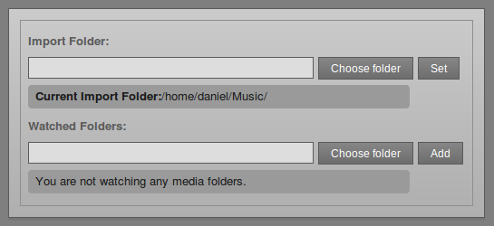
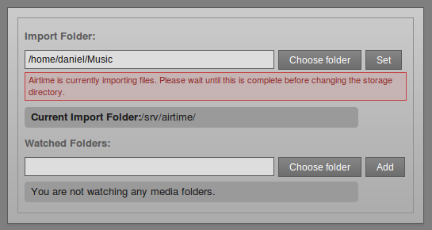
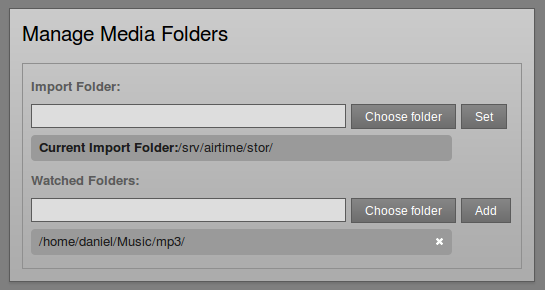
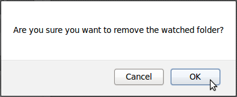

Airtime's media library is inside the */srv/airtime/stor/* folder on your server, by default. 
# This functionality is not currently supported by LibreTime 3.x
See [Libretime-import](../libretime-import) for an alternative filesystem based import service developed for LibreTime

In **Media folders** on the **System** menu, you can change this default location, or add extra folders to be watched by Airtime.

If you specify a network drive as a media folder and that network becomes disconnected for any reason, Airtime's **media monitor** will flag the files as 'missing' in its database until the drive is reconnected. If those files are still missing at the time of the show, the broadcast output could be silenced.

For the same reason, if a removable drive (such as a USB memory stick or MP3 player) is specified as a watched folder, that drive has to be present and powered on until the corresponding show time, so that the Airtime playout engine can download the files needed for the show. If your station staff use removable drives to store media files, it is safer to use the **Add media** page of the Airtime administration interface or the **airtime-import copy** command to copy the files to the main storage server. See the chapters *Add media* and *Using the airtime-import script* for more details.

The metadata for new media files you add to the *organize* folder or a watched folder will be automatically imported into the Airtime database. The *organize* or watched folders can be exported to computers on the local network. This would enable dragging and dropping of media uploads using the file managers on the desktop computers at your studio.

A file dropped into the *organize* folder will appear to vanish as the metadata is read, and the file is moved to the correct location under the *imported* directory, according to its creator and title. This means you can find files for download and editing using a file browser connected to your server, as well as in the **Search** table in the **Library**. This location could be under a filesystem path such as */srv/airtime/stor/imported/Beck/Midnite Vultures/* in the screenshot below.

If a media file is corrupted and cannot be played by Liquidsoap, Airtime will move the file to the *problem\_files* folder in the storage archive, and its metadata will not be added to the database. This feature ensures that all files are tested for encoding errors or upload corruption before playout time.

Files in watched folders are not moved into the main Airtime storage folder. However, just like in the main storage, files deleted from a watched folder will be automatically flagged as missing in any show that they are part of.

Edits to your stored and watched media files are noticed by Airtime. If you edit any file known to the database and change its duration, Airtime will automatically adjust the duration of playlists, smart blocks and shows that the file is included in. If you edit the metadata tags of a file, Airtime will automatically update the database with the new information. This may invalidate existing playlists or smart blocks that the file is part of. For example, if you use 'genre' as a search criteria to create a playlist or smart block and then edit the 'genre' tag for a file, that file may no longer match the original search criteria. A playlist or static smart block would still have an entry for the original file if either of these items was created before you modified the tag of the file in question.

Changing the storage folder
---------------------------

To change Airtime's storage folder, click the upper **choose folder** button. In the pop-up window that opens, double-click on the folder names to select the folder that you require. Then click the **Open** button to open that folder.

Back on the **Manage Media Folders** page, click the **Set** button to change the storage folder. Airtime will ask if you are sure about this action. Click the **OK** button to confirm your choice.

The **Manage Media Folders** page will now display the new storage location.

The storage folder cannot be changed while a file import is in progress. If you attempt to do this, an error message will be displayed.

Watching a folder
-----------------

Under **Watched Folders**, click the lower **choose folder** button, open the folder you require, and then click the **Add** button. You can add as many watched folders as you require.

To remove a watched folder, click the small **x** on the right side of its row in the list. Again, you will be asked to confirm if you are sure about the action.

