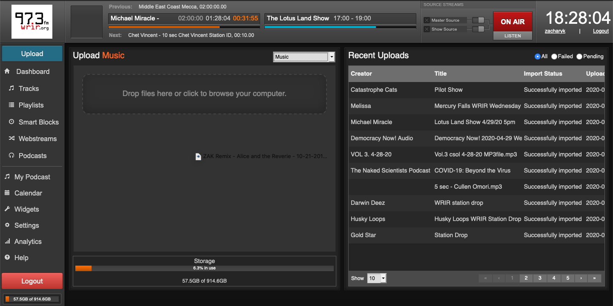
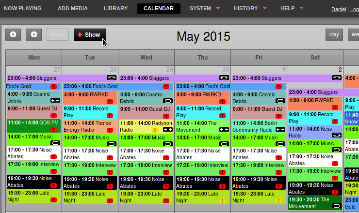
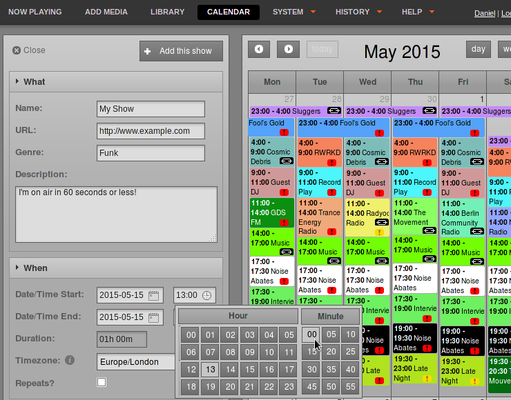
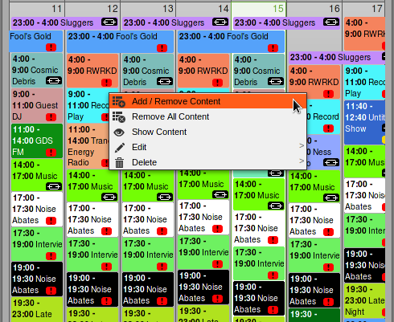
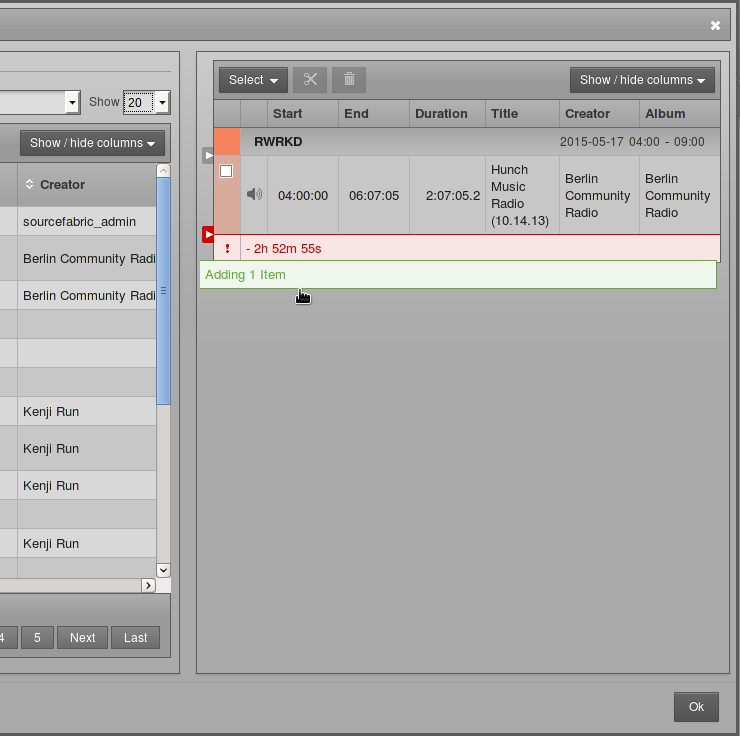
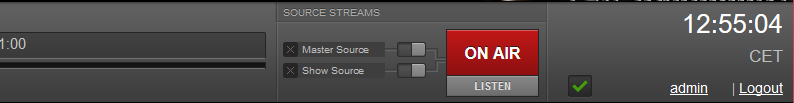

# On Air in 60 Seconds

Here's how you can use LibreTime to manage your broadcasts. Chapter names in
this book are shown in *italics*, to help you find the details of each step (if
you need to read more).

1. Log in to your LibreTime server with your **Username** and **Password**
(*Getting started*).

2. Add your files to the LibreTime library by clicking **Upload** on the left
menu, then click on the the **Drop files here or click to browse your computer**
area. You can drag and drop your files into this window too. The upload will
start as soon as you drop a file (*Add media*).

3. Create a show by clicking **Calendar** on the main menu, and then clicking
the **New Show** button (*Calendar*). Only admins and program managers can add
shows (*Users*).

4. Set a name for your show in the **What** section of the box, and a date and
time in the **When** section, then click the **+ Add this show** button at the
end of the page (*Calendar*).

5. Add media to the new show by clicking the name of your show in the
**Calendar** and selecting **Schedule Tracks** (*Calendar*).

6. Search for the media in the left side of the pop-up window which will appear,
and drag it into your show on the right side (*Now Playing*).

7. You're on air! Click the **Listen** button to hear available streams.

