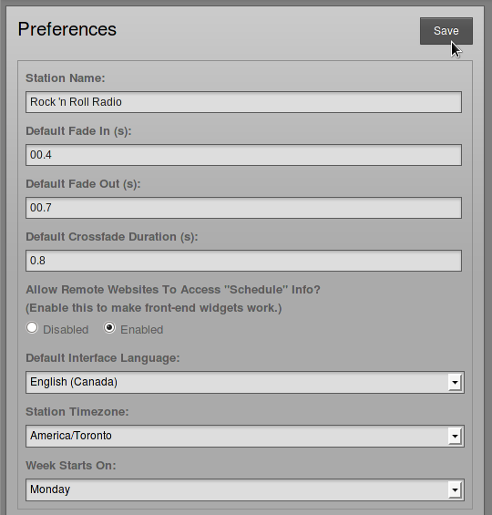
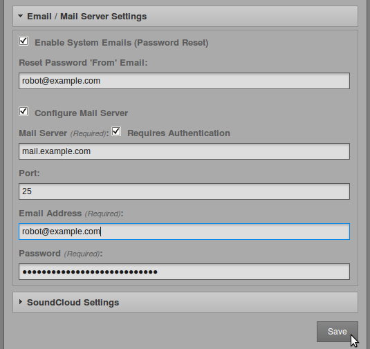

On the Settings menu, click **General** to set your **Station Name**. This text is shown in your web browser's title bar when your station staff are logged into Airtime, and optionally in stream metadata. You can also set a **Station Description** and **Station Logo** here.
You can enable live, read-only access to the Airtime schedule calendar for your station's public website with the **Allow Remote Websites to Access "Schedule" Info?** option, if you wish. (There is more about this feature in the *Exporting the schedule* chapter, in the *Advanced Configuration* section of this book).

Initially, the **Default Fade In** and **Default Fade Out** times for automated fades are set to half a second, and the **Default Crossfade Duration** is set to zero seconds. Custom fade and crossfade times can be set for adjacent items in a playlist or static smart block. See the chapter *Library* for details.  

The **Default Interface Language** drop-down menu sets the default localization for your Airtime instance, and the **Station Timezone** drop-down menu can be used to display local time at your station. Airtime stores show times internally in UTC format (similar to *Greenwich Mean Time*), but displays local time for the convenience of your station staff. You can also set the day of the week that you wish to start your station's weekly schedule on, which defaults to Sunday. Then click the **Save** button.

Individual Airtime users can choose another interface localization when they log in, or set personal preferences for localization and time zone by clicking their username on the right side of the menu bar.

Email / Mail Server Settings
----------------------------

The **Enable System Emails (Password Reset)** box is not checked by default, because although enabling staff users to retrieve their lost password for themselves may be convenient, this option does have security implications. If the email account of the staff user is compromised, an attacker could very easily gain access to your Airtime server by clicking the **Reset Password** link on the login page.

If you wish to enable the password reset option, your Airtime server can have an SMTP mail program installed. (See the chapter *Preparing the server* for details). Alternatively, you can check the box **Configure Mail Server** and specify the details of an external SMTP server, which would usually require authentication if it is outside of your local network.

Whether SMTP runs on the same server as Airtime or on another server, you should enter a valid email address into the **Reset Password 'From' Email** field to help ensure emails are delivered correctly. Then click the **Save** button.

 

SoundCloud Settings
-------------------

If your station has a SoundCloud account (on [http://soundcloud.com](http://soundcloud.com/ "SoundCloud")), you may wish to upload files and show recordings to this service, in order to broaden distribution and balance the bandwidth load with your own servers. Click the small black triangle next to **SoundCloud Settings** to show the options available. Check the **Enable Soundcloud Upload** box, then optionally check the **Automatically Upload Recorded Shows** box. You will also need to enter your SoundCloud login email address and password, and the tag metadata that SoundCloud will use to categorize your show recordings.

Check the box **Automatically Mark Files "Downloadable" on SoundCloud** if you wish to enable this option. **** You can also set a default genre, track type and copyright license here, including public domain, all rights reserved, or one of the *Creative Commons* licenses (see [http://creativecommons.org](http://creativecommons.org/ "Creative Commons")). Then click the **Save** button again.

Please note that like most online distribution services, SoundCloud terms of service require you to have copyright in, or permission for Internet distribution from the copyright holder of, any media that you upload. Commercially released music files uploaded to SoundCloud are likely to be automatically removed from your station's SoundCloud page.
