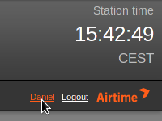

General
=======

Only users with the **User Type** of *Admin* can see the **Settings** menu when they log in.

On the Settings menu, click **General** to set your **Station Name**. This text is shown in your web browser's title bar when your station staff are logged into Airtime, and optionally in stream metadata. You can also set a **Station Description** and **Station Logo** here.

The **Default Language** drop-down menu sets the default localization for your Airtime instance, and the **Station Timezone** drop-down menu can be used to display local time at your station. Airtime stores show times internally in UTC format (similar to *Greenwich Mean Time*), but displays local time for the convenience of your station staff. You can also set the day of the week that your station's **Week starts on**, which defaults to Sunday.

Individual Airtime users can choose another interface localization when they log in, or set personal preferences for localization and time zone by clicking their username on the right side of the menu bar.

Initially, the **Default Fade In** and **Default Fade Out** times for automated fades are set to half a second, and the **Default Crossfade Duration** is set to zero seconds. Custom fade and crossfade times can be set for adjacent items in a playlist or static smart block. See the chapter *Library* for details. 

You can enable live, read-only access to the Airtime schedule calendar for your station's public website by enabling the **Public Airtime API** option, if you wish. You can choose to reveal or hide the **login button** on your Radio Page by ticking on the **Display login button** option.

The **TuneIn Settings** enable the use of the [TuneIn broadcaster API](http://tunein.com/broadcasters/api/ "TuneIn broadcaster API"). This feature is intended to push your Airtime station's stream metadata to your station's page on TuneIn. 

You will need to add the **Station ID **which you can find in your TuneIn station URL and is the letter '*s*' and the six digits that follow. 

The next fields to fill in are the **Partner Id **and **Partner Key**. You will have to contact TuneIn to request both the Id and Key. Send a email including your Station ID to [broadcaster-support@tunein.com](mailto:broadcaster-support@tunein.com "TuneIn broadcaster API") and let them know you are using Airtime Pro as your broadcasting software.

**SoundCloud Settings **enable you to upload tracks from your Airtime Pro instance to your SoundCloud account. If you frequently broadcast full, pre-produced radio shows, this new feature can help you streamline your audio publishing workflow. Title, genre, and year metadata are passed along to SoundCloud to save you time, and you can set a default visibility for new uploads in the preferences.

Once you've connected your Airtime Pro account to your SoundCloud account you'll be able to upload your tracks. To do so you only need to Left-click on a track in your library and select SoundCloud -&gt; Upload track.

 

Under **Dangerous Options **there is the possibility to clear your entire library *permanently. *By clicking on this option you will clear all uploaded files from your library. This does not include playlists, smart blocks or webstreams, however all their contents will be deleted. 

Once you have updated the preferences, click the **Save** button.

