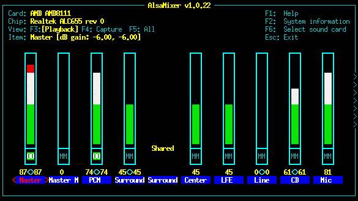

***Beware, here be dragons!*** 

These Airtime instructions are outdated, see [install.md](../../install.md) for LibreTime instructions.

The following instructions assume that you have root access (**sudo** on Ubuntu) to a GNU/Linux server, and are familiar with basic command line tasks. Experienced system administrators may prefer to skip to the *Expert install* chapter in the appendix of this book after preparing the server as shown in the steps below.

The recommended Airtime server platform is Debian 7.2 'wheezy'. Ubuntu 12.04 LTS 'Precise Pangolin' is also supported. Users of other GNU/Linux distributions may be able to adapt these instructions to suit their needs.

The server should have at least a 1GHz processor and 1GB of RAM, preferably 2GB RAM or more. If you are using a desktop environment and web browser directly on the server you should install at least 2GB RAM, to avoid swapping to disk.

The Airtime installation does not use much disk space, but you should allow plenty of storage capacity for the Airtime library. A hot-swap RAID array is recommended for media storage, in case of disk failure. You should also consider a UPS or other battery-powered system to offer some protection against short-term power failures.

Sound cards
-----------

If your Airtime machine will only be used to stream directly to an **Icecast** or **SHOUTcast** streaming media server, you do not require a sound card to be installed on the Airtime server side. This option is suitable for Airtime installations at your ISP's data centre, remote from any transmitter. However, you will not be able to take advantage of Airtime's live show recording feature (yet).

If you intend that your Airtime server will have a direct audio output to a broadcast transmitter or a separate stream encoder, your server machine must have a sound card supported by an **ALSA** driver. Almost all standard sound cards have ALSA drivers built into the Linux kernel, which do not need to be installed separately. If in doubt about driver support for your sound card, check the ALSA support matrix at: <http://www.alsa-project.org/main/index.php/Matrix:Main>

USB audio device index
----------------------

Some server motherboards do not have a default ALSA device (index number zero, shown as hw:0,0 in ALSA notation), and a USB sound card is often prevented from getting index zero by the GNU/Linux distribution's configuration. This setting may be in a file such as */etc/modprobe.d/alsa-base.conf* in Ubuntu, which can be edited with **nano**:

    sudo nano /etc/modprobe.d/alsa-base.conf

Comment out the lines beginning *options snd-usb-* to fix the problem:

    # Prevent abnormal drivers from grabbing index 0

    # options snd-usb-audio index=-2
    # options snd-usb-us122l index=-2
    # options snd-usb-usx2y index=-2
    # options snd-usb-caiaq index=-2

Save the file with **Ctrl+O** and close **nano** with **Ctrl+X**. Then remove and re-insert the cable connecting the USB sound card to the server (making sure any mixer or amplifier connected is faded down, to avoid a 'thump' on the output). The command **aplay -l** should now confirm that the *USB Audio* device has index 0 (shown as card 0, device 0):

    aplay -l
    **** List of PLAYBACK Hardware Devices ****
    card 0: MobilePre [MobilePre], device 0: USB Audio [USB Audio]
      Subdevices: 1/1
      Subdevice #0: subdevice #0

When using a USB sound card with ALSA, some how-to documents advocate setting the *nrpacks=1* option, but this is not recommended for Airtime because it can increase CPU load significantly.

Intel HDA mixer labels
----------------------

If you have an **Intel HDA** sound card, as built in to many contemporary motherboards, you may discover that the recording controls in **alsamixer** have incorrect labels. This problem can make it difficult to adjust mixer levels except by trial and error. To fix these labels, you can pass a specific *model=* parameter to the *snd-hda-intel* module of the Linux kernel. On Debian or Ubuntu GNU/Linux, you can do this by first identifying the model you have, with the command:

    cat /proc/asound/card0/codec* | grep Codec

The server should respond with a line such as:

    Codec: Realtek ALC882

Referring to the appendix *HD Audio Models* in this book, find the matching codec and model. In this example, the codec is *ALC882* and the motherboard has six analogue jacks and two S/PDIF sockets, so the model is *6stack-dig*.

    ALC882/883/885/888/889
    ======================
      3stack-dig    3-jack with SPDIF I/O
      6stack-dig    6-jack digital with SPDIF I/O

Edit the file */etc/modprobe.d/alsa-base.conf* with **nano** as follows:

    sudo nano /etc/modprobe.d/alsa-base.conf

Add an appropriate line for your soundcard model to the end of the file, such as:

    # Realtek ALC882
    options snd-hda-intel model=6stack-dig

Save the file with **Ctrl+O** and close **nano** with **Ctrl+X**. Then reboot the server. After the reboot, you should now see that the mixer controls are correctly labelled.

Disable desktop and other sounds
--------------------------------

If you are installing Airtime on a desktop computer, make sure you disable or remove any programs that could send unintended audio to a sound card you are using for broadcast output. This includes alert sounds which play when the computer is ready for use, or when a user logs in. On Ubuntu, these sounds are configured using *System -&gt; Preferences -&gt; Sound* on the main desktop menu. (This configuration tool only works when the PulseAudio sound server is installed).

You may prefer to remove all system sound files from the computer, in case they could be played unintentionally via the sound card. For example, on Ubuntu you may wish to remove the **ubuntu-sounds** package, with the following command:

    sudo apt-get purge ubuntu-sounds

PulseAudio
----------

The PulseAudio sound server is not recommended for Airtime sound card output, but is installed by default on Ubuntu. To remove PulseAudio from an Ubuntu machine, type the following command:

    sudo apt-get purge pulseaudio

Removing the **pulseaudio** package on a desktop Ubuntu machine may force the removal of the **ubuntu-desktop** metapackage. However, this metapackage is only installed on the system for managing upgrades; removing it does not remove the entire desktop.

After removing PulseAudio, if your Airtime machine has a desktop, you can install a mixer applet which can control the ALSA soundcard driver directly, such as **gnome-alsamixer**:

    sudo apt-get install gnome-alsamixer

On a server with a sound card but without a desktop, you can control sound input and output levels using the command line program **alsamixer**:

This program should already be installed on an Ubuntu or Debian machine with a sound card. If not, you can install it with the command:

    sudo apt-get install alsa-utils

The PHP cache
-------------

This dependency, introduced in Airtime 2.5.0, can improve the responsiveness of the Airtime administration interface and reduce server load. Various PHP cache software is available, but the current cache software required by Airtime is **APC** (<http://pecl.php.net/package/APC>). You should uninstall or disable any other PHP cache that may be present on the server, such as **XCache**, before installing Airtime and APC. This is because having multiple caches enabled can cause problems for PHP.

You can remove the XCache package **php5-xcache** from a Debian or Ubuntu server with the command:

    sudo apt-get remove php5-xcache

APC is available in Debian or Ubuntu as the **php-apc** package. If you already have Apache installed on the server you are going to use for Airtime, you can install APC and get it working with the following commands:

    sudo apt-get install php-apc
    sudo invoke-rc.d apache2 restart

APC has an administration page, which is not installed by default. If you wish, you can install and configure it with the following commands:

    sudo cp /usr/share/doc/php-apc/apc.php /usr/share/airtime/public/
    sudo nano /usr/share/airtime/public/apc.php

You should set an admin password for the *apc* user on line 42 of the file, such as *mynewpassword* in this example:

     defaults('ADMIN_PASSWORD','mynewpassword');

Save the *apc.php* file with **Ctrl+O** and close it with **Ctrl+X**. Then open a web browser at the *apc.php* page of your Airtime server, such as:

    http://airtime.example.com/apc.php

You will then be able to confirm that APC is working, and view some statistics for the cache.

Remove webmin, if installed
---------------------------

The **webmin** control panel (<http://www.webmin.com>) has been known to remove Apache and PHP packages on Debian and Ubuntu systems, which can cause the Airtime package to be removed in turn. This problem is easily reversed by re-installation of the affected packages, but it has the potential to disrupt your broadcast playout from Airtime. Webmin is not likely to be installed on your server unless your system administrator has installed it manually. This is because webmin was removed from official Debian and Ubuntu package repositories some years ago.

RabbitMQ hostname
-----------------

**RabbitMQ** requires a fixed and resolvable hostname (see<http://www.rabbitmq.com/ec2.html#issues-hostname>), which is normal for a server. For a desktop or laptop machine where the hostname changes frequently or is not resolvable, this issue may prevent RabbitMQ from starting. When using a desktop or laptop computer with a dynamic IP address, such as an address obtained from a wireless network, the **rabbitmq-server** daemon must not start up before the **NetworkManager** service.

RabbitMQ on Debian squeeze
--------------------------

In Debian 6.0 'squeeze' the **rabbitmq-server** daemon does not start automatically after a reboot. This should be fixed before installing Airtime, to prevent problems at playout time. If the rabbitmq-server package was installed before the last reboot, you will need to run:

    invoke-rc.d rabbitmq-server start

as the root user before the installation of Airtime. If it is not already installed, run the following command as root:

    apt-get install rabbitmq-server

After a fresh installation, rabbitmq-server will start automatically, so there is no need to run the **invoke-rc.d** command mentioned above.

In either case, you should then edit lines 13 and 14 of the file */etc/init.d/rabbitmq-server* (as root) to show:

    # Default-Start:     2 3 4 5
    # Default-Stop:      0 1 6

and then run the command (as root):

    update-rc.d rabbitmq-server defaults

This should make sure that **rabbitmq-server** starts after the next reboot.

libav on Debian squeeze and .m4a files
--------------------------------------

The version of libav shipped with Debian 6.0 'squeeze' is known to cause problems when Airtime analyses .m4a files containing the AAC codec for silence, using Silan (see <https://github.com/x42/silan/issues/2>). It is recommended that Debian servers are upgraded to the current stable 'wheezy' 7.2 release. As a short-term measure, updated libav packages from the squeeze-backports repository can be used to work around this problem. This work-around is only required if you do not wish to upgrade to 'wheezy' yet, but have AAC codec .m4a files in your Airtime library.

Mail server
-----------

If you wish Airtime to be able to send password reminder emails to your staff users, the server can have an SMTP program installed, such as the **postfix** package in Debian or Ubuntu. For configuration options, refer to the documentation for your mail server of choice. Alternatively, you can specify an external SMTP server in the **Preferences** page on Airtime's **System** menu.

Proceed to installation
-----------------------

Now your server should be ready for Airtime to be installed. Depending on your requirements, you should now proceed to either the chapter *Easy setup*, the chapter *Automated installation,* the chapter *Manual installation* or the *Expert install* appendix.
