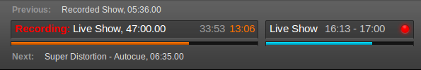
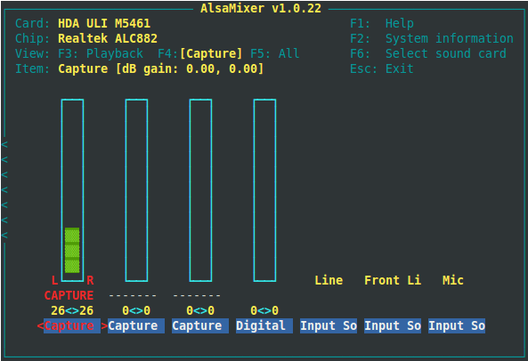
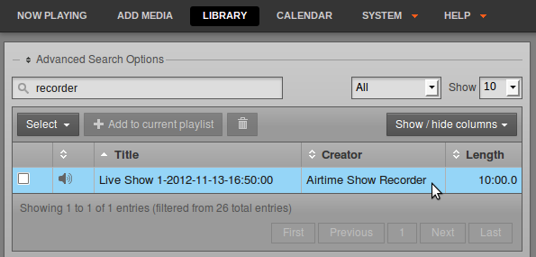
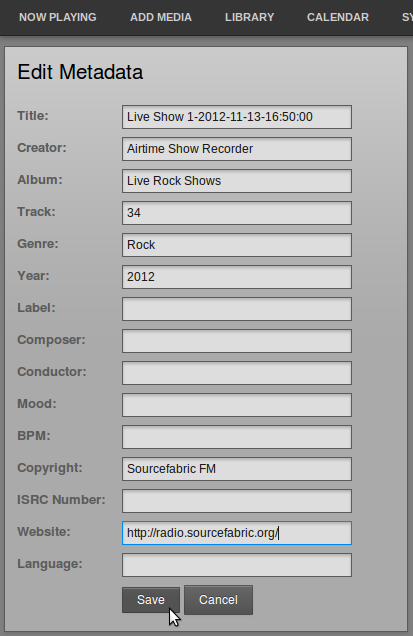
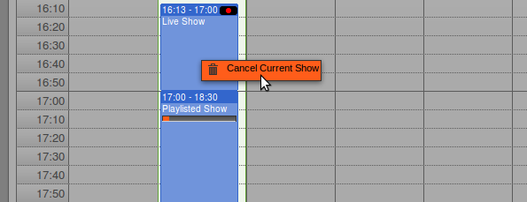
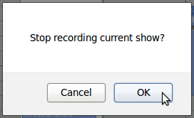

Live show recording from the input of the server's sound card, if one is fitted, can be enabled in the **Add Show** box of Airtime's **Calendar** (see the *Calendar* chapter for details). During a recording, a red light is shown in the Master Panel, and the word **Recording** appears in a red font to the left of the show name.

Before the first broadcast show scheduled for recording begins, you should check that the level of recording is sufficient to ensure a good signal to noise ratio, but not so high a level that clipping (distortion) occurs in the recorded file. You can perform this check using the command **alsamixer** on the Airtime server. This command opens a soundcard mixer application in the server console.

Press the **F4** key on your keyboard to set capture levels. Some experimentation may be required to find the correct control on the mixer, using the **Left** and **Right** arrow keys on your keyboard. Levels are set with the **Up** and **Down** arrows, and *Capture* is toggled with the **Space** bar. *Capture dB gain* should be set to *0.00, 0.00* initially.

If you hear nothing at all in the recording, you may need to set the value of *Input Source* to *Line*, using the **Up** or **Down** arrows. Depending on the particular sound card and sockets you are using, you may have to enable other inputs, such as *Digital* or *S/PDIF*. If a test recording is too quiet, try raising the line output level of your broadcast mixer towards *0dB* before increasing gain above *0dB* on the sound card, in order to achieve the optimal gain structure.

Using recordings
----------------

After the recording has finished, you can find the recorded file in the **Library**, by searching for *recorder*. The file will be labelled with a **Title** containing a date and time stamp, as well as the name of the show.

Click a file and select **Edit Metadata** from the pop-up menu to enter additional details of the recording which will help you find it in searches later, such as **Album** or **Language**. Then click the **Save** button.

Cancelling a recording
----------------------

If you wish to cancel the recording of a live show, click on the show in the **Calendar** and select **Cancel Current Show** from the pop-up menu.

Airtime will ask you if you are sure about this action, as it cannot be undone. The recorded show file in the Airtime library will be truncated if you click the **OK** button.

