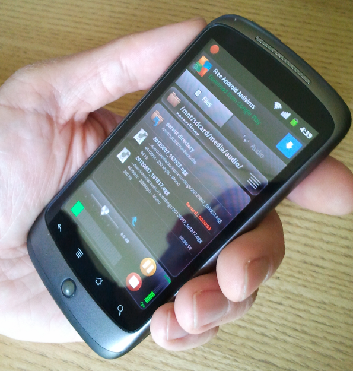

Using an ordinary smartphone and LibreTime, you can upload your audio reports to the studio library or put them straight on the air. Here's how...

The basic voice recorder app on your phone may not have all the features you need for journalism, but there are plenty of more suitable recording apps available for both iPhone and Android. For instance, searching for 'ogg recorder' in the *Play Store* on an Android phone yields plenty of alternatives. The following example uses *RecForge Lite* because of its configurable recording formats. This free app is limited to three minutes per recording in Ogg and MP3 formats, but there is an unrestricted version available at very modest cost.

In the Settings window of the app, set the recording format as Ogg Vorbis, 44.1KHz sample rate, mono. Disable automatic gain control to get a consistent recording level, rather than artificially boosting quiet sounds, which should result in less distortion. Under 'Limit folders browsing' give the app access to all of the SD Card storage of the phone.

Back in the main recording window of RecForge, create a directory such as '*recordings*' under the */mnt/sdcard/media/audio/* path, which is normally used by the phone's music application. You can then make recordings using the big red button, watching the input level meter to ensure a good signal to noise ratio. The recorded files are automatically named with date and time stamps, but can be renamed in the app later by selecting the **Edit** feature. The latest recordings are listed in the main recording window; individual files can be auditioned by tapping on them.

Open the web interface of your station's LibreTime server in the phone's browser, log in with your username and password, and tap **Add Media** on LibreTime's main menu. After tapping the **Add Files** button, the phone will offer a choice of file to upload. By tapping **Select music track** you can browse the */mnt/sdcard/media/audio/* directory on the SD card filesystem, without requiring the installation of a file manager app on the phone.

Tap one of the date-and-time-stamped files listed from the '*recordings*' directory to select it, then tap the **OK** button. The files are credited to '*Unknown artist*' because they have not yet been tagged with creator metadata.

After tapping the **Start upload** button on the Add Media page, the files are now copied into the remote LibreTime library.

You can now add the uploaded files directly to a forthcoming show, use them to create smart blocks or playlists in the **Library**, or edit their metadata to make them easier to find in searches later. One of the limitations of mobile recording is that it isn't always convenient to enter large amounts of text metadata when you're on the move. So a phone app that tagged audio recordings with creator, location and other relevant metadata would be very useful.

Going live
----------

Mobile apps which enable you to stream directly into LibreTime's live rebroadcast feature include **KoalaSan** for iOS: <http://koalasan.net/> and **BroadcastMySelf** for Android: <https://play.google.com/store/apps/details?id=sa.broadcastmyself> DemoIcesShout for Android also shows promise, although it can only stream a static file, rather than stream from a microphone: <http://droidtools.sourceforge.net/content/icecast-client-android>

A live workflow does of course depend on a steady network connection between the phone and LibreTime server. Because streaming media on a regular basis can use a lot of bandwidth, it is advisable to use WiFi rather than mobile data (3G/4G) whenever possible, especially when roaming across networks.

KoalaSan can stream input from either the built-in microphone or the external jack of the iOS device. An example configuration for the **Settings** tab might be:

    Name: LibreTime
    Server: libretime.example.com
    Port: 8003
    Mountpoint: mastermount
    Stream name: LibreTime
    Description: A live stream to LibreTime
    Genre: News
    Username: masterstreamer
    Password: masterpassword
    Codec: mp3
    Bitrate: 128
    Protocol: Icecast2
    Stereo: off
    AudioBus: off
    Dump: on
    Broadcast: on

You can start streaming from the iOS device by tapping the start button in KoalaSan's **Stream!** tab.

To configure BroadcastMySelf, tap the gears icon in the top left corner to enter the settings page, then tap **Output Settings**. This action opens the **Icecast Settings** page, where example settings could be:

    Hostname
    libretime.example.com

    Port
    8003

    Path
    /mastermount

    Username
    masterstreamer

    Password
    masterpassword

    MP3 Encoder Bitrate
    128 Kbit/s

    Metadata Template
    _song__artist

    Streaming Buffer Size
    MP3 buffer size X 8

You may also wish to configure the **Tracks Folder** setting, which enables you to stream static files from the storage of the device. Depending on where you keep your audio files, this could be a path such as:

    /mnt/sdcard/media/audio/

To connect the Android device to the LibreTime server, tap the square button in the lower middle of the main interface. The connection indicator on the button should turn blue, and the message *connected* should be shown. Push up the fader on the left to increase input level from the internal microphone, or push up the fader on the right and tap one of the named files in the upper right window to stream it. Tap either of the **LOCK** buttons to prevent the stream input level being changed accidentally.

When the connection is made, LibreTime output will fade from scheduled play to the stream from your mobile device. See the chapter *Stream settings* for more details of connection preferences.
