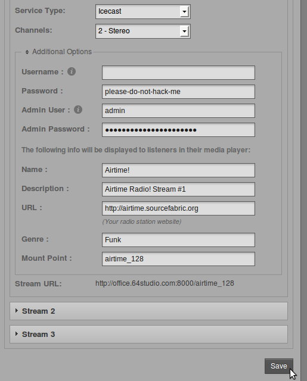
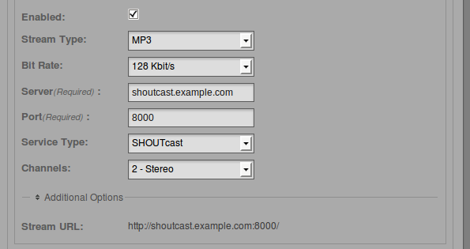

Streams
=======

You can configure direct Icecast and SHOUTcast streams by clicking **Streams** on the **System** menu.

At the top left of the **Stream Settings** page are global settings. The first checkbox enables the sending of **Icecast Vorbis Metadata** with direct streams. This setting is optional, because some media players have a bug which makes them disconnect from Ogg Vorbis streams when an Icecast server notifies the player that a new track is starting.

The **Stream Label** radio button allows you to set the metadata that will be sent with direct streams; *Artist* and *Title*, *Show*, *Artist* and *Title*, or *Station name* and *Show name*.

The **Off Air Metadata** field configures the text that will be sent to any configured streaming servers, and from there on to media players, when Airtime is not streaming any output.

Below this is the **Enable Replay Gain** checkbox which, if checked, automatically adjusts Airtime's output level to an average of -14dBFS, based on prior analysis of the level of individual files in the **Library**. This feature helps guard against unwanted changes in Airtime's output level caused by the typical variation in average level of recordings made in different studios at different times. The correction value for each file can be viewed by enabling the ReplayGain column in the **Library**.

If Replay Gain is enabled, output level can be adjusted up to 10dB louder or quieter from the reference level of -14dBFS by clicking and dragging the **Replay Gain Modifier** control. Increasing level too far is likely to result in clipping (distortion) since the output level is adjusted to be greater than that of the original files.

Click the **Save** button on the right side of the page to save any changes that you have made to global settings.

Input stream settings
---------------------

On the lower left side of the Stream Settings page you can configure remote live input streams from DJ programs such as **Mixxx** or **IDJC**, or smartphone applications used by broadcast journalists. Airtime supports two types of live input stream; the **Show Source**, which enables a specific person to stream in during their own show, and the **Master Source**, which can override the Show Source if necessary. If neither type of live input is available, Airtime will fall back to **Scheduled Play** (playlists, smart blocks, remote streams and files scheduled in Airtime, in advance of or during a show).

The **Auto Switch Off** and **Auto Switch On** checkboxes enable playout to be switched automatically to the highest priority source whenever an authenticated input source disconnects from or connects to Airtime, respectively. The field **Switch Transition Fade** sets the length of the audio fade as scheduled playout is switched to a remote input source, and back.

Each type of input stream requires a username and password before the remote broadcaster can connect to Airtime at the **Connection URL**. The **Master Username** and **Master Password** can be set in the Input Stream Settings box, while custom authentication for individual Show Sources can be set up in Airtime's schedule calendar. See the *Calendar* chapter for details.

Switching input streams
-----------------------

In the Master Panel, available input source streams are shown with an orange line connecting the source to the switch, which you could think of like a patch cable connecting a source to a broadcast mixer. When that switch is active, another orange line connects the switch to the On Air indicator, like a patch cable connecting a mixer to a transmitter.

If you have checked the **Auto Switch On** box in the Stream Settings page, the **Master Source** switch will move automatically to the active position, on the left, when an authenticated master source connects to Airtime. Otherwise, you can activate the switches manually by clicking the left side of each switch, or deactivate them by clicking the right side. The switches do not have to be dragged with the mouse, in the way that a switch on a hardware mixer would be pushed sideways. **Show Source** live input streams and **Scheduled Play** can be manually activated or deactivated in the same way.

To force disconnection of a live remote source, for example when the remote input source has crashed and is no longer sending audio data, click the **X** icon to the left of the source name.

Output stream settings
----------------------

On the right side of the page, you can configure up to three independent output streams with different bit rates or formats, and send these streams to different Icecast or SHOUTcast servers.

To configure a stream, click the bar with the stream number to expand its box, and make sure **Enabled** is checked. Enter at least the streaming **Server** IP address or domain name, and **Port** details. The default port for Icecast and SHOUTcast servers is 8000. 

If the Airtime player widget on your public website detects that the listener is on a mobile device (iPad, iPhone, etc.) it will switch that listener to the stream marked with the **Mobile** checkbox. The configuration of these streams should be with a lower bitrate and more compatible stream types to be mobile friendly (MP3 and ACC are best supported across all devices). 

Then you are able to offer the most compatible stream to those listening on your **player**. Go to **Preferences** and **Player **to "Auto detect the most appropriate stream to use." 

 

Click **Additional Options** to expand a box in which you can enter the usernames, passwords and metadata to send to the streaming server. The default **Username** for Icecast servers is *source*, and if this the name in use on your streaming server, you can leave this field empty. The **Admin User** and **Admin Password** settings are optional, and are used to query the streaming server for audience numbers by the **Listener Stats** page on the **System** menu.

You can also set the specific **Mount Point** that listeners will connect to here. Then click one of the **Save** buttons in the upper or lower right corner of the page to update the Airtime server's settings.

Airtime supports output to Icecast in Ogg Vorbis, Ogg Opus, MP3 and AAC formats. When selecting a SHOUTcast server from the **Service Type** drop-down menu, you are restricted to using MP3 or AAC formats only, so the choice of Ogg Vorbis and Opus formats is greyed out in the **Stream Type** drop-down menu. The SHOUTcast username for stream sources is fixed, so you do not need to enter this value under **Additional Options**, but you will usually have to enter a password.

Any connection problems between Liquidsoap and Icecast or SHOUTcast are shown on the Stream Settings page. For example, if you enter the wrong password, you will see an *Authentication Required* error message. To fix this, enter the correct password in the **Additional Options** box, and click the **Save** button. If the streaming server is down for any reason, or you have entered an incorrect **Server** name or **Port** number, you will see the message *Can not connect to the streaming server*.

