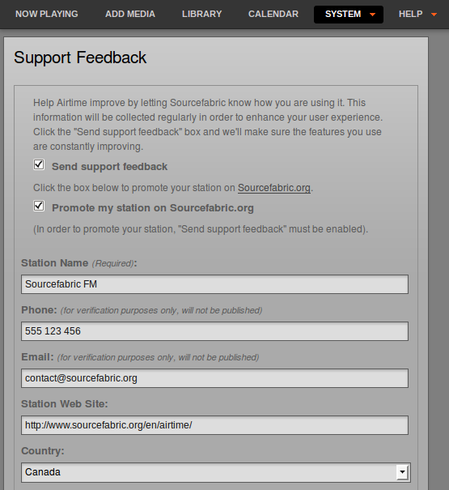
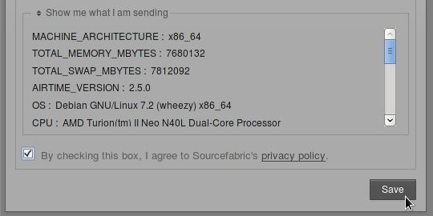

If you did not already register Airtime when you installed it, as shown in the *Getting Started* chapter, you can click **Support Feedback** on the System menu to display Airtime's automated feedback options. Check the **Send support feedback** box in order to post technical details about your Airtime installation to Sourcefabric, over the Internet. These details help Sourcefabric diagnose any problem that you might be having with your Airtime system.

You may also wish to send details of your station to Sourcefabric, so that your station has the opportunity to be promoted with other Airtime users on the [http://www.sourcefabric.org](http://www.sourcefabric.org/) website. This feature also helps Sourcefabric target its support services to the countries where they are needed most. Check the box **Promote my station on Sourcefabric.org** and fill in the details of your station. You can upload a station logo file (of up to 600 x 600 pixels) from your desktop computer by clicking the **Browse** button.

Click on the **Show me what I am sending** link to expand a box which displays the technical data being returned to Sourcefabric. The data is collected according to the Sourcefabric privacy policy (<http://www.sourcefabric.org/en/about/policy/>) which you are required to agree to before you can submit the information. If you have already checked the box to indicate your acceptance of the privacy policy, a link to the policy will be displayed instead.

