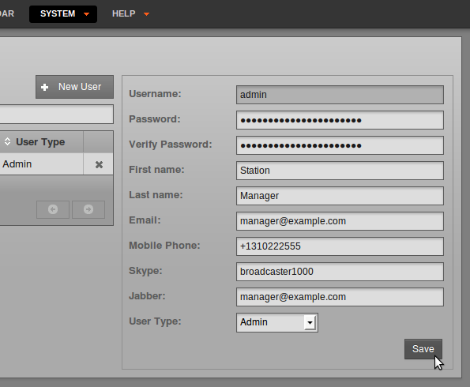
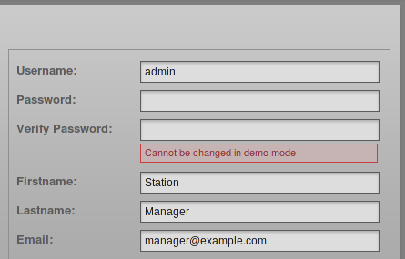

If your Airtime server is accessible from the public Internet, it will not be secure until you set your own, strong password for the all-powerful *admin* user. Should the password for the *admin* user still be set to *admin* or some other easily guessed word, you should set a new password immediately, via the **Users** page on the System menu. Only users with the **User Type** of *Admin* can see the **System** menu when they log in.

Setting passwords and contact details
-------------------------------------

On the left side of the **Users** page, click on *admin* in the table. The details for this user will appear in the box on the right side. To begin with, on a freshly installed Airtime server, the *admin* user only has a **Username**, **Password** and **User Type** set.

To set a new password for the *admin* user, enter a string of letters and numbers (as long and as varied as is practical) into the **Password** field, then again into the **Verify Password** field to guard against typing errors. Keeping this password secret is essential for the smooth running of your station, because it enables access to all scheduling and management features. You can also enter other details for the *admin* user account on this page, including full name and contact details. Then click the **Save** button.

Adding user accounts
--------------------

To add further user accounts to the system, one for each of your station staff that need access to Airtime, click the **New User** button with the plus icon. Enter a user name, password and contact details, and then select the **User Type** from the drop down menu, which can be *Admin*, *Program Manager*, *DJ*, or *Guest*. The difference between these user types is:

-   An *Admin* (station manager) has read and write access to all the features of Airtime. This role should be reserved for trusted staff members only. If you give the *Admin* role to too many people, there could be arguments at the station!
-   A *Program Manager* has write access to the entire broadcast schedule, but cannot see the **System** menu and therefore cannot adjust Airtime preferences, manage user accounts, change media folder or stream settings, check the server status, or see the Listener Stats. A *Program Manager* can view the **History** menu and the Playout History page, but cannot edit History Templates. **
-   A *DJ* (presenter) only has write access to features related to the specific shows assigned to them by an *Admin* or *Program Manager*. The *DJ* can read data for other shows in the **Calendar**, but not write to them. This read access to other shows helps staff plan their own shows, for instance avoiding the scenario where two DJs play the same music by coincidence. Like a *Program Manager*, a *DJ* cannot see the **System** menu when they log in, and cannot edit History Templates.
-   A *Guest* can log in to read the forthcoming schedule or playlists, but has no write permission for any feature. *Guest* users cannot see the **Add Media**, **Library**, **System** or **History** menus when they log in. The group of guest users might include the station accountant, or the show assistants.

Editing or deleting user accounts
---------------------------------

New user accounts that you add will be shown in the table on the left side of the **Users** page. If you have a large number of users on the system, you can use the search tool above the table (which has a magnifying glass icon) to identify specific user accounts. Click the white chevrons in the table headings to sort the search results by **Username**, **First Name**, **Last Name** or **User Type**.

To edit a user account, click on that user's row in the table, change the user's details in the box on the right side, and then click the **Save** button. To remove a user account, click the small **x** icon to the right side of its row in the table. You cannot delete your own user account, and usernames cannot be changed once created.

If the Airtime server is running in demo mode, user accounts cannot be created or updated. See the chapter *Host configuration* for details of how to enable demo mode.

Updating your own account
-------------------------

Users can update their own password, and their contact, language and time zone details, by clicking their username on the right side of the main menu bar, next to the **Logout** link.

 

This action opens a separate, individual page which the user can update regardless of their **User Type** and access to the **System** menu. Click the **Save** button to update your account.

