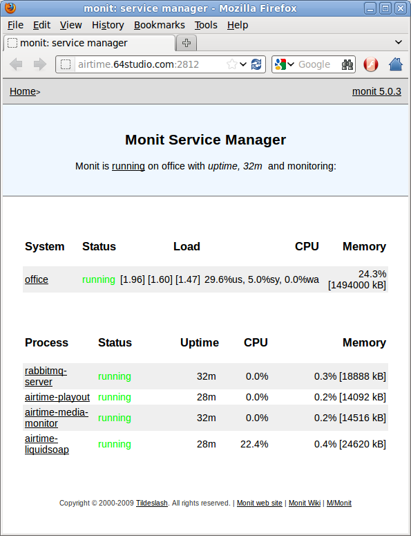
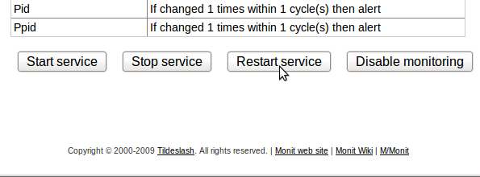
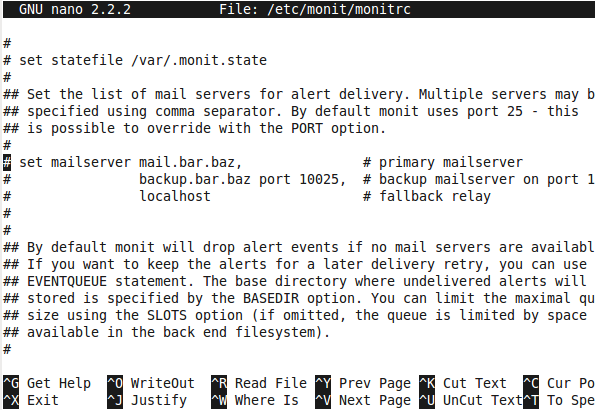
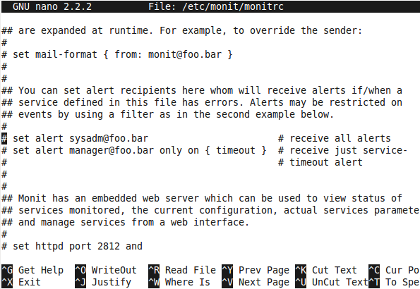

**Monit** is a utility which can be used to manage and monitor processes, files, directories and filesystems on your Airtime server. It is installed by default when you install Airtime.

To view the Monit web interface, open port 2812 of your server in a web browser. For example, on the localhost you can use:

    http://localhost:2812/

You will have to log in to see the Monit web interface. The username to use is guest and the default password is *airtime*.

Clicking on the name of a service in the Process column, such as *airtime-playout*, opens another page with details of that service.

By default, the Monit *guest* login is configured for read-only access, which means you cannot restart services through its web interface. To log in as the *admin* user, you will need the randomly generated password set by Airtime in the */etc/monit/conf.d/monit-airtime-generic.cfg* file. You can see this with the command:

    sudo less /etc/monit/conf.d/monit-airtime-generic.cfg

The random password for the admin user should follow on the line *allow admin:* such as the this example of *LHR32YP7H1*:

     set daemon 10 # Poll at 10 second intervals
     set logfile /var/log/monit.log

     set httpd port 2812
        allow admin:LHR32YP7H1
        allow guest:airtime read-only

Logging in as the *admin* user, you will now see buttons for controlling a service at the end of each service page:

Monit does not have a logout button, so if you have already logged in as *guest*, you may have to clear the active login from your web browser before logging in as *admin*. In *Firefox* on Ubuntu, this is accomplished using *Clear Recent History* on the *History* menu.

Locking down remote access
--------------------------

To make remote access more secure, you can edit the file */etc/monit/conf.d/monit-airtime-generic.cfg* with **nano**:

    sudo nano /etc/monit/conf.d/monit-airtime-generic.cfg

If you wish to enable access from the localhost only, append an *and use address* statement to the end of the line which sets the server port:

     set httpd port 2812 and use address localhost

To enable access from other servers, comment out the part of the line *use address localhost* and then append an *'allow'* line with the IP address and netmask of the machine to connect to Monit from, such as a local network address of *10.0.1.2* and netmask of *255.255.255.0*:

        allow 10.0.1.2/255.255.255.0

If you enable remote *admin* access, be sure to change the randomly generated password in the line beginning *allow admin:* on a regular basis, like you would for any important password. The password for the read-only *guest* access should remain as *airtime*, because Airtime uses this password to collect information for the **Status** page of the administration interface.

     set httpd port 2812 and # use address localhost
        allow localhost
        allow 10.0.1.2/255.255.255.0
        allow admin:LGW12WB9J7
        allow guest:airtime read-only

Press Ctrl+O to save the file, then Ctrl+X to exit **nano**. Then restart Monit with:

    sudo invoke-rc.d monit restart

Sending email alerts
--------------------

To configure Monit to send email alerts, edit the file */etc/monit/monitrc* to uncomment the *set mailserver* parameter. Change this line to show the name of the SMTP server on your Airtime server's network, as provided by your system administrator.

    sudo nano /etc/monit/monitrc

Further down the configuration file, you can set the *From:* and *To:* addresses for the alert emails using the *set mail-format* and *set alert* parameters. Then uncomment these lines for the parameters to be read by Monit.

Press Ctrl+O to save the file, then Ctrl+X to exit **nano**. Then restart Monit with:

    sudo invoke-rc.d monit restart

 More information about using Monit is available at <http://mmonit.com/monit/documentation/>
