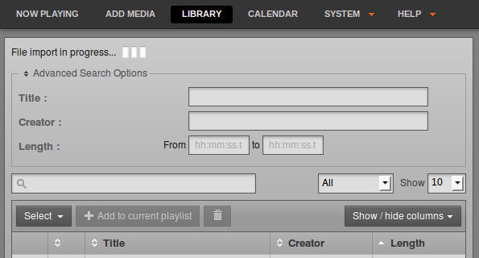

Using the import script
=======================

###NOTE: This page has issues, as the import script is not currently functional

If you have a large number of files in your media library, importing these files one at a time into a broadcast automation system would be time-consuming and tedious. That's why Airtime includes a script that can import an entire directory of files in one go.

Copying versus watching
-----------------------

There are three main options when using the **airtime-import** script: Either to **copy** or **move** files into Airtime's main storage folder, or to **watch** files elsewhere. Each option has advantages and disadvantages, so you will have to think about how the files will be used in your station in the long term.

-   For files that are *copied* or *moved*, you may run into problems with hard disk space if you do not remove files from the storage server periodically.
-   For files that are watched, you must make sure that the files are actually going to be there at playout time, otherwise they will be skipped. For this reason, it is not recommended to use the **watch** option for easily-removable storage (like MP3 players or USB memory sticks). There's a strong likelihood that the storage might be unplugged and taken away before playout time. It is also important to make sure that any external hard disk with watched files is powered on, and stays on.

The **airtime-import** script works from the command line, so you must first log into a console on the Airtime server. In recent versions of Airtime, you no longer need to specify the full file system path to the media files that you wish to import. Copying is specified with the **copy** sub-command:

    airtime-import --copy <directory>

where *&lt;directory&gt;* is the base directory of the media files that you wish to import.

Alternatively, you may wish to delete the files from the original location after copying them to the storage archive, which is accomplished with the **move** sub-command:

    airtime-import --move <directory>

If the new files are exact duplicates of files that have already been imported, the **airtime-import** script will detect this.

Any users logged into the administration interface will be warned if a **File import** is **in progress**... Users assigned the *admin* privilege should not attempt to change Airtime's default storage directory while an import is taking place.

Watching a new folder on the command line is specified by using the **watch add** sub-command:

    airtime-import --watch-add <directory>

The script will report the name of the folder now being watched, for example:

    airtime-import --watch-add /home/Music/
    /home/Music/ added to watched folder list successfully

The watched folder will also be listed on the **Media Folders** page on the **System** menu of the Airtime administration interface. (See the chapter *Media Folders* for making changes to watched folders via the administration interface).

To obtain a list of currently watched folders in the server console, you can use the **watch list** sub-command:

    airtime-import --watch-list
    /home/Music/

Any new files copied to a watched folder (for example, using your desktop computer's file manager) will automatically appear in the Airtime database, and are then ready for playout. In the same way, if you delete a media file using your file manager, it will be automatically removed from the Airtime database, and will no longer be available for playout.

If you wish to no longer watch a particular folder, you can use the **watch remove** sub-command:

    airtime-import --watch-remove /home/Music/
    /home/Music/ removed from watched folder list successfully 

Get or set the storage folder path
----------------------------------

See the chapter *Media Folders* for making changes to the storage folder path via the administration interface. The **airtime-import** script also enables you to read or write Airtime's storage path configuration. You can find out the current setting with the **storage-dir get** sub-command:

    airtime-import --storage-dir-get
    /srv/airtime/stor

A new storage folder path can be configured using the **storage-dir set** sub-command:

    airtime-import --storage-dir-set /home/Music/
    Successfully set storage folder to /home/Music/

The **storage-dir set** sub-command should be used with caution on a production server, because moving the storage folder during scheduled programming has the potential to disrupt your broadcast playout. The Airtime playout engine caches files up to 24 hours ahead, but any last-minute additions to the schedule during storage migration could cause problems.

 There has been error in communication with Booktype server. Not sure right now where is the problem.

You should refresh this page.

-   OK
-   Back
-   Create
-   Cancel
-   Next
-   Import
-   Save changes
-   Couldn't create a group!
-   enter epub URL
-   enter Archive.org ID
-   enter Wikibooks URL
-   enter Booktype URL
-   Delete book

