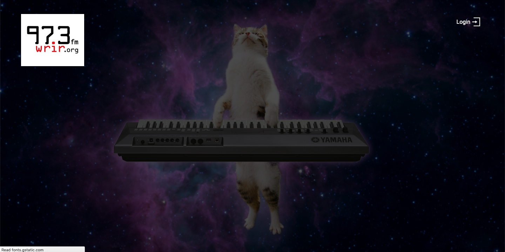

# Radio page

LibreTime includes a mini-site, which can be accessed at _localhost_ (for local installations) or
_libretime.example.com_ (for installations to a server on a domain).

The site includes your logo (set under Settings > General), the login button to the LibreTime interface, links for the schedule, station description, and podcast tabs, and a livestream player that runs of the stream from the built-in Icecast2 server.
The currently playing artist and track are displayed.

The schedule tab opens by default and shows a schedule for your station based on LibreTime's Calendar
for the next 7 days. All times are presented in 12 hour format.

The about tab includes your station name and a quick blurb about your station that can be set under Settings > General (more info [here](../general/index.md)).

Tracks published wind up here, and can be played back on-demand. This is a great place for putting episodes of shows that have already played out on stream. The Subscribe button allows for listeners to subscribe to your podcast's RSS feed in a podcast client of their choice, such as Apple Podcasts.

The background of the radio page can be changed; see instructions [here](interface-customization). Image comes from [CATS ON SYNTHESIZERS IN SPACE](https://www.catsonsynthesizersinspace.com/).
