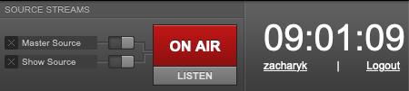

# Scheduling Shows

Log in using your username and password using the link in the upper right corner. (If you just installed
LibreTime, your username/password is admin/admin.)

The main workflow in LibreTime is **Upload** media -> create a show on the **Calendar** -> **Schedule Tracks**.

Once you log in, click on the big blue button on the left navigation that says **Upload**.

Select the type of media you are uploading (Music, Station IDs, etc.) by using the dropdown box
at the top of the pane. After that, either drag and drop media into the area below or click the
dashed rectangle to open a file browser.

Once your files have uploaded and have been successfully imported (as shown in the pane on the right),
click on **Calendar** on the left navigation.

Click on the blue **+ New Show** button to add a new show.

At the very minimum, fill out the show's name and when the show will take place. If the show will repeat regularly,
check the **Repeats?** box and fill out the repeat information. Click on the grey **+ Add this show** button at the top
of the pane to add your show to the calendar.

Once your show is created, click on it to open its context menu. Select **Schedule Tracks** to open the track scheduler.

The track scheduler behaves similar to iTunes or Windows Media Player: media browser on the left, playlist on the right.
Find the tracks that you'd like to schedule by using the search box or sorting columns and then drag them
into the playlist.

The bar at the end of the show's playlist will show the amount of time the show is underscheduled or overscheduled.
Shows that are underscheduled will have dead air at the end and shows that are overscheduled
will fade out exactly when the show is over (the orange colored entry), meaning tracks scheduled to start
after this point will not play (dark red colored entries). Click the **Ok** button in the bottom right to save.

Show playback will start and end as per each show's start and end times, allowing you to rely completely on
LibreTime for running your station or using LibreTime as a part of your live setup to cover when DJs are not present.
When media is playing, the **On Air** indicator at the top will turn red.

You can listen to your stream by going to `yourserverIP:8000` or by clicking the **Listen** button under the On Air
indicator.