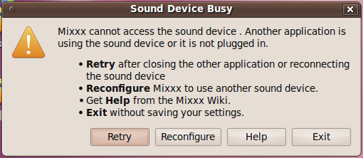
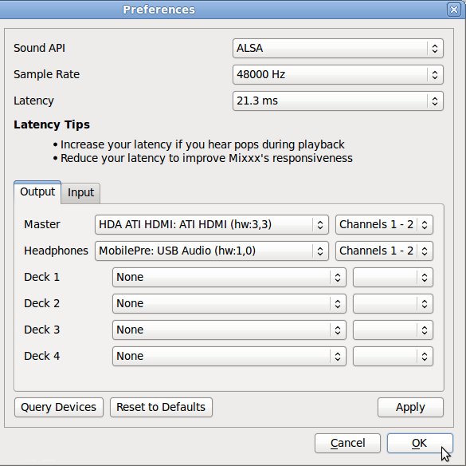

Mixxx is a cross-platform Open Source application for DJs, available from <http://www.mixxx.org/>

Installed on a desktop or laptop computer, Mixxx complements your LibreTime server to provide a complete system for both live and scheduled broadcasting. Although Mixxx has many features designed for dance music DJs that require beat matching and pitch independent time stretching, the program can be used for any kind of manually triggered broadcast playout, including live speech shows such as news or current affairs.

Mixxx supports a wide variety of popular hardware control surfaces, which can be connected to your computer using a USB cable. A control surface might replace or augment an analogue mixer in your studio, depending on your live mixing and playout requirements.

Sound cards
-----------

If you wish to use LibreTime and Mixxx on the same machine, you will need two or more sound cards, as each program requires exclusive access to the sound hardware. Otherwise, you may see an error message that Mixxx cannot access the sound device.

 

The solution is to configure Mixxx to use additional sound cards by clicking **Options**, **Preferences**, then **Sound Hardware** in the main Mixxx menu. Select devices other than the ALSA default of *hw:0,0* for at least the **Master** and **Headphones** outputs. Then click the **OK** button.

Sharing storage
---------------

If you make the LibreTime server's storage directory */srv/airtime/stor/* accessible to a desktop machine as a read-only location, Mixxx will accept that location as its default music library when starting up for the first time. (This location can also be configured after installation by clicking **Options**, **Preferences**, then **Library** in the main Mixxx menu).

You may need to adjust file and directory permissions so that the storage directory has read access from the desktop user account. Enabling write access directly to the storage server is not recommended, as this would allow desktop users to delete files which might be needed for playout later.

If the filesystem path has been configured correctly, the metadata for the files in the LibreTime storage server will be displayed in the main window of the Mixxx interface. Individual files from the LibreTime storage server can then be added to either of Mixxx's live players with a right-click on the filename, or by using the appropriate hardware buttons on a control surface. Therefore it is possible to manage the station's storage archive remotely and collaboratively through LibreTime, while using Mixxx as the live playout client in multiple, remote studios.

The LibreTime storage archive can be exported like any other file server share. The method that you implement would depend on the operating system of your desktop client machines, and whether they were on the same local network as the LibreTime server, or remote.

For performance and redundancy reasons it is advisable to cache files required for a particular show on the client machine where Mixxx is installed. For example, for a GNU/Linux client machine, a nightly **rsync** download of new media in the archive would guard against network problems at playout time potentially disrupting a broadcast at a remote studio.

Mixxx users can also record a show, and then upload it through the LibreTime web interface on a local or remote server for collaborative or user-generated broadcasts.

Streaming from Mixxx into LibreTime
---------------------------------

Mixxx 1.9.0 or later includes a live streaming client which, like LibreTime, is compatible with the **Icecast** and **SHOUTcast** media servers. This feature can also be used to stream from Mixxx directly into LibreTime, using either the **Show Source** or **Master Source**.

To configure **Mixxx** for streaming into LibreTime, click **Options**, **Preferences**, then **Live Broadcasting** on the main Mixxx menu. For server **Type**, select the default of **Icecast 2**. For **Host**, **Mount**, **Port**, **Login** and **Password**, use the **Input Stream Settings** configured in the LibreTime **Streams** page, on LibreTime's **System** menu. See the chapter *Stream settings* for remote input connection details.
