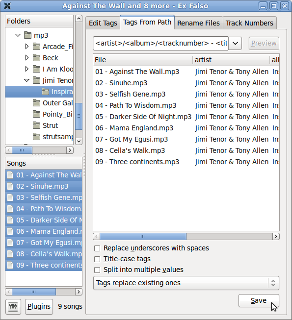

Before uploading media to an LibreTime server, there are a number of factors which should be considered. Getting your ingest workflow right will save you a lot of time later.

## Metadata quality

LibreTime automatically imports any metadata that is in the files' ID3 tags. If these tags are incorrect or are missing information, you will have to either edit the metadata manually. Files with metadata such as track title and artist information may be difficult to locate in larger libraries, or add to shows, playlists, or smart blocks.

There are a number of programs available which can be used to correct mistakes or incomplete information in ID3 tags. You can use a music library manager (like Apple Music, Rhythmbox, or Windows Media Player) to edit ID3 tags as well, but you may be required to import the files into your library, which may not always be convenient.

- [TagScanner](https://www.xdlab.ru/en/) (Windows)
- [Mp3tag](https://www.mp3tag.de/en/index.html) (Windows)
- [MusicBrainz Picard](https://picard.musicbrainz.org/) (Mac, Windows, Linux)
- [Ex Falso](https://github.com/quodlibet/quodlibet) (Linux)

The _Tags From Path_ feature of Ex Falso is a particularly useful time saver if you have a large archive of untagged files. Sometimes there is useful creator or title information in the file name or directory path structure, which can be converted into an ID3 tag automatically.



## Metadata in legacy character sets

LibreTime expects file tag metadata to be stored in the international _UTF-8_ character set. Programs such as **Ex Falso** (described above) encode metadata in UTF-8 by default. If you have an archive of files encoded with metadata in a legacy character set, such as the Cyrillic encoding _Windows-1251_, you should convert these files before import.

The program **mid3iconv** (part of the **python-mutagen** package in Debian and Ubuntu) can be used to batch convert the metadata character set of files on the command line. You can install **python-mutagen** with the `sudo apt-get install python-mutagen`.

For example, to preview the conversion of tags from Windows-1251 (CP1251) character set to UTF-8 for a whole archive of MP3 files, you could use the command:

```bash
find . -name "*.mp3" -print0 | xargs -0 mid3iconv -e CP1251 -d -p
```

in the base directory of the archive. The **-d** option specifies that the new tag should be printed to the server console (debug mode), and the **-p** option specifies a preview run. This preview will enable you to confirm that the metadata is being read and converted correctly before writing the new tags.

To actually convert all of the tags and strip any legacy ID3v1 tag present from each file at the same time, you could use the command:

```bash
find . -name "*.mp3" -print0 | xargs -0 mid3iconv -e CP1251 --remove-v1
```

The name of the original character set follows the **-e** option. Other legacy character sets that mid3iconv can convert to UTF-8 include:

```
KOI8-R: Russian
KOI8-U: Ukrainian

GBK: Traditional Chinese
GB2312: Simplified Chinese

EUC-KR: Korean
EUC-JP: Japanese

CP1253: Greek
CP1254: Turkish
CP1255: Hebrew
CP1256: Arabic
```

## Audio loudness

On file ingest, LibreTime analyzes each Ogg Vorbis, MP3, AAC or FLAC file's loudness, and stores a _ReplayGain_ value for that file in its database. At playout time, the ReplayGain value is provided to Liquidsoap so that gain can be automatically adjusted to provide an average output of -14 dBFS loudness (14 decibels below full scale). See https://en.wikipedia.org/wiki/ReplayGain for more details of ReplayGain.

Because of this automatic gain adjustment, any files with average loudness higher than -14 dBFS won't sound louder than quieter files at playout time, but the lower crest factor in the louder files (their relatively low peak-to-average ratio) may be apparent in the output, making those files sound less dynamic. This may be an issue for contemporary popular music, which can average at -9 dBFS or louder before ReplayGain adjustment. (See https://www.soundonsound.com/sound-advice/dynamic-range-loudness-war for a detailed analysis of the problem).

Your station's producers should therefore aim for 14dB between peak and average loudness to maintain the crest factor of their prepared material (also known as _DR14_ on some dynamic range meters, such as the command-line DR14 T.meter available from https://sourceforge.net/projects/dr14tmeter/). If the producers are working to a different loudness standard, the ReplayGain modifier in LibreTime's Stream Settings page can be adjusted to suit their material.

Large transient peaks in otherwise quiet files should be avoided, to guard against the need for peak limiting when ReplayGain is applied to those quieter files.

The **vorbisgain** command-line tool, available in the **vorbisgain** package in Debian/Ubuntu, can be used to indicate the ReplayGain of an individual Ogg Vorbis file before ingest into LibreTime. (A similar tool for MP3 files is available in the **mp3gain** package in Debian/Ubuntu).

Here is an example of a very quiet file where the use of ReplayGain would make the output more than 17dB louder:

```bash
$ vorbisgain -d Peter_Lawson-Three_Gymn.ogg
Analyzing files...

    Gain   | Peak | Scale | New Peak | Track
----------+------+-------+----------+------
+17.39 dB | 4536 |  7.40 |    33585 | Peter_Lawson-Three_Gymn.ogg
```

And here is an example of a very loud file, with lower crest factor, where the output will be more than 7dB quieter with ReplayGain applied:

```bash
$ vorbisgain -d Snoop_Dogg-Doggfather.ogg
Analyzing files...

   Gain   | Peak  | Scale | New Peak | Track
----------+-------+-------+----------+------
 -7.86 dB | 36592 |  0.40 |    14804 | Snoop_Dogg-Doggfather.ogg
```

In the output from vorbisgain, _Peak_ is the maximum sample value of the file before any ReplayGain has been applied, where a value of 32,767 represents full scale when decoding to signed 16 bit samples. Note that lossy compressed files can have peaks greater than full scale, due to encoding artifacts. The _New Peak_ value for the Snoop Dogg file may be relatively low due to the hard limiting used in the mastering of that piece of music.

## Silence in media files

Before importing media, it's good practice to check for any silent sections in the media files. While LibreTime compensates for leading and trailing silence with the use of automatic cue-in and cue-out points, it's best to trim these files to the intended length before upload. Two notable audio file editors for removing silent sections are [Audacity](https://www.audacityteam.org/) and [Ocenaudio](https://www.ocenaudio.com/).

:::danger

Gaps in playout or dead air can have legal repercussions for your station. Check with your station manager or local or state communications authority for more information.

:::

Quiet introductions or extended fades can also lead to apparent gaps in your broadcast playout. This is more common when playing back audio from ripped CDs or dubbed from tape or vinyl. Long periods of silence should be removed from files before uploading to LibreTime.


