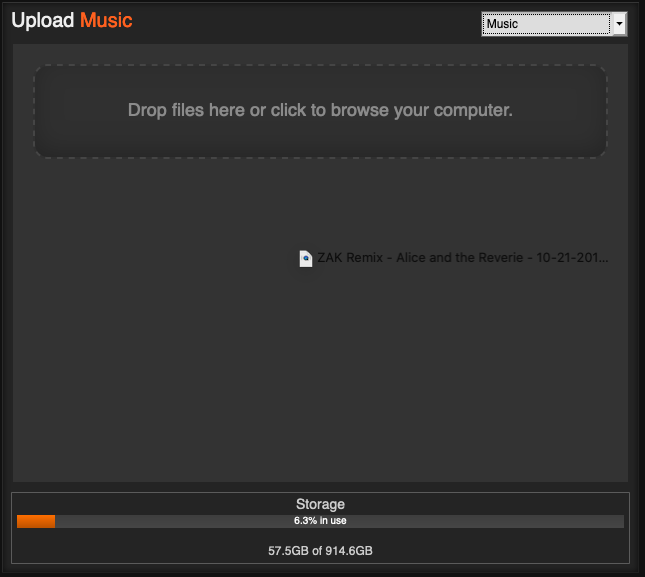
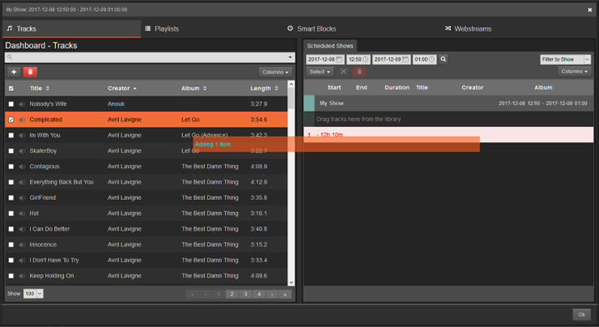

<iframe
    width="560"
    height="315"
    src="https://www.youtube-nocookie.com/embed/TJtWUzAlP08"
    frameborder="0"
    allow="accelerometer; autoplay; encrypted-media; gyroscope; picture-in-picture"
    allowfullscreen
></iframe>

Log in using your username and password using the link in the upper right corner. (If you just installed
LibreTime, your username/password is admin/admin.)

The main workflow in LibreTime is **Upload** media -> create a show on the **Calendar** -> **Schedule Tracks**.

Once you log in, click on the big blue button on the left navigation that says **Upload**.

Select the type of media you are uploading (Music, Station IDs, etc.) by using the dropdown box
at the top of the pane. After that, either drag and drop media into the area below or click the
dashed rectangle to open a file browser.

Once your files have uploaded and have been successfully imported (as shown in the pane on the right),
click on **Calendar** on the left navigation.

Click on the blue **+ New Show** button to add a new show.

At the very minimum, fill out the show's name and when the show will take place. If the show will repeat regularly,
check the **Repeats?** box and fill out the repeat information. A description of all fields of the New Show box
are in the table below. Finally, click on the grey **+ Add this show** button at the top
of the pane to add your show to the calendar.

Once your show is created, click on it to open its context menu. Select **Schedule Tracks** to open the track scheduler.

The track scheduler behaves similarly to iTunes or Windows Media Player: media browser on the left, playlist on the right.
Find the tracks that you would like to schedule by using the search box or sorting columns and then dragging them
into the playlist.

The bar at the end of the show's playlist will show the amount of time the show is underscheduled or overscheduled.
Shows that are underscheduled will have dead air at the end and shows that are overscheduled
will fade out exactly when the show is over (the orange colored entry), meaning tracks scheduled to start
after this point will not play (dark red colored entries). Click the **Ok** button in the bottom right to save.

Show playback will start and end as per each show's start and end times, allowing you to rely completely on
LibreTime for running your station or using LibreTime as a part of your live setup to cover when DJs are not present.
When media is playing, the **On Air** indicator at the top will turn red.

You can listen to your stream by going to `yourserverIP:8000` or by clicking the **Listen** button under the On Air
indicator.

### Show properties appendix

| Field                               | Description                                                                                                                                                                                                                                                                                                                                                                                                                                |
| ----------------------------------- | ------------------------------------------------------------------------------------------------------------------------------------------------------------------------------------------------------------------------------------------------------------------------------------------------------------------------------------------------------------------------------------------------------------------------------------------ |
| _What_                              |                                                                                                                                                                                                                                                                                                                                                                                                                                            |
| Name (Required)                     | The name of your show                                                                                                                                                                                                                                                                                                                                                                                                                      |
| URL                                 | The URL of your show. Not used on the public page.                                                                                                                                                                                                                                                                                                                                                                                         |
| Genre                               | The genre of your show. Not used on the public page.                                                                                                                                                                                                                                                                                                                                                                                       |
| Description                         | Description of your show. Not used on the public page.                                                                                                                                                                                                                                                                                                                                                                                     |
| _When_                              |                                                                                                                                                                                                                                                                                                                                                                                                                                            |
| Start Time (Required)               | The time and date the show starts. Note that the time element is in 24 hour time. If the **Now** option is selected, the show will be created to immediately start.                                                                                                                                                                                                                                                                        |
| End Time (Required)                 | The time and date the show ends. Defaults to a time one hour after the start time, which can be seen in the **Duration** field, which is uneditable.                                                                                                                                                                                                                                                                                       |
| Repeats?                            | If checked, allows for options to schedule a repeated show. Shows can repeat weekly up to monthly in increments of one week and can be scheduled on multiple days of the same week. An end date can be set, otherwise the show can be deleted by clicking on its entry in the calendar and clicking Delete > Future Occurrences. If **Linked ?** is checked, the playlist scheduled for the next show will also play for all future shows. |
| _Autoloading Playlist_              |                                                                                                                                                                                                                                                                                                                                                                                                                                            |
| Add Autoloading Playlist?           | If checked, allows for the following options                                                                                                                                                                                                                                                                                                                                                                                               |
| Select Playlist                     | Select the playlist the show will autofill from (shows autofill exactly one hour before air). If you wish to use a smartblock you must add it to a playlist and then select that playlist. This can be used to auto-schedule new podcast episodes to air.                                                                                                                                                                                  |
| Repeat Playlist Until Show Is Full  | If checked, the playlist will be added to the show multiple times until the slot is full. Useful for applying a one-hour music playlist made up of smartblocks to a two-hour show.                                                                                                                                                                                                                                                         |
| _Live Stream Input_                 |                                                                                                                                                                                                                                                                                                                                                                                                                                            |
| Use LibreTime/Custom Authentication |                                                                                                                                                                                                                                                                                                                                                                                                                                            |
| Show Source                         |                                                                                                                                                                                                                                                                                                                                                                                                                                            |
| _Who_                               |                                                                                                                                                                                                                                                                                                                                                                                                                                            |
| Search Users, DJs                   | Program Managers and Admins may assign DJs to a show, giving DJs access to schedule tracks for said show. DJs cannot create shows on their own.                                                                                                                                                                                                                                                                                            |
| _Style_                             |                                                                                                                                                                                                                                                                                                                                                                                                                                            |
| Background/Text Color               | Set the color of the background and text of entries on the calendar. If not set, LibreTime will select contrasting colors for easy readability.                                                                                                                                                                                                                                                                                            |
| Show Logo                           | If desired, you can upload a show logo here. The logo does not appear on the public page.                                                                                                                                                                                                                                                                                                                                                  |
