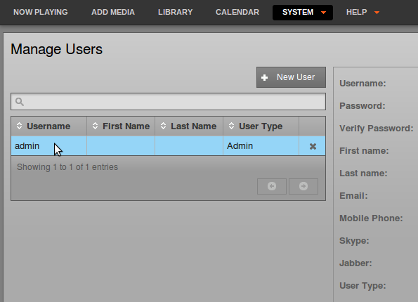

The Users page
---------------

If your Airtime server is accessible from the public Internet, it will not be secure until you set your own, strong password for the all-powerful *admin* user. Should the password for the *admin* user still be set to *admin* or some other easily guessed word, you should set a new password immediately, via the **Users** page on the System menu. Only users with the **User Type** of *Admin* can see the **System** menu when they log in.

Setting passwords and contact details
-------------------------------------

On the left side of the **Users** page, click on *admin* in the table. The details for this user will appear in the box on the right side. To begin with, on a freshly installed Airtime server, the *admin* user only has a **Username**, **Password** and **User Type** set.

To set a new password for the *admin* user, enter a string of letters and numbers (as long and as varied as is practical) into the **Password** field, then again into the **Verify Password** field to guard against typing errors. Keeping this password secret is essential for the smooth running of your station, because it enables access to all scheduling and management features. You can also enter other details for the *admin* user account on this page, including full name and contact details. Then click the **Save** button.

Adding user accounts
--------------------

To add further user accounts to the system, one for each of your station staff that need access to Airtime, click the **New User** button with the plus icon. Enter a user name, password and contact details, and then select the **User Type** from the drop down menu, which can be *Admin*, *Program Manager*, *DJ*, or *Guest*. The difference between these user types is:

* Guests
  - Can view shows and the playout log on the Calendar and Dashboard, respectively
  - Listen to the output stream without leaving the interface
* DJs
  - Everything Guests can do, plus
  - Upload media (music, PSAs, underwriting, shows, etc.) to their own library (DJs cannot view other libraries)
  - Edit metadata, delete, and schedule media in their own library to shows they are assigned to
  - Preview uploaded media _without_ affecting the live playout
  - Create Playlists, Smart Blocks, and connect Podcasts and Webstreams to LibreTime
  - Publish media items to LibreTime's built-in My Podcast function or 3rd party sources such as Soundcloud
* Program Managers
  - Everything DJs can do, plus
  - Manage other users' libraries in addition to their own
  - Create, edit, and delete color-coded shows on the Calender and assign them to DJs (if needed)
  - Shows can be scheduled to repeat, with the option of linking content between the shows (helpful if a DJ livestreams in each week)
  - View listener statistics
  - Export playout logs for analysis or reporting for music royalties
* Administrators
  - Everything Program Managers can do, plus
  - Manage all user accounts, including the ability to reset passwords
  - Configure Track Types for easy sorting of uploaded content
  - Change system settings

Editing or deleting user accounts
---------------------------------

New user accounts that you add will be shown in the table on the left side of the **Users** page. If you have a large number of users on the system, you can use the search tool above the table (which has a magnifying glass icon) to identify specific user accounts. Click the white chevrons in the table headings to sort the search results by **Username**, **First Name**, **Last Name** or **User Type**.

To edit a user account, click on that user's row in the table, change the user's details in the box on the right side, and then click the **Save** button. To remove a user account, click the small **x** icon to the right side of its row in the table. You cannot delete your own user account, and usernames cannot be changed once created.

If the Airtime server is running in demo mode, user accounts cannot be created or updated. See the chapter *Host configuration* for details of how to enable demo mode.

Updating your own account
-------------------------

Users can update their own password, and their contact, language and time zone details, by clicking their username on the right side of the main menu bar, next to the **Logout** link.

 

This action opens a separate, individual page which the user can update regardless of their **User Type** and access to the **System** menu. Click the **Save** button to update your account.

