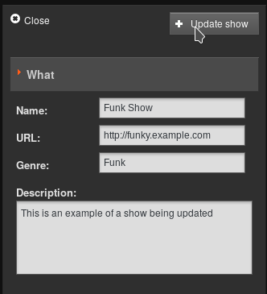

La page Calendrier de l'interface d'administration de LibreTime comporte trois vues : **jour**, **semaine** et **mois**, qui peuvent être changées à l'aide des boutons gris dans le coin supérieur droit. Par défaut, la vue du mois est affichée, avec la date du jour mise en évidence par un fond gris pâle.

Dans le coin supérieur gauche de la page, vous pouvez revenir en arrière ou avancer dans le **Calendrier** en cliquant sur les boutons qui ont un petit triangle gris dans un cercle blanc. Cliquez sur le bouton **Aujourd'hui** pour passer à la date du jour dans la vue actuelle. (Le bouton **Aujourd'hui** sera grisé si vous visualisez déjà cette date). Dans les vues **jour** ou **semaine**, il existe également un menu déroulant qui vous permet de définir la résolution affichée pour le Calendrier, allant d'une minute par ligne à soixante minutes par ligne.

### Modification d'un programme

La configuration et les métadonnées d'un programme peuvent être modifiées à tout moment, à l'exception des options **Date/Heure de début** et **Enregistrer à partir d'une entrée**, qui sont fixes une fois que la diffusion du programme a commencé. Cliquez sur le programme dans le Calendrier, et sélectionnez **Modifier le programme** dans le menu contextuel qui s'affiche. Cela ouvre la boîte de dialogue **Mettre à jour le programme**, qui est presque exactement la même que la boîte de dialogue **Ajouter ce programme**. Cliquez sur le bouton **+ Mettre à jour le programme** en haut ou en bas de la case lorsque vous avez terminé.

Les épisodes des programmes récurrents ont également un champ **Description de l'instance** dans lequel vous pouvez ajouter des détails pour cet épisode particulier. Cliquez sur l'épisode dans le Calendrier, cliquez sur **Modifier** dans le menu contextuel, puis sur **Modifier cette instance**. Après avoir saisi une description d'instance, cliquez sur le bouton **+ Mettre à jour** l'émission.

Il est également possible de cliquer sur des programmes particuliers et de les faire glisser vers de nouveaux jours et heures dans le calendrier. Cependant, LibreTime ne permet pas de faire glisser un programme futur dans le passé, ni de faire glisser et déposer des instances d'un programme récurrent. Dans les vues **Jour** et **Semaine**, la longueur du programme peut être ajustée en cliquant sur le bord inférieur de la case du programme, et en faisant glisser le bord de la case vers le haut ou vers le bas. La nouvelle durée du programme est calculée automatiquement.

### Ajout de contenu à un programme

Pour ajouter du contenu à un programme, cliquez sur le programme dans n'importe quelle vue du Calendrier puis sélectionnez **Ajouter des pistes** dans le menu contextuel.Les programmes qui ne contiennent pas encore de contenu programmé sont marqués d'un point d'exclamation rouge, à droite des heures de début et de fin du programme dans la barre supérieure. Les programmes partiellement remplies de contenu sont marquées d'un point d'exclamation jaune. Pendant la diffusion du programme, une icône de lecture verte s'affiche également dans la barre supérieure.

L'action **Ajouter des pistes** ouvre une fenêtre avec le nom du programme. Comme lorsque vous utilisez la page **Lecture en cours**, vous pouvez rechercher des éléments de contenu et les ajouter à la programmation de l'émission sur le côté droit de la page. Reportez-vous au chapitre "**Lecture en cours**" pour plus de détails.

Lorsque votre programme contient tout le contenu requis, cliquez sur le bouton **OK** dans le coin inférieur droit pour fermer la fenêtre. De retour dans le **Calendrier**, cliquez sur le programme et sélectionnez **Afficher** dans le menu contextuel pour afficher une liste du contenu désormais inclus dans le programme

La fenêtre **Contenu du programme** est une interface en lecture seule comportant une barre orange qui indique la quantité de média ajoutée au programme. Cliquez sur le bouton **OK** dans le coin inférieur droit, ou sur l'icône **x** blanche dans le coin supérieur droit, pour fermer la fenêtre.

### Suppression du contenu d'un programme

Pour supprimer un élément individuel d'un programme, cliquez sur le programme dans le **calendrier** et sélectionnez **Ajouter des pistes** dans le menu contextuel. Dans la fenêtre qui s'ouvre, cliquez sur l'élément que vous souhaitez supprimer de la présentation, puis cliquez sur **Supprimer** dans le menu contextuel, ou cochez la case dans la ligne de l'élément, puis cliquez sur l'icône Supprimer en haut du tableau. Pour supprimer tous les fichiers et toutes les listes de lecture d'un programme, cliquez sur le programme dans le **calendrier**, puis sélectionnez **Annuler l'émission** dans le menu contextuel.

### Suppression d'un programme à venir

Pour supprimer une instance à venir d'un programme récurrent, cliquez sur le programme dans le **calendrier**, puis sélectionnez **Supprimer**, puis **Supprimer l'instance** dans le menu contextuel. Si vous souhaitez supprimer toutes les instances futures d'un spectacle répétitif, sélectionnez **Supprimer l'instance et toutes les instances suivantes** dans le menu contextuel..

Vous ne pouvez pas supprimer ou retirer le contenu de programmes qui ont déjà été diffusées. Ces programmes n'ont qu'une seule option dans le menu contextuel, qui est **Afficher**.

### Annulation de la diffusion

Si vous souhaitez annuler la diffusion d'un programme en cours, cliquez sur le programme dans le **Calendrier** et sélectionnez **Annuler l'émission** dans le menu contextuel. Cette action ne peut pas être annulée.
