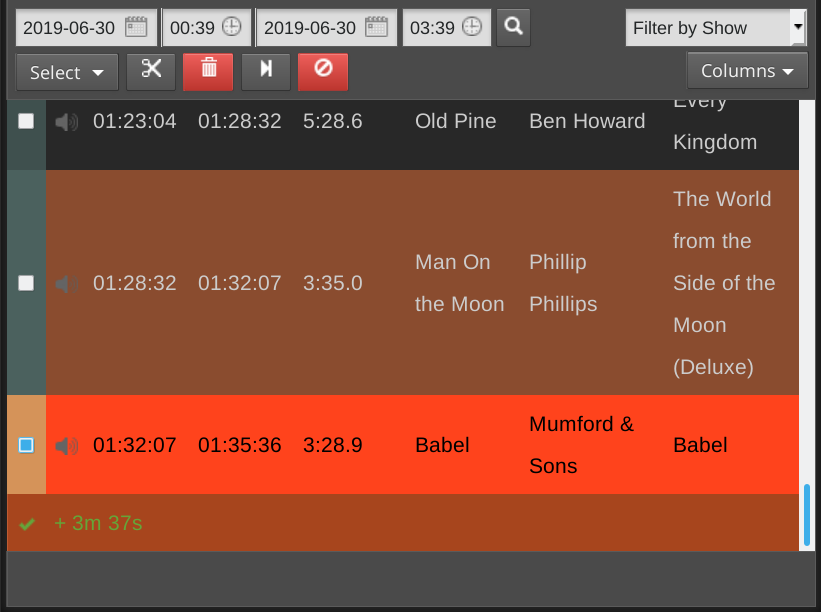

:::conseil

Want to listen to LibreTime's output stream? Click **Listen** below the **On Air** light.

:::

Le Dashboard (Tableau de bord)est divisé en deux sections : une section **Bibliothèque** divisée entre **Pistes**, **listes de lecture**, **Blocs intelligents,** **fLUX Web** et **Podcasts**, avec la boîte de dialogue **scheduled shows** (créneaux programmés) sur la droite. Cette page donne un aperçu de l'interface de droite.\* Vérifiez les liens pour obtenir des informations sur les autres sections qui fournissent le contenu qui peut être programmé.

La page **scheduled shows** (créneaux programmés) offre une vue du contenu que votre station va diffuser, ou a déjà diffusé, qui affiche par défaut les 3 heures à venir.
Cette page vous permet également d'apporter des modifications de dernière minute aux émissions en cours.

Si vous venez d'installer LibreTime, il se peut qu'aucun contenu ne soit encore affiché. Cliquez sur les icônes de **calendrier** et d'**horloge** au-dessus du tableau pour modifier la date et l'heure, puis cliquez sur le bouton** Rechercher des programmes** (avec l'icône de la loupe) à droite.

Pour afficher le contenu d'un programme particulier, cliquez sur **Filtrer par émission** et sélectionnez le nom du programme dans le menu déroulant qui apparaît.

Dans la partie gauche de la page, les heures de début et de fin, la durée et le titre de chaque élément de contenu sont affichés. Sur la droite, le.a créateur.ice, l'album, les temps de repérage ou de fondu et le type Mime (format de fichier) peuvent également être affichés. Ces informations peuvent vous aider à préparer les* pistes audio* pour l'insertion dans le programme, y compris les contrôles de temps si vous le souhaitez. Le fait de mettre des informations sur l'heure actuelle aux pistes audio décrivant un contenu spécifique peut, bien sûr, limiter la réutilisation de ces pistes audio, à moins que vous ne diffusiez toujours un élément particulier à la même heure de la journée.

Cliquez sur le bouton **Afficher/masquer les colonnes** à droite pour configurer les métadonnées affichées, en cochant les cases dans la fenêtre contextuelle.

La ligne correspondant à l'élément en cours de lecture s'affiche sur un fond vert vif. Les programmes sous-remplis (programmes dont le contenu est insuffisant pour remplir le temps imparti) sont affichés avec une ligne indiquant la durée de la sous -réservation en minutes et secondes. Ces lignes contiennent un point d'exclamation rouge dans la première colonne et ont un fond rose.

### Suppression du contenu d'un programme en cours

Si un programme est surbooké, c'est-à-dire que la durée totale de diffusion est supérieure au temps imparti pour le programme, une ligne marron indique que l'élément sera supprimé à la fin de l'émission. Une ligne rouge indique que l'élément ne sera pas diffusé du tout. La durée du surbooking est indiquée en minutes et en secondes dans la dernière ligne de l'émission. Pour supprimer les éléments supplémentaires à la fin d'un programme surbooké, cliquez sur l'icone **Ciseaux** en haut à gauche du tableau.

Vous pouvez également cocher les cases des éléments dont la diffusion n'est pas encore terminée et cliquer sur le bouton **Corbeille**, à droite du bouton **Ciseaux**, pour les supprimer de la programmation. Si vous supprimez l'élément en cours de lecture,Dashbo le playout passera automatiquement à l'élément suivant d du programme, vous devez donc vous assurer qu'il reste suffisamment d'éléments dans l'émission pour éviter les temps morts.

Si vous avez une long programme affiché et que vous souhaitez passer à l'élément en cours de lecture, cliquez sur le bouton avec l'icône de la flèche de fin, à droite de la **corbeille**.

Pour annuler complètement le programme en cours, cliquez à nouveau sur le bouton rouge à droite. Une fenêtre pop-up vous demandera de confirmer l'annulation, car cette action ne peut être annulée.

Les éléments qui ne sont plus disponibles ont une icône en forme de point d'exclamation dans la deuxième colonne. Cela peut se produire pour des fichiers multimédia qui faisaient partie d'émissions précédentes et qui ont été supprimés de la bibliothèque de LibreTime (stockage principal ou dossiers surveillés) par la suite. Les éléments qui font partie de programmes à venir ne peuvent pas être retirés de la bibliothèque via l'interface LibreTime.

### Ajouter du contenu à un programme en cours

Après avoir trouvé les éléments que vous souhaitez à l'aide des outils de recherche, vous pouvez les faire glisser et les déposer depuis le tableau de la bibliothèque sur le côté gauche de la page dans les programmes sur le côté droit, y compris le programme en cours.

Si le programme en cours n'est pas en cours de diffusion, la lecture du nouvel élément commencera immédiatement. Ce déclenchement manuel de la diffusion peut être utilisé comme une technique d'assistance en direct, dans laquelle la sortie de la carte son du serveur LibreTime est mélangée avec d'autres sources telles que des microphones ou des hybrides téléphoniques sur son chemin vers un émetteur, ou un encodeur de flux séparé. Par exemple, l'animateur d'une émission en direct peut ne pas vouloir couper une discussion en studio pour jouer de la musique à une heure fixe.

Vous pouvez également sélectionner plusieurs éléments à l'aide du bouton de menu **Sélectionner**, situé juste en dessous du champ de recherche simple, qui offre les options suivantes :**Sélectionner cette page** de résultats de recherche, **Désélectionner cette page** et **Désélectionner tout**. Vous pouvez également utiliser les cases à cocher situées à gauche du tableau de la bibliothèque pour sélectionner des éléments spécifiques. Faites ensuite glisser l'un des éléments dans la présentation pour ajouter tous les éléments sélectionnés, ou cliquez sur le bouton **Ajouter à la présentation sélectionnée**, qui comporte une icône plus. Si vous le souhaitez, vous pouvez également utiliser le bouton **Corbeille** pour supprimer définitivement des éléments de la bibliothèque de LibreTime. Seuls les utilisateurs admin ont la permission de supprimer tous les éléments.

Pour insérer des éléments sélectionnés dans une case à cocher à un moment précis de l'horaire du programme, cliquez sur l'un des morceaux dans le tableau des horaires. Puis cliquez sur le bouton **Ajouter au programme sélectionné** dans le tableau de la bibliothèque. Cela insérera les pistes de la bibliothèque après la piste programmée sélectionnée.

Pour ajouter un seul élément au point d'insertion, double-cliquez dessus dans la bibliothèque. Il n'est pas nécessaire de sélectionner ou de faire glisser l'élément au préalable.

Si vous cliquez avec le bouton droit de la souris sur une pistes dans le tableau de programmation, une fenêtre contextuelle s'affiche. Ce menu contextuel vous permet également d'écouter l'ensemble du programme avant la diffusion, ou de supprimer du programme l'élément sur lequel vous avez cliqué.
