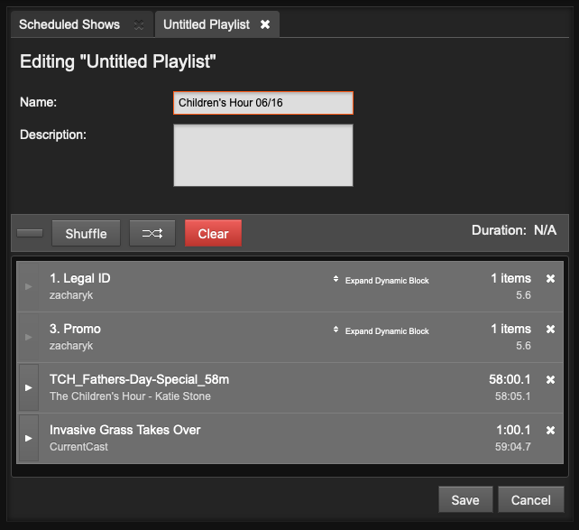

## Création d'une nouvelle playlist

Vous pouvez créer une nouvelle liste de lecture dans la barre d'outils de la page **Listes de lecture**.

Saisissez un **nom** et une **description** pour la liste de lecture, puis cliquez sur le bouton **Enregistrer**. La définition de métadonnées de bonne qualité ici vous aidera à trouver la liste de lecture à l'aide de la boîte de recherche plus tard, vous devez donc être aussi descriptif que possible..

### Ajouter du contenu à une playlist

Lorsqu'une liste de lecture est ouverte, faites glisser et déposez les éléments des résultats de la recherche sur la gauche dans la liste de lecture sur la droite. Les jingles et les pistes vocales peuvent être ajoutés avant, après ou entre les éléments musicaux.

Après avoir ajouté des fichiers à la liste de lecture, la durée totale de la liste de lecture s'affiche dans le coin supérieur droit. La durée d'un fichier individuel est indiquée dans chaque rangée de la playlist dans une police blanche, et sous ce chiffre, le temps écoulé depuis le début de la playlist est affiché dans une police plus petite en gris clair. Ce chiffre de temps écoulé peut être utilisé comme contrôle de temps pour les pistes vocales, bien que cette option puisse limiter la réutilisation de la piste vocale.

Pour écouter un fichier de liste de lecture dans votre navigateur Web, cliquez sur le bouton triangulaire blanc situé à gauche de sa ligne. (Si le format du fichier n'est pas pris en charge par votre navigateur, le triangle de ce bouton sera grisé). Si l'audition du format du fichier est prise en charge, une fenêtre pop-up s'ouvrira, avec la liste de lecture commençant au fichier sur lequel vous avez cliqué

Cliquez sur la petite icône **x** blanche à droite de chaque ligne pour supprimer un fichier de la liste de lecture. Vous pouvez également faire glisser et déposer les fichiers pour les réorganiser, ou cliquer sur le bouton **Aleatoire**" pour réorganiser les fichiers automatiquement.

Lorsque votre liste de lecture est complète, cliquez sur le bouton **Nouveau** dans le coin supérieur gauche pour créer une autre liste de lecture, cliquez sur l'icône de fermeture (une croix blanche dans un cercle noir) dans le coin supérieur droit, ou naviguez vers une autre page de l'interface LibreTime.

Si vous souhaitez modifier le contenu ou les métadonnées de la liste de lecture ultérieurement, vous pouvez la retrouver par **Titre**, **Créateur.ice**, **Date de dernière modification**, **Longueur**, **Propriétaire** ou **Année** en utilisant l'un des outils de recherche de la page **Bibliothèque**. Cliquez sur la **playlist** dans la liste des résultats de la recherche, puis cliquez sur **Modifier** dans le menu contextuel. Vous pouvez également prévisualiser l'ensemble de la liste de lecture dans une fenêtre d'audition contextuelle, dupliquer ou supprimer l'une de vos listes de lecture à partir de ce menu.

### Chargement automatique des playlists

LibreTime programmera les pistes d'une liste de lecture sélectionnée une heure avant la diffusion d'une émission. C'est un excellent moyen de programmer automatiquement des émissions hebdomadaires qui sont reçues via des podcasts.

## Création d'un bloc intelligent ( smartblock)

Les blocs intelligents sont automatiquement remplis de fichiers média de la bibliothèque LibreTime, selon les critères que vous spécifiez. Cette fonction est destinée à faire gagner du temps au personnel, par rapport à la sélection manuelle d'éléments pour une liste de lecture, et peut être utilisée pour programmer des qui fonctionnent dans un format cohérent.

Pour créer un bloc intelligent, cliquez sur le bouton **bloc intelligent** dans la barre latérale gauche, puis sélectionnez Nouveau dans la barre d'outils. Comme pour les listes de lecture, les blocs intelligents peuvent avoir un titre et une description, que vous pouvez modifier. Cela vous aide à trouver des blocs intelligents pertinents dans les recherches.

Remplissez les sections **Nom**, **Critères de recherche** et **Limiter à**. Le critère de recherche peut être n'importe quelle catégorie de métadonnées de LibreTime, comme le **titre**, le.a **créateur.ice** ou le **genre**. Le modificateur dépend du fait que la métadonnée en question contient des lettres ou des chiffres. Par exemple, \*\*Titre a des modificateurs tels que contains et starts with, alors que les modificateurs pour BPM incluent is greater than et is in the range.

Si vous disposez d'un grand nombre de fichiers qui répondent aux critères que vous spécifiez, vous pouvez limiter la durée du bloc intelligent à l'aide du champ
Remplissez les sections **Nom**, **Critères de recherche** et **Limiter à**. Le critère de recherche peut être n'importe quelle catégorie de métadonnées de LibreTime, comme le **Limiter à**, afin qu'il s'inscrive dans le cadre du spectacle que vous avez en tête. Sélectionnez des heures, des minutes ou des éléments dans le menu déroulant, puis cliquez à nouveau sur le bouton **Générer** s'il s'agit d'un bloc intelligent statique. Cliquez ensuite sur le bouton **Enregistrer**.

:::note

Par défaut, les blocs intelligents ne dépasseront pas la durée d'un spectacle programmé. Cela permet d'éviter que des pistes soient coupées parce qu'elles dépassent la limite de temps d'un spectacle. Si vous souhaitez qu'un bloc intelligent programme des pistes jusqu'à ce qu'il soit plus long que la limite de temps, vous pouvez cocher la case **Autoriser la dernière piste à dépasser la limite de temps** (utile pour éviter les temps morts dans les émissions programmées automatiquement).

:::

Vous pouvez également définir le type de bloc intelligent. Un bloc intelligent **statique** enregistre les critères et génère le contenu du bloc immédiatement. Cela vous permet de modifier le contenu du bloc dans la page **Bibliothèque** avant de l'ajouter à une émission. Un bloc intelligent **dynamique** enregistre uniquement les critères et le contenu spécifique est généré au moment où le bloc est ajouté à une présentation. Ensuite, le contenu de l'émission peut être modifié ou réorganisé dansla page **lecture en cours**.

Cliquez sur le bouton plus à gauche pour ajouter des critères OR, tels que les créateur.ice contenant "beck" OR "jimi". Pour ajouter des critères ET, tels que Créateur.ice contenant "jimi" ET BPM compris entre 120 et 130, cliquez sur le bouton plus à droite. (Les critères ne sont pas sensibles à la casse). Cliquez sur **Aperçu** pour voir les résultats.

:::conseil

Si vous voyez le message 0 fichier répond aux critères, cela peut signifier que les fichiers de la bibliothèque n'ont pas été étiquetés avec les métadonnées correctes. Consultez le chapitre **Préparation des médias** pour obtenir des conseils sur le balisage du contenu.
:::

Si vous n'aimez pas l'ordre qui est généré, cliquez sur le bouton **Aléatoire** ou faites glisser et déposez le contenu du bloc intelligent dans l'ordre que vous préférez. Vous pouvez également supprimer des éléments ou en ajouter de nouveaux manuellement à partir de la bibliothèque. Les modifications apportées au contenu des blocs intelligents statiques sont enregistrées automatiquement lorsque vous ajoutez des éléments, les supprimez ou les réorganisez, ou lorsque vous cliquez sur le bouton **Générer**. Cliquez sur le bouton **Enregistrer** dans le coin supérieur droit pour enregistrer les modifications apportées aux critères du bloc intelligent.

Par défaut, un bloc intelligent ne contient pas d'éléments répétés, ce qui limite la durée du bloc si votre **bibliothèque** ne contient pas suffisamment d'éléments répondant aux critères spécifiés. Pour ignorer le comportement par défaut, cochez la case **Autoriser les pistes répétées**. Le menu **Trier les pistes par** offre les options suivantes : **aléatoire**, **éléments les plus récents** ou **les plus anciens en premier**.

Les blocs intelligents peuvent être ajoutés aux spectacles de la même manière qu'une liste de lecture créée manuellement. Les blocs intelligents peuvent également être ajoutés à une ou plusieurs listes de lecture. Dans le cas d'une liste de lecture contenant un bloc intelligent statique, cliquez sur **Développer le bloc statique** pour en afficher le contenu. Pour un bloc intelligent dynamique, vous pouvez examiner les critères et la durée limite en cliquant sur **Développer le bloc dynamique**.

Une fois créés, les blocs intelligents peuvent être trouvés sous l'onglet **bloc intelligent** et affinés à tout moment. Vous pouvez les rouvrir en cliquant avec le bouton droit de la souris sur le bloc intelligent et en sélectionnant **Editer** dans le menu contextuel.
