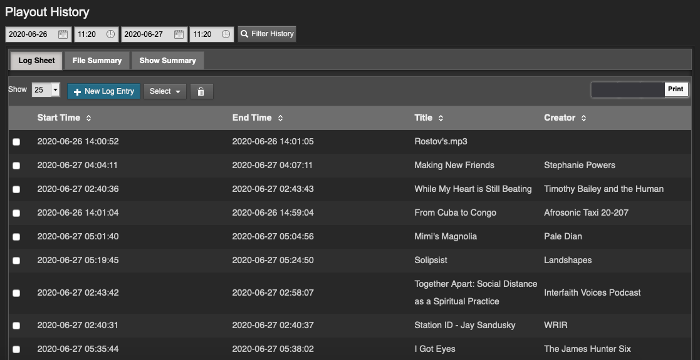

Dans la page **Statistiques**, le menu **Historique de diffusion** vous permet d'afficher une liste des fichiers lus dans une plage de dates et d'heures spécifique. Cette page est conçue pour aider votre station à préparer les rapports destinés aux sociétés de perception des droits musicaux et aux organismes de réglementation.

Les résultats de la recherche peuvent être copiés dans le presse-papiers à l'aide du bouton **Copier**, exportés sous forme de données au format **CSV** (comma separated values), exportés sous forme de document au format **PDF** ou affichés dans un format imprimable à l'aide du bouton **Imprimer**. (Votre navigateur web doit avoir un plugin Adobe Flash installé pour que ces boutons apparaissent). Une fois l'impression terminée, appuyez sur la touche \*\*Escùù pour revenir à l'interface LibreTime.

Cette page comporte trois onglets : **log sheet**, **file summary** ,**show summary**. Sur chacun de ces onglets, vous pouvez sélectionner une plage de dates et d'heures en cliquant sur les icônes de calendrier et d'horloge dans le coin supérieur gauche de la page. Cliquez ensuite sur le bouton de recherche, qui comporte une icône en forme de loupe, à droite. Une liste des fichiers lus pendant cette période apparaîtra plus bas sur la page.



Dans l'onglet **Log Sheet**, l'historique de la lecture est trié par défaut par **Heure de début** et **Heure de fin**.

Le nombre de fois que chaque fichier a été lu et la longueur des fichiers sont indiqués dans l'onglet **file summary**. Pour une utilisation optimale de cette fonctionnalité à des fins de déclaration de redevances, les fichiers musicaux doivent être étiquetés avec les métadonnées **Composer** et **Copyright**. L'artiste qui interprète un morceau de musique peut ne pas être le compositeur original de l'œuvre, ni le détenteur des droits d'auteur de l'enregistrement sonore.

Dans l'onglet **show summary**, cliquez sur le nom d'un spectacle dans la plage de recherche pour développer sa ligne et voir les détails de sa diffusion.

### Enregistrement manuel

Si votre station dispose d'une diffusion à partir de sources analogiques telles que des platines ou des microphones, LibreTime ne collecte pas automatiquement les métadonnées de ces entrées. Pour vous assurer que l'historique des diffusions est complet, vous pouvez ajouter des entrées manuellement en cliquant sur le bouton **+ Créer une nouvelle entrée de log**. Cette action ouvre une fenêtre pop-up avec des champs par défaut de Start Time, End Time, Title et Creator. Cliquez sur le bouton **Find** pour remplir automatiquement le menu **Choose Show Instance** avec les noms des émissions qui ont eu lieu dans la plage de temps spécifiée. Cliquez ensuite sur le bouton **Enregistrer** pour entrer le nouvel élément dans l'historique de diffusion.

Les entrées du journal peuvent également être supprimées manuellement, en utilisant le bouton avec l'icône de la corbeille, à droite du bouton **+ Créer une entrée**. Les pages des entrées peuvent être sélectionnées pour être supprimées à l'aide du menu déroulant **Sélectionner**.

## Modèle d'historique


La page **Modèles d'historique** du menu **Historique** vous permet de préparer des rapports dont le contenu exact est exigé par les organismes de réglementation des territoires sur lesquels vous diffusez. Vous pouvez commencer à créer un modèle personnalisé en cliquant sur le bouton **new log sheet template** (Nouveau modèle de feuille de route) ou sur le bouton ** new file summery template** (Nouveau modèle de résumé de fichier).


L'une ou l'autre de ces actions ouvre une page dans laquelle vous pouvez nommer le nouveau modèle, et ajouter ou supprimer des éléments de la liste de gauche. Pour ajouter un nouvel élément dans la liste de droite, cliquez sur l'icône plus correspondant à l'élément souhaité. Si l'élément dont vous avez besoin ne figure pas dans la liste, vous pouvez utiliser la case **Ajouter un nouveau champ** située en bas de la colonne de droite. Sélectionnez _string_, _boolean_, _integer_, or _float_, selon le type de données que vous souhaitez enregistrer, puis cliquez sur le bouton **+ Ajouter**.

Lorsque le modèle a le format souhaité, cliquez sur le bouton **Enregistrer**, puis sur **Définir le modèle par défau**t si vous le souhaitez. Le nouveau modèle sera désormais répertorié sur la page **Modèles d'historique**. Si vous avez défini un nouveau modèle par défaut, les modifications seront visibles sur les onglets de la page Historique de diffusion.

## Exportation de la programmation #exporting}

LibreTime dispose d'une fonctionnalité qui permet d'afficher les informations relatives aux émissions et à la programmation de votre station sur des sites web distants. Cette fonctionnalité est incluse dans LibreTime car vous n'invitez généralement pas le grand public à accéder directement à votre serveur LibreTime. Si un très grand nombre de personnes demandaient des données au serveur LibreTime en même temps, l'explosion du trafic réseau pourrait surcharger le serveur et potentiellement perturber vos émissions. Si elle est malveillante, cette surcharge du réseau est connue comme une attaque par déni de service.

Au lieu de cela, votre serveur web accessible au public peut récupérer les informations relatives aux horaires à partir de l'API LibreTime. Elles peuvent être présentées à l'aide de widgets Javascript et stylisées avec CSS, dans le format que vous souhaitez.

Deux types d'informations peuvent être récupérés à distance depuis l'API de LibreTime sans authentification : les métadonnées de l'émission en cours et de l'émission suivante (live-info), ou la programmation de la semaine en cours et de la semaine à venir (week-info). Les métadonnées week-info comprennent les noms des émissions, les heures et les URL des émissions individuelles sur votre site Web public. Ainsi, le public de votre station peut cliquer sur les informations de la grille pour en savoir plus sur une émission particulière, ou télécharger un enregistrement d'une émission précédente que vous auriez pu mettre à disposition.

Si votre serveur LibreTime était accessible à l'adresse [https://libretime.example.com](https://libretime.example.com), les informations sur les émissions en direct pourraient être récupérées par votre serveur web en utilisant cette URL :

```
https://libretime.example.com/api/live-info/?callback
```

Les métadonnées de texte séparées par des virgules renvoyées à votre serveur Web pourraient ressembler à ceci :

```json
{
  "env": "production",
  "schedulerTime": "2013-07-03 14:07:31",

  "previous": {
    "name": "Earth, Wind &amp; Fire - Boogie Wonderland",
    "starts": "2013-07-01 22:53:00",
    "ends": "2013-07-01 22:55:00",
    "type": "track"
  },
  "current": {
    "name": "Deodato - Also Sprach Zarathustra",
    "starts": "2013-07-03 13:07:06",
    "ends": "2013-07-03 13:16:05",
    "media_item_played": true,
    "record": 0,
    "type": "track"
  },

  "next": {
    "id": 8,
    "instance_id": 10,
    "name": "Rock Show",
    "url": "https://rock.example.com/",
    "start_timestamp": "2013-07-03 14:00:00",
    "end_timestamp": "2013-07-03 15:00:00",
    "starts": "2013-07-03 14:00:00",
    "ends": "2013-07-03 15:00:00",
    "record": 0,
    "type": "show"
  },

  "currentShow": [
    {
      "start_timestamp": "2013-07-03 14:07:00",
      "0": "2013-07-03 13:07:00",
      "end_timestamp": "2013-07-03 15:00:00",
      "1": "2013-07-03 14:00:00",
      "name": "Funk Show",
      "2": "Funk Show",
      "id": 7,
      "3": 7,
      "instance_id": 9,
      "4": 9,
      "record": 0,
      "5": 0,
      "url": "https://funk.example.com/",
      "6": "",
      "starts": "2013-07-03 14:07:00",
      "7": "2013-07-03 13:07:00",
      "ends": "2013-07-03 15:00:00",
      "8": "2013-07-03 14:00:00"
    }
  ],

  "nextShow": [
    {
      "id": 8,
      "instance_id": 10,
      "name": "Rock Show",
      "url": "https://rock.example.com/",
      "start_timestamp": "2013-07-03 15:00:00",
      "end_timestamp": "2013-07-03 16:00:00",
      "starts": "2013-07-03 15:00:00",
      "ends": "2013-07-03 16:00:00",
      "record": 0,
      "type": "show"
    }
  ],

  "timezone": "BST",
  "timezoneOffset": "3600",
  "AIRTIME_API_VERSION": "1.1"
}
```

Les informations relatives à l'horaire de la semaine en cours peuvent être récupérées à l'aide de l'URL :

```
https://libretime.example.com/api/week-info/?callback
```

Dans ce cas, les métadonnées renvoyées seraient dans un format différent de celui de l'exemple ci-dessus, quelque chose comme ce qui suit. Pour que l'exemple soit bref, cette exportation de programmation particulière ne contient que quatre émissions le lundi. Une exportation de programmation hebdomadaire complète contiendrait beaucoup plus de texte.

```json
{
  "monday": [
    {
      "start_timestamp": "2013-07-01 12:05:00",
      "end_timestamp": "2013-07-01 13:00:00",
      "name": "Elvis Show",
      "id": 2,
      "instance_id": 2,
      "record": 0,
      "url": "https://elvis.example.com/",
      "starts": "2013-07-01 12:05:00",
      "ends": "2013-07-01 13:00:00"
    },

    {
      "start_timestamp": "2013-07-01 13:00:00",
      "end_timestamp": "2013-07-01 14:00:00",
      "name": "News",
      "id": 3,
      "instance_id": 4,
      "record": 0,
      "url": "https://news.example.com/",
      "starts": "2013-07-01 13:00:00",
      "ends": "2013-07-01 14:00:00"
    },

    {
      "start_timestamp": "2013-07-01 14:00:00",
      "end_timestamp": "2013-07-01 15:00:00",
      "name": "Funk Show",
      "id": 4,
      "instance_id": 6,
      "record": 0,
      "url": "https://funk.example.com/",
      "starts": "2013-07-01 14:00:00",
      "ends": "2013-07-01 15:00:00"
    },

    {
      "start_timestamp": "2013-07-01 15:00:00",
      "end_timestamp": "2013-07-01 17:30:00",
      "name": "Rock Show",
      "id": 5,
      "instance_id": 7,
      "record": 0,
      "url": "https://rock.example.com/",
      "starts": "2013-07-01 15:00:00",
      "ends": "2013-07-01 17:30:00"
    }
  ],

  "tuesday": [],
  "wednesday": [],
  "thursday": [],
  "friday": [],
  "saturday": [],
  "sunday": [],
  "AIRTIME_API_VERSION": "1.1"
}
```

Si vous voyez le message You are not allowed to access this resource (Vous n'êtes pas autorisé à accéder à cette ressource) lorsque vous tentez d'afficher des informations sur les horaires dans votre navigateur Web, connectez-vous à l'interface d'administration de LibreTime, cliquez sur **Système** dans le menu principal, puis sur **Préférences**. Réglez **Allow Remote Websites To Access "Schedule" Info ?** sur **activé** cliquez sur le bouton **Save**, puis rafraîchissez la fenêtre du navigateur ouverte sur l'URL d'exportation des horaires. Si vous ne souhaitez pas mettre les informations de programmation à la disposition du public, définissez plutôt cette option sur **Désactivé**

### Mise en cache des informations sur les horaires

Si le serveur LibreTime est derrière un pare-feu, ou si vous voulez protéger le serveur LibreTime d'un grand nombre de requêtes de programmation, vous pouvez mettre en cache les informations de programmation sur un serveur public ou intermédiaire. Vous pouvez alors créer une règle de pare-feu qui n'autorise que le serveur de programmation à se connecter au serveur LibreTime, en plus de tous les utilisateurs distants de l'interface web de LibreTime.

Votre administrateur système peut configurer la mise en cache des horaires sur un serveur web standard Apache et PHP avec le programme curl installé, en suivant les étapes suivantes :

1. Créez un script shell sur le serveur de planification (schedule.example.com) qui interroge le serveur LibreTime distant (libretime.example.com), et écrit les métadonnées retournées dans une paire de fichiers temporaires locaux :

```
sudo nano /usr/local/bin/libretime-schedule.sh
```

Le contenu de ce fichier doit ressembler au script suivant, en remplaçant libretime.example.com par le nom de votre serveur LibreTime :

```bash
#!/bin/sh

curl -s "https://libretime.example.com/api/live-info/?callback=***" > /tmp/live-info

curl -s "https://libretime.example.com/api/week-info/?callback=***" > /tmp/week-info
```

2. Rendez le script exécutable :

```
sudo chmod +x /usr/local/bin/libretime-schedule.sh
```

3. Créez une configuration VirtualHost Apache pour le serveur de planification :

```
sudo nano /etc/apache2/sites-available/schedule
```

contenant une définition comme la suivante, en remplaçant schedule.example.com par le nom de votre serveur de planification :

```apacheconf
    <VirtualHost *:80>
       ServerName schedule.example.com
       DocumentRoot /var/www/schedule/
    </VirtualHost>
```

4. Dans le dossier DocumentRoot du serveur de planification, créez les dossiers api/live-info/ et api/week-info/.

```bash
sudo mkdir -p /var/www/schedule/api/live-info/
sudo mkdir -p /var/www/schedule/api/week-info/
```

5. Créez un fichier index.php dans le dossier api/live-info/ :

```bash
sudo nano /var/www/schedule/api/live-info/index.php
```

contenant le code suivant :

```php
<?php
$filename = '/tmp/live-info';  // define here the path and name of uploaded live-info file

header('Content-Type: text/javascript');
header("Expires: Thu, 01 Jan 1970 00:00:00 GMT");
header("Cache-Control: no-store, no-cache, must-revalidate");

$callback = empty($_GET['callback']) ? null : $_GET['callback'];
$content = file_get_contents($filename);
$content = str_replace('***', $callback, $content);
echo $content;
?>
```

6. Créez un fichier index.php dans le dossier api/week-info/ :

```
sudo nano /var/www/schedule/api/week-info/index.php
```

contenant le code suivant :

```php
<?php
$filename = '/tmp/week-info';  // define here the path and name of uploaded week-info file

header('Content-Type: text/javascript');
header("Expires: Thu, 01 Jan 1970 00:00:00 GMT");
header("Cache-Control: no-store, no-cache, must-revalidate");

$callback = empty($_GET['callback']) ? null : $_GET['callback'];
$content = file_get_contents($filename);
$content = str_replace('***', $callback, $content);
echo $content;
?>
```

7. Activez la nouvelle configuration et rechargez le serveur web Apache :

```bash
sudo a2ensite schedule
sudo /etc/init.d/apache2 reload
```

8. Créez une tâche cron pour exécuter le script shell chaque minute :

```bash
sudo nano /etc/cron.d/libretime-schedule
```

contenant la ligne :

```
* * * * * www-data /usr/local/bin/libretime-schedule.sh
```

Le serveur de planification va maintenant servir les mêmes informations de spectacle que le serveur LibreTime, avec une durée de vie du cache d'une minute. Vous pouvez ajuster la durée de vie du cache en modifiant la fréquence de la tâche cron qui interroge le serveur LibreTime.

### Pousser les informations de programmation via FTP ou SSH

S'il n'y a pas d'accès entrant au serveur LibreTime, un script FTP peut être utilisé pour pousser les données de programmation en cache de LibreTime vers un serveur web externe. La commande ftp standard doit être disponible sur le serveur LibreTime et le serveur web externe doit avoir un compte FTP restreint. Après avoir suivi les étapes 1 et 2 ci-dessus pour exporter les données de programmation vers une paire de fichiers temporaires sur le serveur LibreTime, créez un nouveau script sur le serveur LibreTime pour effectuer automatiquement le téléchargement :

```
sudo nano /usr/local/bin/upload-schedule-data.sh
```

Remplacez les valeurs d'hôte, d'utilisateur et de mot de passe par les valeurs appropriées pour votre serveur Web externe :

```bash
#!/bin/sh
HOST='website.example.com'
USER='ftp_user'
PASSWD='ftp_password'

ftp -n -v $HOST << EOT
user $USER $PASSWD
ascii
prompt
put /tmp/airtime-week-info
put /tmp/airtime-live-info
bye
EOT
```

Ensuite, rendez le nouveau script exécutable et créez une tâche cron pour le lancer toutes les minutes, comme à l'étape 8 ci-dessus. Les étapes 3 à 7 ci-dessus doivent être exécutées sur le serveur web externe afin qu'il puisse convertir les deux fichiers temporaires téléchargés par FTP en données publiques de planification.

Si vous disposez d'un accès shell sécurisé (SSH) au serveur web distant, vous pouvez écrire un script pour utiliser la commande de copie sécurisée (scp) au lieu de ftp.
