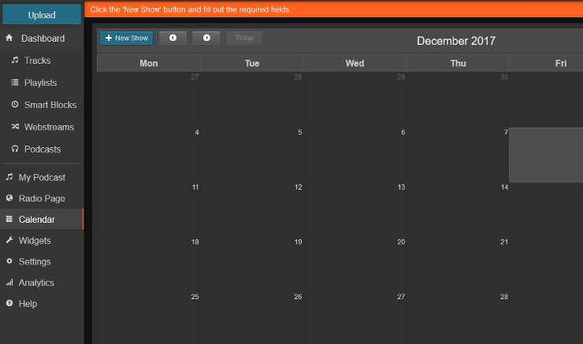
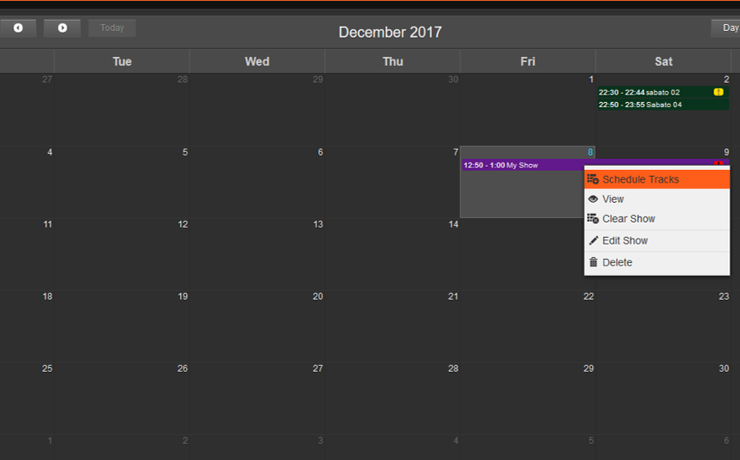

<iframe
    width="560"
    height="315"
    src="https://www.youtube-nocookie.com/embed/TJtWUzAlP08"
    frameborder="0"
    allow="accelerometer; autoplay; encrypted-media; gyroscope; picture-in-picture"
    allowfullscreen
></iframe>

Connectez-vous en utilisant votre nom d'utilisateur et votre mot de passe en utilisant le lien dans le coin supérieur droit. (Si vous venez d'installer LibreTime, votre nom d'utilisateur/mot de passe est admin/admin).

Le flux de travail principal dans LibreTime est **Télécharger les médias\*** -> créer une émission sur le **calendrier** -> **Programmer les pistes**.

Une fois que vous vous êtes connecté, cliquez sur le gros bouton bleu dans la navigation de gauche qui dit **upload**.

Sélectionnez le type de média que vous téléchargez (musique, identifiants de station, etc.) à l'aide de la liste déroulante située en haut du volet. Ensuite, faites glisser et déposez les médias dans la zone ci-dessous ou cliquez sur le rectangle en pointillés pour ouvrir un navigateur de fichiers.

Une fois que vos fichiers ont été téléchargés et importés avec succès (comme indiqué dans le volet de droite), cliquez sur **Calendrier** dans la navigation de gauche.

Cliquez sur le bouton bleu **+ nouvelle émission** pour ajouter une nouvelle émission.

Au minimum, indiquez le nom de l'émission et la date à laquelle elle aura lieu. Si l'émission doit être répétée régulièrement, cochez la case **Répétitions ?** et indiquez les informations relatives aux répétitions. Vous trouverez une description de tous les champs de la boîte de dialogue **nouvelle émission**dans le tableau ci-dessous. Enfin, cliquez sur le bouton gris **+ Add this show** en haut du volet pour ajouter votre spectacle au calendrier.

Une fois que votre émission est créé, cliquez dessus pour ouvrir son menu contextuel. Sélectionnez **Schedule Tracks** (créneaux programmés)pour ouvrir le planificateur de pistes.

Le planificateur de pistes se comporte de la même manière que iTunes ou Windows Media Player : navigateur multimédia à gauche, liste de lecture à droite. Trouvez les pistes que vous souhaitez programmer en utilisant le champ de recherche ou les colonnes de tri, puis faites-les glisser dans la liste de lecture.

La barre située à la fin de la liste de lecture de l'émission indique le temps pendant lequel l'émission est sous-planifiée ou surplanifiée. Les émissions qui ne sont pas programmées auront de l'air mort à la fin et les émissions qui sont programmées en trop auront un fondu enchaîné exactement à la fin de l'émission (entrée de couleur orange), ce qui signifie que les morceaux programmés pour commencer après ce point ne seront pas lus (entrées de couleur rouge foncé). Cliquez sur le bouton **Ok** en bas à droite pour enregistrer.

SLa lecture de l'émission commencera et se terminera selon les heures de début et de fin de chaque émission, ce qui vous permet de vous fier entièrement à LibreTime pour gérer votre station ou d'utiliser LibreTime dans le cadre de votre installation en direct pour couvrir les moments où les DJ ne sont pas présents. Lorsque le média est en cours de lecture, l'indicateur **On Air** en haut de l'écran devient rouge.

Vous pouvez écouter votre flux en vous rendant sur yourserverIP:8000 ou en cliquant sur le bouton **Listen** sous l'indicateur On Air.
indicator.

### Show properties appendix

| Description du champ                                              | Description                                                                                                                                                                                                                                                                                                                                                                                                                                                                                                                                                                 |
| ----------------------------------------------------------------- | --------------------------------------------------------------------------------------------------------------------------------------------------------------------------------------------------------------------------------------------------------------------------------------------------------------------------------------------------------------------------------------------------------------------------------------------------------------------------------------------------------------------------------------------------------------------------- |
| _Quoi_                                                            |                                                                                                                                                                                                                                                                                                                                                                                                                                                                                                                                                                             |
| Nom (obligatoire)                                                 | Le nom de votre émission                                                                                                                                                                                                                                                                                                                                                                                                                                                                                                                                                    |
| URL                                                               | L'URL de votre émission. Non utilisé sur la page publique.                                                                                                                                                                                                                                                                                                                                                                                                                                                                                                                  |
| Genre                                                             | Le genre de votre v. Non utilisé sur la page publique.                                                                                                                                                                                                                                                                                                                                                                                                                                                                                                                      |
| Description                                                       | Description de votre spectacle. Non utilisé sur la page publique.                                                                                                                                                                                                                                                                                                                                                                                                                                                                                                           |
|                                                                   |
| _Quand_                                                           |                                                                                                                                                                                                                                                                                                                                                                                                                                                                                                                                                                             |
| Heure de début (obligatoire)                                      | Date et heure de début de l'émission. Notez que l'élément de temps est en 24 heures. Si l'option Maintenant est sélectionnée, le spectacle sera créé pour démarrer immédiatement start.                                                                                                                                                                                                                                                                                                                                                                                     |
| Heure de fin (obligatoire)                                        | L'heure et la date de fin du spectacle. Par défaut, il s'agit d'une heure après l'heure de début, ce qui est indiqué dans le champ Durée, qui n'est pas modifiable.                                                                                                                                                                                                                                                                                                                                                                                                         |
| Répétitions ?                                                     | Si cette option est cochée, elle permet de programmer un spectacle répété. Les spectacles peuvent être répétés chaque semaine ou chaque mois par incréments d'une semaine et peuvent être programmés sur plusieurs jours de la même semaine. Une date de fin peut être définie, sinon l'émission peut être supprimée en cliquant sur son entrée dans le calendrier et en cliquant sur Supprimer > Occurrences futures. Si la case Linked ? est cochée, la liste de lecture programmée pour la prochaine émission sera également diffusée pour toutes les émissions futures. |
| _Liste de lecture automatique_                                    |                                                                                                                                                                                                                                                                                                                                                                                                                                                                                                                                                                             |
| Ajouter une liste de lecture à chargement automatique ?           | Si cette case est cochée, les options suivantes sont disponibles                                                                                                                                                                                                                                                                                                                                                                                                                                                                                                            |
| électionner la liste de lecture                                   | Sélectionnez la liste de lecture à partir de laquelle l'émission se chargera automatiquement (les émissions se chargent automatiquement une heure avant leur diffusion). Si vous souhaitez utiliser un smartblock, vous devez l'ajouter à une liste de lecture, puis sélectionner cette liste. Cela peut être utilisé pour programmer automatiquement la diffusion de nouveaux épisodes de podcast.                                                                                                                                                                         |
| Répéter la liste de lecture jusqu'à ce que l'émission soit pleine | Si cette option est cochée, la liste de lecture sera ajoutée à l'émission plusieurs fois jusqu'à ce que le créneau soit plein. Utile pour appliquer une liste de lecture musicale d'une heure composée de smartblocks à une émission de deux heures. If checked, the playlist will be added to the show multiple times until the slot is full. Useful for applying a one-hour music playlist made up of smartblocks to a two-hour show.                                                                                                                                     |
| _Entrée du flux en direct_                                        |                                                                                                                                                                                                                                                                                                                                                                                                                                                                                                                                                                             |
| Utiliser LibreTime/authentification personnalisée                 |                                                                                                                                                                                                                                                                                                                                                                                                                                                                                                                                                                             |
| Afficher la source                                                |                                                                                                                                                                                                                                                                                                                                                                                                                                                                                                                                                                             |
| _Qui_                                                             |                                                                                                                                                                                                                                                                                                                                                                                                                                                                                                                                                                             |
| Chercher les Utilisateur.ice.s DJ                                 | Les responsables de programmes et les administrateurs peuvent affecter des DJs à une émission, leur donnant ainsi accès à la programmation des pistes pour cette émission. Les DJ ne peuvent pas créer d'émissions par eux-mêmes.                                                                                                                                                                                                                                                                                                                                           |
| _Style_                                                           |                                                                                                                                                                                                                                                                                                                                                                                                                                                                                                                                                                             |
| Couleur du fond/texte                                             | la couleur du fond et du texte des entrées du calendrier. Si aucun paramètre n'est défini, LibreTime sélectionnera des couleurs contrastées pour une meilleure lisibilité.                                                                                                                                                                                                                                                                                                                                                                                                  |
| Logo de l'émission                                                | Si vous le souhaitez, vous pouvez télécharger un logo de spectacle ici. Le logo n'apparaît pas sur la page publique.                                                                                                                                                                                                                                                                                                                                                                                                                                                        |
