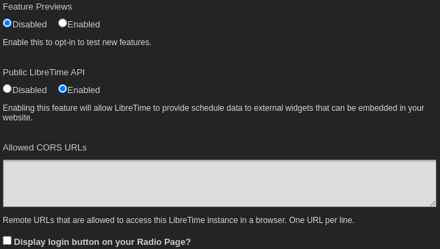
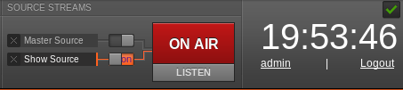

## Paramètres généraux

Dans le menu **Paramètres**, cliquez sur **Général** pour définir le **nom de votre station**. Ce texte s'affiche dans la barre de titre de votre navigateur Web lorsque le personnel de votre station est connecté à LibreTime, et éventuellement dans les métadonnées du flux. Vous pouvez également définir une **description de la station** et un **logo de la station** ici.

Le menu déroulant **Langue d'interface par défaut** définit la localisation par défaut de votre instance de LibreTime, et le menu déroulant **Fuseau horaire de la station** peut être utilisé pour afficher l'heure locale de votre station. LibreTime stocke les heures d'affichage en interne au format UTC (similaire au Greenwich Mean Time), mais affiche l'heure locale pour la commodité du personnel de votre station. Vous pouvez également définir le jour de la semaine auquel vous souhaitez commencer la programmation hebdomadaire de votre station, qui est par défaut le dimanche.

Initialement, les **durées par défaut du fondu entrant** et du **fondu sortant** pour les fondus automatiques sont fixées à une demi-seconde, et la **durée par défaut du fondu enchaîné** est fixée à zéro seconde. Des durées de fondu et de fondu enchaîné personnalisées peuvent être définies pour des éléments adjacents dans une liste de lecture ou un bloc intelligent statique. Consultez le chapitre _Bibliothèque_ pour plus de détails.

La **liste de lecture d'introduction à chargement automatique** vous permet de sélectionner une liste de lecture qui sera programmée au début de chaque émission ayant activé une liste de lecture à chargement automatique. Elle peut être utilisée, par exemple, pour insérer un identifiant de station ou d'autres annonces au début de chaque émission.

La **liste de lecture d'outro en chargement automatique** vous permet de sélectionner une liste de lecture qui sera programmée après le contenu de chaque émission avec une liste de lecture en chargement automatique.

L'option **Overwrite Podcast Episode Metatags**, activée par défaut, permet à LibreTime de remplacer les champs Artist, Title \& Album sur toutes les pistes téléchargées à partir d'un podcast par les informations du flux RSS..

L'option **Générer un bloc intelligent et une liste de lecture lors de la création d'un nouveau podcast**, lorsqu'elle est activée, créera un bloc intelligent correspondant au plus récent épisode d'un podcast et une liste de lecture contenant ce bloc intelligent automatiquement lors de l'ajout d'un podcast à LibreTime. Ceci peut aussi être fait manuellement par le bouton **generate bloc intelligent et liste de lecture** dans les paramètres d'un podcast, c'est pourquoi cette option est désactivée par défaut.

Vous pouvez choisir de tester les nouvelles fonctionnalités avec l'option **Feature Previews**. Les fonctionnalités que nous déployons en douceur de cette façon peuvent nécessiter plus de commentaires ou avoir encore des bogues tolérables. Cela comprend, sans s'y limiter, des fonctionnalités telles que les refactors importants de l'interface utilisateur. Vous pouvez revenir en arrière à tout moment.

Si vous le souhaitez, vous pouvez activer l'accès en lecture seule au calendrier LibreTime pour le site web public de votre station avec l'option **Public LibreTime API**. (Vous trouverez plus d'informations sur cette fonctionnalité dans le chapitre Exportation du calendrier,[_Exporting the schedule_](./playout-history.md) dans la section _Configuration avancée_ de ce manuel).

L'option **Autoriser les URL CORS** est destinée à gérer les situations où vous souhaitez qu'un site distant avec un domaine différent puisse accéder à l'API. Ceci est pertinent lorsqu'il y a un serveur proxy inverse en face de LibreTime. Si vous utilisez un proxy inverse, les URLs qui seront utilisées pour y accéder doivent être ajoutées ici.

L'option **Afficher le bouton de connexion sur votre page Radio ?** déterminera si les visiteurs de votre site verront un lien pour se connecter. Si cette option est désactivée, les DJ et les administrateurs devront se rendre sur [http://example.org/login](http://example.org/login) pour pouvoir se connecter.

La section **Tune-In Settings** est destinée aux stations qui ont conclu un partenariat avec TuneIn afin de transmettre automatiquement leurs métadonnées de lecture à TuneIn. Ceci n'a pas été testé et nécessite également des informations d'identification spéciales de TuneIn.

La section **Dangerous Options** permet à un administrateur d'effacer la bibliothèque de pistes de LibreTime.

:::danger

L'effacement de la bibliothèque de titres de LibreTime ne peut être annulé.

:::

Les utilisateurs individuels de LibreTime peuvent choisir une autre localisation de l'interface lorsqu'ils se connectent, ou définir des préférences personnelles pour la localisation et le fuseau horaire en cliquant sur leur nom d'utilisateur sur le côté droit de la barre de menu.

---

## Types de pistes

### réer des types de pistes

1. Cliquez sur **Paramètres**
1. Cliquez sur **Track Types**
1. Cliquez sur **New Track Type**
1. Dans le champ "Code", tapez un code unique facilement identifiable. Par exemple, pour la musique, utilisez "MUS" ou pour les effets sonores, utilisez quelque chose comme "FX".
1. Dans le champ "Nom du type", tapez le nom du type de piste. Exemple : "Station IDs".
1. Dans le champ "Description", entrez la description du type donné.
1. Dans le menu déroulant "Visibilité", choisissez d'activer ou de désactiver le type de piste. Par défaut, il est activé. S'il est désactivé, il ne sera pas affiché dans LibreTime ou dans l'API pour les développeur.euse.s.
1. Cliquez sur **Sauvegarder**.

---

## Paramètres des flux

<iframe
    width="560"
    height="315"
    src="https://www.youtube-nocookie.com/embed/QPNo52Fc0ck"
    frameborder="0"
    allow="accelerometer; autoplay; encrypted-media; gyroscope; picture-in-picture"
    allowfullscreen
></iframe>

### Paramètres généraux

Vous pouvez configurer les flux directs Icecast et SHOUTcast ainsi que la sortie de la carte son en cliquant sur **Flux** dans le menu **Système**.

En haut à gauche de la page **Stream Setting** se trouvent les **paramètres généraux**, dont **Hardware Audio Outputùù, qui permet la diffusion à partir de la carte son par défaut du serveur, si celui-ci en est équipé. Le **type de sortie par défaut,_ ALSA_ dans le menu déroulant, convient à la plupart des serveurs équipés d'une carte son. Si ce n'est pas le cas, vous avez la possibilité de choisir parmi les autres interfaces Liquidsoap disponibles, comme _OSS_ ou _PortAudio_.

La deuxième case à cocher sous Global Settings permet l'envoi de **métadonnées Icecast Vorbis** avec les flux directs. Ce paramètre est facultatif, car certains lecteurs multimédias ont un bug qui les fait se déconnecter des flux Ogg Vorbis lorsqu'un serveur Icecast notifie au lecteur qu'une nouvelle piste commence.

Le bouton **Label du flux** vous permet de définir les métadonnées qui seront envoyées avec les flux directs : artiste et titre, spectacle, artiste et titre, ou nom de la station et nom du spectacle.

Le champ **Off Air Metadata** (Métadonnées hors antenne) permet de configurer le texte qui sera envoyé à tous les serveurs de diffusion en continu configurés, puis aux lecteurs multimédias, lorsque Airtime ne diffuse aucune sortie.

En dessous de ce champ se trouve la case à cocher **Enable Replay Gain** qui, si elle est cochée, ajuste automatiquement le niveau de sortie d'Airtime à une moyenne de -14dBFS, sur la base d'une analyse préalable du niveau des fichiers individuels de la **bibliothèque**. Cette fonction permet de se prémunir contre les changements indésirables du niveau de sortie d'Airtime causés par la variation typique du niveau moyen des enregistrements réalisés dans différents studios à différents moments. La valeur de correction pour chaque fichier peut être visualisée en activant la colonne ReplayGain dans la **Bibliothèque**.

Si la colonne Replay Gain est activée, le niveau de sortie peut être ajusté jusqu'à 10dB plus fort ou plus faible par rapport au niveau de référence de -14dBFS en cliquant et en faisant glisser la commande **Replay Gain Modifier**. Une augmentation trop importante du niveau risque d'entraîner un écrêtage (distorsion) puisque le niveau de sortie est réglé pour être supérieur à celui des fichiers d'origine. Ce scénario est indiqué par des facteurs de correction d'amplitude supérieurs à 1,0 dans le fichier journal de Liquidsoap.

Cliquez sur le bouton **sauvegarder** sur le côté droit de la page pour enregistrer les modifications que vous avez apportées aux paramètres globaux. Si vous n'utilisez que la sortie audio matérielle et que vous n'avez pas l'intention de diffuser des flux vers ou depuis Airtime, vous pouvez quitter la page **Stream Settings** après avoir cliqué sur le bouton \*_sauvegarder_.

### Paramètres du flux d'entrée

Dans la partie inférieure gauche de la page Stream Settings, vous pouvez configurer les flux d'entrée en direct à distance à partir de programmes DJ tels que **Mixxx** ou **IDJC**, ou d'applications smartphone utilisées par les journalistes de diffusion. Un bug avec les versions 1.14 à 1.16 de **Butt** fait que les flux ne se connectent pas à LibreTime. Un correctif a été introduit avec la version 1.17 de **Butt** qui lui permet d'être utilisé par LibreTime.

Airtime prend en charge deux types de flux d'entrée en direct : la **Show Source**, qui permet à une personne spécifique de se connecter pendant sa propre émission, et la **Master Source**, qui peut remplacer la **Show Source** si nécessaire. Si aucun type d'entrée en direct n'est disponible, Airtime se rabat sur la lecture programmée (listes de lecture, blocs intelligents, flux distants et fichiers programmés dans Airtime, avant ou pendant une émission).

Les cases à cocher **Auto Switch Off** et **Auto Switch On** permettent de basculer automatiquement la diffusion vers la source la plus prioritaire lorsqu'une source d'entrée authentifiée se déconnecte ou se connecte à Airtime, respectivement. Le champ **Switch Transition Fade** définit la durée du fondu audio lorsque la diffusion programmée est commutée vers une source d'entrée distante, et inversement.

Chaque type de flux d'entrée nécessite un nom d'utilisateur et un mot de passe avant que le diffuseur distant puisse se connecter à Airtime. Le **nom d'utilisateur principal** et le **mot de passe principal** peuvent être définis dans la boîte Input Stream Settings, tandis que l'authentification pour les Show Sources individuelles est configurée dans le calendrier de Airtime. Voir le chapitre _Calendrier_ pour plus de détails.

Les flux d'entrée doivent avoir un **Port** auquel le diffuseur distant peut se connecter, qui doit être un nombre compris entre 1024 et 49151. Si le serveur de streaming Icecast ou SHOUTcast fonctionne sur la même machine qu'Airtime, vous devez éviter d'utiliser le port 8000 ou 8001 pour l'un ou l'autre type de flux d'entrée Airtime. En effet, Icecast et SHOUTcast utilisent tous deux le port 8000, et SHOUTcast utilise également le port 8001. Si les noms d'utilisateur et les mots de passe étaient similaires, les diffuseurs distants pourraient accidentellement se connecter directement au serveur de streaming, en contournant Airtime.

Pour éviter toute confusion supplémentaire, il est également recommandé de définir un **point de montage** (le nom de fichier spécifique auquel les diffuseurs et les auditeurs doivent se connecter) différent de celui utilisé sur votre serveur public Icecast ou SHOUTcast.

Si votre serveur Airtime se trouve derrière un pare-feu et que vous souhaitez que les diffuseurs distants se connectent à ses flux d'entrée via l'Internet public, vous devrez peut-être cliquer sur le lien Override pour définir une URL de connexion disponible en dehors de votre réseau local. Cette URL peut être basée sur le nom de domaine attribué au routeur qui transmet le port approprié à votre serveur. Ensuite, cliquez sur **OK** tpour sauvegarder la nouvelle connection URL.

### Switching input streams

Dans le panneau principal, les flux de sources d'entrée disponibles sont affichés avec une ligne orange reliant la source au commutateur, que vous pouvez considérer comme un câble de raccordement reliant une source à un mélangeur de diffusion. Lorsque ce commutateur est actif, une autre ligne orange relie le commutateur à l'indicateur On Air, comme un câble patch reliant un mélangeur à un émetteur.
uite)

Si vous avez coché la case **Auto Switch On** dans la page Stream Settings, le commutateur **Master Source** passera automatiquement en position active, à gauche, lorsqu'une source maître authentifiée se connectera à Airtime. Sinon, vous pouvez activer les commutateurs manuellement en cliquant sur le côté gauche de chaque commutateur, ou les désactiver en cliquant sur le côté droit. Il n'est pas nécessaire de faire glisser les commutateurs avec la souris, comme on le ferait avec un commutateur sur un mélangeur matériel. Les flux d'entrée en direct **Show Source** peuvent également être activés ou désactivés manuellement de la même manière. Si ni la source de démonstration ni la source principale ne sont actives, LibreTime utilisera par défaut ce qui est programmé dans le calendrier.

Si vous avez coché la case **Arrêt automatique**, LibreTime reprendra la lecture programmée dès qu'un flux se déconnectera. Sinon, vous devrez glisser pour désactiver une source après l'arrêt du streaming d'un DJ.

Vous pouvez également forcer la déconnexion d'une source distante en direct, par exemple lorsque la source d'entrée distante a planté et n'envoie plus de données audio, cliquez sur l'icône **X** à gauche du nom de la source.

### Paramètres du flux de sortie

Le bouton radio Streaming par défaut qui est configuré par défaut repose actuellement sur un mot de passe Icecast non sécurisé. Vous voudrez modifier le mot de passe Icecast2 et sélectionner Custom Streaming. Voir l'avis ci-dessus pour un tutoriel sur la façon de résoudre ce problème.

Dans la partie droite de la page, vous pouvez configurer jusqu'à trois flux de sortie indépendants avec des débits ou des formats différents, et envoyer ces flux à différents serveurs Icecast ou SHOUTcast. Par défaut, seul le flux 1 est activé, ce flux étant envoyé au serveur Icecast configuré lors de l'installation.

Pour configurer un autre flux, cliquez sur la barre portant le numéro du flux pour développer sa case, et assurez-vous que la case **Enabled** est cochée. Saisissez au moins l'adresse IP ou le nom de domaine du **serveur de streaming**, ainsi que les détails du **port**. Le port par défaut des serveurs Icecast et SHOUTcast est 8000.

Cliquez sur **Options supplémentaires** pour développer une boîte dans laquelle vous pouvez saisir les noms d'utilisateur, les mots de passe et les métadonnées à envoyer au serveur de streaming. Le **nom d'utilisateur** par défaut pour les serveurs Icecast est source. Si c'est le nom utilisé sur votre serveur de streaming, vous pouvez laisser ce champ vide. Les paramètres Admin User et Admin Password sont facultatifs. Ils sont utilisés pour interroger le serveur de streaming sur les chiffres d'audience par la page **Statistiques d'audience** du menu **System**.

Vous pouvez également définir ici le **Point de montage** spécifique auquel les auditeurs se connecteront. Cliquez ensuite sur l'un des boutons **sauvegarder** dans le coin supérieur ou inférieur droit de la page pour mettre à jour les paramètres du serveur Airtime.

Airtime prend en charge la sortie vers Icecast aux formats Ogg Vorbis, Ogg Opus, MP3 et AAC. Lorsque vous sélectionnez un serveur SHOUTcast dans le menu déroulant Type de **service**, vous êtes limité à l'utilisation des formats MP3 ou AAC. Le choix des formats Ogg Vorbis et Opus est donc grisé dans le menu déroulant **Type de flux**. Le nom d'utilisateur SHOUTcast pour les sources de streaming est fixe, vous n'avez donc pas besoin d'entrer cette valeur sous **Options supplémentaires**, mais vous devrez généralement entrer un mot de passe.

Tout problème de connexion entre Liquidsoap et Icecast ou SHOUTcast est indiqué sur la page Stream Settings. Par exemple, si vous entrez un mauvais mot de passe, vous verrez un message d'erreur "Authentification requise". Pour résoudre ce problème, saisissez le bon mot de passe dans la case **Options supplémentaires**, puis cliquez sur le bouton **Enregistrer**. Si le **serveur de streaming** est hors service pour une raison quelconque, ou si vous avez saisi un nom de serveur ou un numéro de **port** incorrect, vous verrez apparaître le message _Can not connect to the streaming server_.
