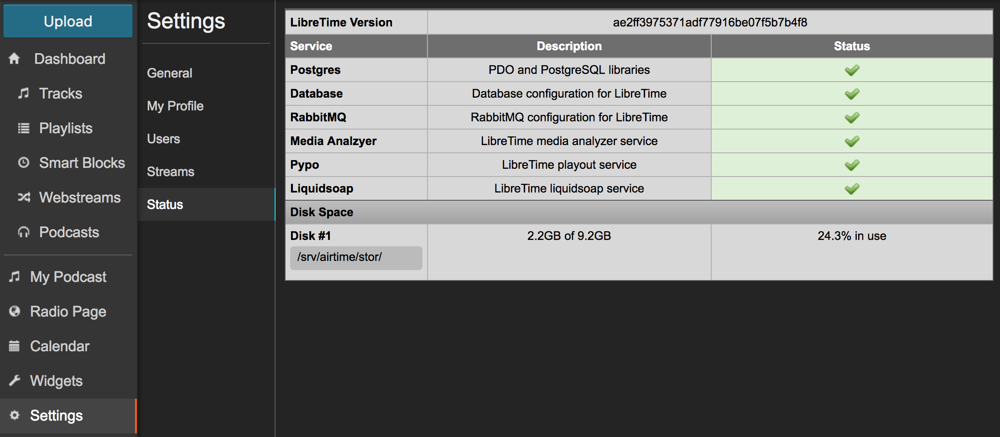

Dans le menu **Paramètres**, la page **satut** fournit un aperçu de la santé et de l'utilisation des ressources des différents services qui composent un système LibreTime. Si tout va bien, vous ne verrez que des icônes vertes cochées dans la colonne Statut. Cette page indique également l'**espace disque utilisé** sur la partition contenant le dossier de stockage des médias.

Si l'une des icônes cochées dans la colonne **Statut** s'est transformée en un signe d'avertissement rouge, contactez votre administrateur système pour obtenir de l'aide. LibreTime fera de son mieux pour redémarrer les services défaillants, mais une intervention manuelle peut parfois être nécessaire, par exemple en cas de panne matérielle.

Si vous n'avez plus d'espace de stockage, un utilisateur de LibreTime ayant des privilèges d'administrateur peut se connecter et supprimer de la **bibliothèque** les fichiers médias qui ne sont plus nécessaires. Vous pouvez également demander à votre administrateur système d'installer une capacité de stockage supplémentaire.
