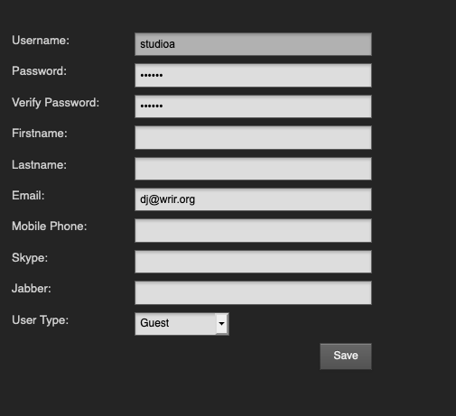

:::danger

Il est fortement recommandé de ne pas utiliser le compte administrateur par défaut en production, surtout si votre serveur LibreTime est accessible depuis Internet.

:::

## Types de comptes utilisateur.ice.s

Pour ajouter d'autres comptes utilisateur.ice.s au système, un pour chaque membre du personnel de votre station qui a besoin d'accéder à Airtime, cliquez sur le bouton **New user** avec l'icône plus. Saisissez un nom d'utilisateur, un mot de passe et des coordonnées, puis sélectionnez le **type d'utilisateur** dans le menu déroulant, qui peut être _Admin_, _Program Manager_, _DJ \_ou \_Guest_.

### invité.e.s

- Peuvent voir les émissions et le journal de diffusion dans le calendrier et le tableau de bord, respectivement.

- peuvent écouter le flux de sortie sans quitter l'interface.

### DJs

- Tout ce que les invité.e.s peuvent faire, plus :
- Télécharger des médias (musique, messages d'intérêt public, souscription, émissions, etc.) dans leur propre bibliothèque (les DJ ne peuvent pas voir les autres bibliothèques).
- Modifier les métadonnées, supprimer et programmer des médias dans leur propre bibliothèque pour les émissions auxquelles ils sont affectés.
- Prévisualiser les médias téléchargés sans affecter la diffusion en direct.

### Programmateur.ice.s

- Tout ce que les DJs peuvent faire, plus :
- Gérer les bibliothèques des autres utilisateurs en plus de la leur.
- Créer, modifier et supprimer des émissions codées par couleur sur le calendrier et les attribuer aux DJ (si nécessaire).
- Les émissions peuvent être programmées pour être répétées, avec la possibilité de lier le contenu entre les émissions (utile si un DJ fait du livestreaming chaque semaine).
- Regarder les statistiques d'audience.
- Exportez les journaux de diffusion à des fins d'analyse ou de rapport pour les redevances musicales.

### Administrators

- Tout ce que les programmateur.ice.s peuvent faire, plus:
- Gérer tous les comptes d'utilisateurs, y compris la possibilité de réinitialiser les mots de passe.
- Configurer les types de pistes pour faciliter le tri du contenu téléchargé.
- Modifier les paramètres du système

## Modifier ou supprimer des comptes d'utilisateur.ice.s

Pour modifier un compte d'utilisateur.ice, cliquez sur la ligne de cet utilisateur dans le tableau, modifiez les détails de l'utilisateur dans la zone située à droite, puis cliquez sur le bouton **sauvegarder**. Pour supprimer un compte utilisateur, cliquez sur la petite icône **x** à droite de sa ligne dans le tableau. Vous ne pouvez pas supprimer votre propre compte d'utilisateur, et les noms d'utilisateur ne peuvent pas être modifiés une fois créés.

Les utilisateur.ice.s peuvent mettre à jour leur propre mot de passe, ainsi que leurs coordonnées, leur langue et leur fuseau horaire, en cliquant sur leur nom d'utilisateur.ice dans la partie droite de la barre de menu principale, à côté du lien **Déconnexion**.
