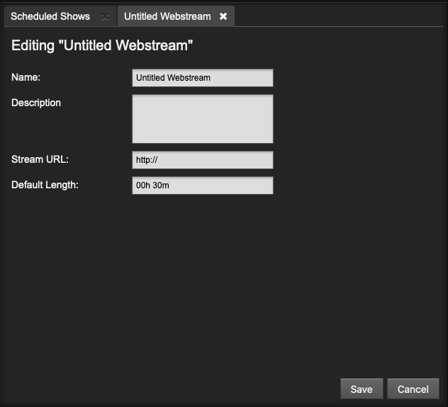

<iframe
    width="560"
    height="315"
    src="https://www.youtube-nocookie.com/embed/Ha3X6aYdY04"
    frameborder="0"
    allow="accelerometer; autoplay; encrypted-media; gyroscope; picture-in-picture"
    allowfullscreen
></iframe>

## Ajouter un flux web

Une URL de flux web et des métadonnées peuvent être ajoutées à la bibliothèque LibreTime, afin qu'un flux distant puisse être recherché et programmé pour être intégré à une émission. Par exemple, au début de l'heure, votre station peut extraire un reportage des journalistes travaillant dans un autre studio. Il s'agit d'un concept différent de celui des flux distants Master Source et Show Source qui sont poussés dans le programme de diffusion de LibreTime.

Pour ajouter un flux Web, cliquez sur le bouton **+ Nouveau** sur le côté gauche de la page Flux web. Comme une liste de lecture, les flux Web dans la bibliothèque peuvent avoir un titre et une description, ce qui peut vous aider à les retrouver dans des recherches ultérieures.

Le paramètre **Stream URL** doit inclure le numéro de port (tel que 8000) et le point de montage (tel que remote_stream) du flux distant, en plus du nom du serveur de streaming. Une **longueur par défaut** pour le flux distant peut également être définie. Si le flux est ajouté à la fin d'une émission qui, de ce fait, est surbookée, il sera supprimé à la fin de l'émission.

:::note

LibreTime vérifie le statut du flux web distant lors de l'édition des paramètres du flux, donc un flux hors ligne entraînera une erreur. Il existe de nombreux outils tels que [BUTT](https://danielnoethen.de/butt/) et [MIXXX](https://www.mixxx.org) qui peuvent être utilisés pour envoyer un flux de test à LibreTime peut le sauvegarder ; lisez plus [ici](./live-broadcast.md).

:::
