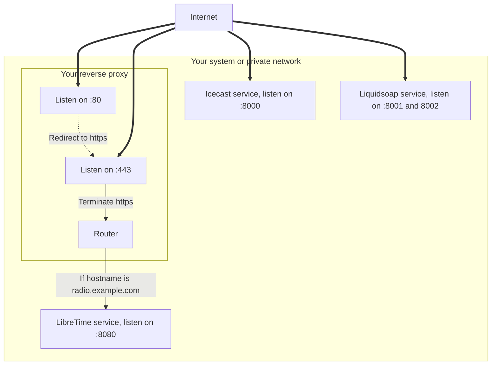

This guide walk you though the steps required to setup a reverse proxy in front of LibreTime.

Setting a reverse proxy in front of LibreTime is recommended, it prevents LibreTime to be
open to the Internet, adds security by enabling `https` and let's you manage your certificates in
a single place.

:::warning

The current input and output streams are Icecast based protocols and does not support being behind a reverse proxy. **Do not attempt** to [reverse proxy Icecast](#icecast) or the Liquidsoap harbor inputs.

Modern protocols such as [HLS](https://en.wikipedia.org/wiki/HTTP_Live_Streaming) and [SRT](https://en.wikipedia.org/wiki/Secure_Reliable_Transport) will be implement in the future to fix those limitations.

:::

Below is a schema that illustrate the goals when setting up a reverse proxy in front of LibreTime:



## Prerequisites

You need a domain name (`radio.example.com`) and a `tls` certificate for that domain. You can get certificates from Let's Encrypt by using [Certbot](https://certbot.eff.org/).

You need to identify the location of the services that should be exposed to the public:

- the LibreTime web server (usually `localhost:8080`, for documentation clarity we use `libretime:8080`).

:::info

If LibreTime is running on the same host as the reverse proxy, you need to change the LibreTime web server default listening port because the reverse proxy needs to listen on the `80`and `443` ports.

:::

:::caution

Be sure that your firewall and network allows communications from the reverse proxy to the services. You can use `ping`, `telnet` and `curl` to check that communication is working.

:::

## Install a reverse proxy

### Apache

:::info

You follow one of these guides to configure Apache with a Let's Encrypt certificate.

- [How To Secure Apache with Let's Encrypt on Ubuntu 20.04](https://www.digitalocean.com/community/tutorials/how-to-secure-apache-with-let-s-encrypt-on-ubuntu-20-04)

:::

:construction:

### Nginx

:::info

You follow one of these guides to configure Nginx with a Let's Encrypt certificate.

- [How To Secure Nginx with Let's Encrypt on Ubuntu 20.04](https://www.digitalocean.com/community/tutorials/how-to-secure-nginx-with-let-s-encrypt-on-ubuntu-20-04)

:::

Once you installed nginx and retrieved the required certificates, you can configure the reverse proxy to work with LibreTime.

Paste the following configuration in `/etc/nginx/sites-available/libretime.conf` and be sure to replace:

- `radio.example.com` with your own station url,
- `libretime:8080` with the location of your LibreTime web server;

```nginx
server {
    listen 80;
    server_name radio.example.com;
    location / {
        rewrite ^ https://$server_name$request_uri? permanent;
    }
}

server {
    listen 443 ssl;
    server_name radio.example.com;

    ssl_certificate /etc/letsencrypt/live/radio.example.com/fullchain.pem;
    ssl_certificate_key /etc/letsencrypt/live/radio.example.com/privkey.pem;

    location / {
        proxy_set_header Host              $host;
        proxy_set_header X-Real-IP         $remote_addr;
        proxy_set_header X-Forwarded-For   $proxy_add_x_forwarded_for;
        proxy_set_header X-Forwarded-Proto $scheme;
        proxy_set_header X-Forwarded-Host  $host;
        proxy_set_header X-Forwarded-Port  $server_port;

        proxy_pass http://libretime:8080/;
    }
}
```

Enable the nginx configuration and restart nginx using the commands below:

```bash
ln -s /etc/nginx/sites-available/libretime.conf /etc/nginx/sites-enabled/
sudo systemctl restart nginx
```

## Icecast

:::warning

If you attempt to listen an insecure Icecast stream on a secure website, a
[mixed content error](https://support.mozilla.org/en-US/kb/mixed-content-blocking-firefox)
will be raised by your browser and should prevent your player from listening to the stream.

You follow one of these guides to configure a secure Icecast server with a Let's Encrypt certificate.

- [Icecast HTTPS/SSL with Let’s Encrypt](https://mediarealm.com.au/articles/icecast-https-ssl-setup-lets-encrypt/)

:::
