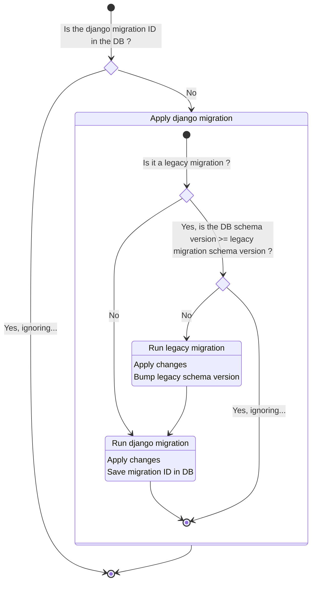

# Database schema creation and migrations

The method to maintain the database schema, is to write both a migration file for already installed databases and to update a `schema.sql` file for fresh databases. On fresh installation, the database is filled with the `schema.sql` and `data.sql` files and LibreTime won't run any sql migration on top of it. Previously, when LibreTime was upgraded, the missing migrations were run using a custom php based migration tool, those migrations are now handled by Django. The missing migrations are tracked using both a `schema_version` field in the `cc_pref` table and a Django migration id.

:::note

Since LibreTime forked, the `schema_version` in the `schema.sql` was locked on `3.0.0-alpha` and all the migrations were run during the first user connection. This has been fixed during the move to the Django based migrations.

:::

Django doesn't maintain a `schema.sql` file, it applies every migrations until it reaches the targeted schema represented by the code. The legacy `schema_version` has to be tracked until we remove the Propel schema generation and let Django handle all the schema migrations. Until then Propel generate the schema and Django handle migrations from already installed databases.

:::info

The first Django migration is the initial schema creation using the `schema.sql` and `data.sql` files.

:::

